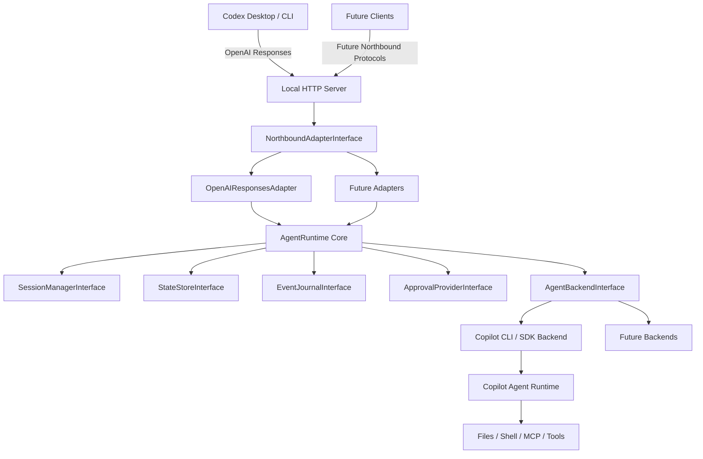

# Agent Loom: OpenAI Responses API to Copilot Agent Runtime Bridge Design

## Purpose

The final goal for **Agent Loom** is to let **Codex Desktop / Codex CLI first, and other agent clients later, use GitHub Copilot's full coding-agent runtime through stable protocol adapters**.

Agent Loom is not trying to expose Copilot as a plain LLM model endpoint. It is trying to make external clients a frontend for a real Copilot-backed coding agent runtime: one that can preserve multi-turn sessions, understand a workspace, read and write files, execute shell commands, use MCP/tools, request approvals, stream progress, support cancellation, and provide enough event history for debugging and replay.

Codex over OpenAI Responses is the first target client because it gives Agent Loom a concrete integration path. It must not become the core abstraction. The core should be client-agnostic and speak only Agent Loom's own canonical request, event, thread, session, approval, and journal interfaces.

Target user experience:

```text
Codex Desktop / Codex CLI
  -> OpenAI Responses-compatible NorthboundAdapterInterface
Agent Loom
  -> Copilot CLI / Copilot SDK / ACP-style agent runtime
  -> real coding-agent execution
```

Example Codex provider configuration:

```toml
model = "copilot-agent"
model_provider = "copilot_agent"

[model_providers.copilot_agent]
name = "Agent Loom"
base_url = "http://127.0.0.1:8000/openai/v1"
env_key = "COPILOT_AGENT_BRIDGE_API_KEY"
wire_api = "responses"
```

## Design Principles

1. **Agent bridge, not model provider**: treat the backend as a stateful coding-agent runtime, not as a stateless text model.
2. **Codex is the first client, not the abstraction**: design the core around Agent Loom interfaces so non-Codex clients can be added later.
3. **OpenAI Responses northbound only for MVP**: keep the first client-facing surface small and Codex-compatible.
4. **Stateful by default**: preserve `previous_response_id -> thread -> backend session` continuity in the OpenAI adapter, while mapping other client protocols to the same thread/session model.
5. **Honest compatibility**: do not fake OpenAI client-side tool calls if tools are executed server-side by the agent runtime.
6. **Security by default**: bind locally, require auth, deny or ask for risky actions, and redact logs.
7. **Event-journaled**: persist redacted raw, canonical, and encoded events so every failure can be replayed.
8. **Interface-first at product seams**: keep client protocols, backend protocols, state stores, approval providers, and event journals behind interfaces. Avoid speculative runtime abstractions until a second runtime is real.
9. **MVP before protocol breadth**: do not add Anthropic, Gemini, `/chat/completions`, a local tool broker, or UI until the core agent lifecycle works.

## Scope

### In Scope for MVP

- Local HTTP server bound to `127.0.0.1`.
- Bearer-token authentication.
- `OpenAIResponsesAdapter` as the first client protocol adapter.
- `GET /openai/v1/models`.
- `POST /openai/v1/responses` with SSE streaming.
- `GET /openai/v1/responses/:id`.
- `POST /openai/v1/responses/:id/cancel`.
- Persistent thread/session mapping.
- SQLite-backed turn/session state and event journal.
- Copilot CLI/SDK backend adapter.
- Basic approval policy: allow reads, ask for writes and shell, deny destructive defaults.
- A minimal authenticated debug endpoint for redacted turn events.

### Out of Scope for MVP

- `/chat/completions`.
- Anthropic Messages API adapter.
- Gemini API adapter.
- Custom UI.
- Full MCP manager.
- Bridge-owned local tool execution.
- OpenAI client-side function-call lifecycle.
- Remote multi-user deployment.
- Private or reverse-engineered Copilot API usage.

## High-Level Architecture



Agent Loom owns protocol translation and orchestration. Northbound adapters translate client protocols into canonical Agent Loom requests and events. Backends own agent execution.

## Core Domain Model

The core runtime should not know about HTTP, Bun, Node, SQLite, or Copilot-specific transport details. It should operate on stable domain objects.

All TypeScript interface names in Agent Loom should use an explicit `Interface` suffix, for example `NorthboundAdapterInterface`, `AgentBackendInterface`, and `StateStoreInterface`. Concrete implementations should not use that suffix.

```ts
type WorkspaceId = string;
type ThreadId = string;
type TurnId = string;
type BridgeSessionId = string;
type BackendSessionId = string;
type ApprovalId = string;
type ClientProtocol = string;
type BackendSessionStatus = "initializing" | "active" | "idle" | "disposing" | "disposed" | "abandoned" | "stale" | "lost";

interface AgentLoomErrorInterface {
  code: string;
  message: string;
  cause?: unknown;
}

interface WorkspaceInterface {
  id: WorkspaceId;
  // Absolute, symlink-resolved, normalized path produced by WorkspaceResolverInterface.
  rootPath: string;
}

interface ThreadInterface {
  id: ThreadId;
  workspaceId: WorkspaceId;
}

interface TurnRecordInterface {
  id: TurnId;
  threadId: ThreadId;
  parentTurnId: TurnId | null;
  bridgeSessionId: BridgeSessionId;
  status: "queued" | "running" | "cancelling" | "succeeded" | "failed" | "cancelled" | "interrupted";
  model: string;
  createdAt: Date;
  completedAt?: Date;
}

interface ClientTurnRefInterface {
  // Lowercase, version-stable identifier such as "openai-responses-v1".
  protocol: ClientProtocol;
  externalId: string;
  turnId: TurnId;
  threadId: ThreadId;
  parentProtocol?: ClientProtocol;
  parentExternalId?: string;
}

Protocol identifiers must be lowercase, version-stable strings such as `openai-responses-v1`. If a wire protocol changes incompatibly, implement it as a new adapter protocol ID and keep old IDs readable during migration windows. `StateStoreInterface.resolveClientRef()` returns `null` for unknown protocol IDs; adapters must handle missing parent refs explicitly instead of silently continuing the wrong thread.

When a protocol version changes, adapters may set `parentProtocol` to the previous version so parent lookups can span a migration window. If `parentProtocol` is absent, parent refs are resolved within the same protocol.

interface AgentRequestInterface {
  turnId: TurnId;
  threadId: ThreadId;
  workspaceId: WorkspaceId;
  input: AgentInputInterface;
  model: string;
  metadata?: Record<string, unknown>;
}

interface AgentInputInterface {
  message: string;
  conversationHistory?: ConversationMessageInterface[];
  systemInstructions?: string;
  attachments?: AgentAttachmentInterface[];
  metadata?: Record<string, unknown>;
}

interface ConversationMessageInterface {
  role: "user" | "assistant" | "system";
  content: string;
}

interface AgentAttachmentInterface {
  kind: "image" | "file" | "other";
  mediaType?: string;
  data?: Uint8Array;
  uri?: string;
}

interface AgentOutputInterface {
  text?: string;
  items?: unknown[];
  metadata?: Record<string, unknown>;
}

// Client protocol is audit metadata held at the adapter/journal boundary.
// Core business logic must not branch on client protocol.
type AgentEvent =
  | { type: "turn.created"; turnId: TurnId; emittedAt?: number }
  | { type: "text.delta"; turnId: TurnId; delta: string; emittedAt?: number }
  | { type: "progress"; turnId: TurnId; message: string; data?: unknown; emittedAt?: number }
  | { type: "tool.observed"; turnId: TurnId; toolName: string; input?: unknown; output?: unknown; emittedAt?: number }
  | { type: "permission.required"; turnId: TurnId; approvalId: ApprovalId; request: PermissionRequestInterface; emittedAt?: number }
  | { type: "permission.resolved"; turnId: TurnId; approvalId: ApprovalId; decision: "allow" | "deny"; emittedAt?: number }
  | { type: "turn.succeeded"; turnId: TurnId; output?: AgentOutputInterface; usage?: unknown; emittedAt?: number }
  | { type: "turn.failed"; turnId: TurnId; error: unknown; emittedAt?: number }
  | { type: "turn.cancelled"; turnId: TurnId; emittedAt?: number }
  | { type: "turn.interrupted"; turnId: TurnId; reason: string; emittedAt?: number };

interface PermissionRequestInterface {
  action: "filesystem:write" | "shell:exec" | "network:http" | "destructive" | string;
  scope: {
    path?: string;
    command?: string;
    url?: string;
  };
  reason?: string;
  metadata?: Record<string, unknown>;
}
```

Allowed turn status transitions:

```text
queued -> running
queued -> interrupted
running -> cancelling
running -> succeeded
running -> failed
running -> interrupted
cancelling -> cancelled
cancelling -> interrupted
```

Terminal statuses are `succeeded`, `failed`, `cancelled`, and `interrupted`. State updates must not move a terminal turn back to a non-terminal status.

## Component Design

### `WorkspaceResolverInterface`

Workspace resolution happens before request parsing so all adapters receive an explicit workspace boundary.

```ts
interface WorkspaceResolverInterface {
  resolve(hints: WorkspaceHintsInterface, config: ServerConfigInterface): Promise<WorkspaceInterface>;
}

interface ServerConfigInterface {
  defaultWorkspaceRoot?: string;
  allowedWorkspaceRoots?: string[];
}

interface WorkspaceHintsInterface {
  requestedRoot?: string;
  source: "server-config" | "client-metadata" | "process-cwd";
}
```

MVP resolution order:

1. explicit trusted server configuration;
2. explicit request metadata from an authenticated local client;
3. bridge process current working directory as a local-development fallback.

Northbound adapters extract protocol-specific workspace hints; `WorkspaceResolverInterface` turns those hints into a canonical workspace. This keeps workspace resolution usable for HTTP clients, CLI clients, and future non-HTTP adapters.

For the MVP, authenticated request metadata must still be constrained by either a single configured workspace root, an explicit allowlist, or the bridge process cwd fallback. Bearer authentication proves the caller may use Agent Loom; it does not grant arbitrary filesystem workspace selection.

The resolver must canonicalize paths and create or fetch the workspace through `StateStoreInterface.getOrCreateWorkspace()` before the adapter creates an `AgentRequestInputInterface`. Canonicalization means absolute path resolution, symlink resolution via platform-native `realpath` or equivalent, removal of trailing separators, and consistent case handling on case-insensitive filesystems. Canonicalization failures, including dangling symlinks and permission-denied intermediate directories, must return `workspace_canonicalization_failed`. If `allowedWorkspaceRoots` is non-empty, the resolved root must be inside that allowlist after canonicalization; otherwise return `workspace_forbidden`.

`WorkspaceResolverInterface.resolve()` should throw typed `AgentLoomErrorInterface`s for `workspace_forbidden`, `workspace_not_found`, and `workspace_canonicalization_failed`; adapters encode those errors into their protocol-specific error response. Before resuming a persisted backend session, `SessionManagerInterface` must re-canonicalize the stored workspace path and compare it with the request workspace. If the path no longer exists or resolves differently, fail the turn with `workspace_changed` rather than reusing the session.

### `NorthboundAdapterInterface`

The northbound side must be an interface. OpenAI Responses is the first implementation, not the architectural center.

```ts
interface NorthboundAdapterInterface {
  readonly protocol: ClientProtocol;

  extractWorkspaceHints(request: NorthboundRequestInterface): Promise<WorkspaceHintsInterface>;
  parseRequest(request: NorthboundRequestInterface, context: RequestContextInterface): Promise<AgentRequestInputInterface>;

  encodeStream(
    events: AsyncIterable<AgentEvent>,
    context: ResponseContextInterface
  ): AsyncIterable<Uint8Array>;

  encodeStoredResponse(record: TurnRecordInterface, events: AgentEvent[]): unknown;

  encodeError(error: AgentLoomErrorInterface): unknown;

  capabilities(): NorthboundCapabilitiesInterface;
}

interface NorthboundRequestInterface {
  transport: "http" | "cli" | "custom";
  method: string;
  path: string;
  query?: Record<string, string | string[]>;
  headers?: Headers;
  body: unknown;
}

interface RequestContextInterface {
  workspaceId: WorkspaceId;
  authSubject?: string;
  requestId: string;
}

interface ResponseContextInterface {
  turnId: TurnId;
  threadId: ThreadId;
  externalResponseId?: string;
}

interface AgentRequestInputInterface {
  threadId?: ThreadId;
  parentTurnId?: TurnId;
  model: string;
  input: AgentInputInterface;
  metadata?: Record<string, unknown>;
  clientRef?: {
    externalId?: string;
    parentExternalId?: string;
  };
}

interface NorthboundCapabilitiesInterface {
  streaming: boolean;
  resumableTurns: boolean;
  clientSideToolCalls: boolean;
  cancellation: boolean;
}
```

First implementation:

```text
OpenAIResponsesAdapter
```

Future implementations:

```text
AnthropicMessagesAdapter
GeminiAdapter
OpenAIChatCompletionsAdapter
CustomHttpAdapter
CliAdapter
```

These future adapters are extension points, not MVP deliverables. The MVP should only implement `OpenAIResponsesAdapter`; the interface exists to prevent Codex/OpenAI concepts from entering the core.

The core runtime should never branch on "Codex" or "OpenAI". It should receive `AgentRequestInterface`, produce `AgentEvent`, and let the selected `NorthboundAdapterInterface` decide how to encode those events for its client protocol.

### `OpenAIResponsesAdapter`

Responsibilities:

- Use the stable protocol identifier `openai-responses-v1` for `ClientTurnRefInterface.protocol`.
- Parse OpenAI Responses-compatible requests.
- Validate request shape.
- Resolve unsupported parameters.
- Map OpenAI `previous_response_id` to canonical `parentTurnId` / `threadId` through `StateStoreInterface`.
- Convert request input into `AgentRequestInterface`.
- Convert `AgentEvent` streams into OpenAI Responses SSE.
- Encode terminal response objects for `GET /responses/:id`.
- For non-terminal `GET /responses/:id`, return a snapshot of the current canonical turn state and accumulated events; do not block waiting for completion.

MVP behavior:

- Accept `model`, `input`, `previous_response_id`, `metadata`, `reasoning`, and `text` fields.
- Reject or explicitly ignore unsupported `tools`, audio, background mode, and OpenAI client-side function-call workflows.
- Map canonical terminal events to OpenAI terminal events: `turn.succeeded -> response.completed`, `turn.failed -> response.failed`, `turn.cancelled` or `turn.interrupted -> response.incomplete`.

### `SessionManagerInterface`

Responsibilities:

- Resolve canonical `threadId` / `parentTurnId` to an existing backend session.
- Create a new thread and backend session when no previous response exists.
- Keep workspace boundaries explicit.
- Prevent accidental cross-workspace session reuse.

State flow:

```text
POST /responses
  -> OpenAIResponsesAdapter maps previous_response_id to parentTurnId/threadId
  -> if threadId exists:
       lookup thread_id -> bridge_session_id
     else:
       create workspace/thread/backend session
  -> create turn row
  -> stream backend events
  -> mark turn terminal
```

```ts
interface SessionManagerInterface {
  startTurn(input: AgentRequestInputInterface, context: RequestContextInterface): Promise<ResolvedTurnInterface>;
  getTurn(turnId: TurnId): Promise<TurnRecordInterface | null>;
  cancelTurn(turnId: TurnId): Promise<CancelResultInterface>;
}

interface ResolvedTurnInterface {
  turn: TurnRecordInterface;
  thread: ThreadInterface;
  session: BackendSessionInterface;
  request: AgentRequestInterface;
}
```

The `OpenAIResponsesAdapter` owns OpenAI-specific lookup of `previous_response_id` through `StateStoreInterface.resolveClientRef()`. `SessionManagerInterface` only receives canonical `threadId` / `parentTurnId` values.

A thread has at most one active backend session at a time. If that backend session is disposed, crashes, or cannot be resumed, the MVP should fail the next turn with a `session_lost` error rather than silently creating a contextless replacement. Post-MVP recovery may create a replacement backend session, but every turn must keep its original `bridgeSessionId` for auditability.

`SessionManagerInterface` depends on `StateStoreInterface`, `AgentBackendInterface`, and `EventJournalInterface`. It should not depend on any concrete northbound adapter.

`SessionManagerInterface.startTurn()` owns the core streaming loop and watchdog timers. It wraps `AgentBackendInterface.send()`, records emitted events, enforces terminal-event guarantees, starts approval and backend inactivity timers, and calls `AgentBackendInterface.cancel()` when a watchdog expires.

Creation order is explicit and transactional where persistence is involved: resolve/create workspace, create thread, reserve a backend session row in `initializing`, call `AgentBackendInterface.createSession()` with that reserved `bridgeSessionId`, activate the row with `backendSessionId` and process metadata, then create the turn referencing `bridgeSessionId`. `BackendSessionInterface.workspaceId` and `BackendSessionInterface.threadId` are immutable metadata set at creation time. `AgentBackendInterface.createSession()` must only be called with a thread and backend session reservation that already exist in `StateStoreInterface`. If activation fails after a process-backed session starts, the newly created backend session must be disposed immediately and the reserved row marked `lost` or `abandoned`; the thread should remain unused rather than attached to a later unrelated session.

The streaming wrapper must use a `try/finally` around the `AgentBackendInterface.send()` iterator. If the iterator throws, is abandoned, times out, or completes without a terminal event, `SessionManagerInterface` appends exactly one synthesized terminal event (`turn.failed` or `turn.interrupted`) and updates the turn status before returning control to the adapter.

`cancelTurn(turnId)` must load the `TurnRecordInterface`, then load the matching `BackendSessionInterface` with `StateStoreInterface.getBackendSession(turn.bridgeSessionId)`, validate thread/workspace continuity, and pass the full `BackendSessionInterface` to `AgentBackendInterface.cancel()`. Backend adapters should only use `BackendSessionInterface.backendSessionId` when calling their runtime.

`TurnRecordInterface` values returned from `getTurn()` are immutable snapshots. Callers that need fresh state should call `getTurn()` again rather than mutating a record in memory.

### `StateStoreInterface`

The persistence layer is an interface. SQLite is the first implementation, not a core dependency.

```ts
interface StateStoreInterface {
  getOrCreateWorkspace(input: { rootPath: string }): Promise<WorkspaceInterface>;
  getWorkspace(workspaceId: WorkspaceId): Promise<WorkspaceInterface | null>;
  getWorkspaceByPath(rootPath: string): Promise<WorkspaceInterface | null>;

  createThread(input: { workspaceId: WorkspaceId }): Promise<ThreadInterface>;
  getThread(threadId: ThreadId): Promise<ThreadInterface | null>;

  createTurn(input: {
    threadId: ThreadId;
    parentTurnId?: TurnId;
    bridgeSessionId: BridgeSessionId;
    model: string;
  }): Promise<TurnRecordInterface>;
  getTurn(turnId: TurnId): Promise<TurnRecordInterface | null>;
  updateTurnStatus(
    turnId: TurnId,
    fromStatus: TurnRecordInterface["status"] | "any-non-terminal",
    toStatus: TurnRecordInterface["status"],
    completedAt?: number
  ): Promise<boolean>;

  bindClientRef(ref: ClientTurnRefInterface): Promise<void>;
  resolveClientRef(protocol: ClientProtocol, externalId: string): Promise<ClientTurnRefInterface | null>;

  resolveApprovalWithJournal(input: ApprovalResolutionInputInterface): Promise<ApprovalResolutionResultInterface>;

  reserveBackendSession(input: { workspaceId: WorkspaceId; threadId: ThreadId; backend: string }): Promise<BackendSessionInterface>;
  activateBackendSession(session: BackendSessionInterface, metadata: BackendProcessMetadataInterface): Promise<void>;
  updateBackendSessionStatus(bridgeSessionId: BridgeSessionId, fromStatus: BackendSessionStatus | "any", toStatus: BackendSessionStatus): Promise<boolean>;
  getBackendSession(bridgeSessionId: BridgeSessionId): Promise<BackendSessionInterface | null>;
  getBackendSessionByThread(threadId: ThreadId): Promise<BackendSessionInterface | null>;
}
```

`getOrCreateWorkspace()` must be atomic; the SQLite implementation should enforce `UNIQUE(root_path)` and retry lookup on unique-constraint conflicts. `createTurn()` always creates turns in `queued` status. `updateTurnStatus()` must enforce the allowed transition table above with a compare-and-set update and return `false` when the stored status does not match `fromStatus` or when `any-non-terminal` sees an already terminal turn. `resolveApprovalWithJournal()` is the single persistence boundary for approval resolution: it must compare-and-set a pending approval to a terminal decision and append the matching `permission.resolved` journal event in one transaction. `reserveBackendSession()` creates an `initializing` row before a process-backed runtime is started; `activateBackendSession()` fills in backend/runtime metadata after creation succeeds.

### `AgentBackendInterface`

The southbound backend is an interface, not a hardcoded Copilot implementation.

```ts
interface AgentBackendInterface {
  name: string;
  capabilities(): BackendCapabilitiesInterface;
  createSession(workspace: WorkspaceInterface, options: CreateSessionOptionsInterface): Promise<BackendSessionInterface>;
  resumeSession(session: BackendSessionInterface): Promise<BackendSessionInterface>;
  send(session: BackendSessionInterface, request: AgentRequestInterface, signal?: AbortSignal): AsyncIterable<AgentEvent>;
  submitApprovalDecision?(session: BackendSessionInterface, approvalId: ApprovalId, decision: ApprovalDecision): Promise<void>;
  cancel(session: BackendSessionInterface, options?: CancelOptionsInterface): Promise<CancelResultInterface>;
  disposeSession(session: BackendSessionInterface): Promise<void>;
}

interface BackendSessionInterface {
  bridgeSessionId: BridgeSessionId;
  backendSessionId?: BackendSessionId;
  workspaceId: WorkspaceId;
  threadId: ThreadId;
  status: BackendSessionStatus;
}

interface BackendProcessMetadataInterface {
  backendSessionId: BackendSessionId;
  processId?: string;
  processStartedAt?: number;
  processIdentityHash?: string;
}

interface CreateSessionOptionsInterface {
  bridgeSessionId: BridgeSessionId;
  threadId: ThreadId;
  model?: string;
}

interface CancelOptionsInterface {
  timeoutMs: number;
  forceAfterTimeout: boolean;
}

interface CancelResultInterface {
  status: "cancelled" | "timed_out" | "not_found";
}

interface BackendCapabilitiesInterface {
  persistentSessions: boolean;
  serverSideTools: boolean;
  permissionRequests: boolean;
  externalApprovalDecisions: boolean;
  cancellation: boolean;
}
```

`BridgeSessionId` is Agent Loom's durable session record ID. `BackendSessionId` is the backend runtime's opaque session identifier. Core and persistence APIs should use `BridgeSessionId`; backend adapters translate it to `BackendSessionId`. The field is named `bridgeSessionId` rather than `id` to avoid accidentally passing Agent Loom's ID to backend APIs.

`backendSessionId` is optional only while a reserved session is `initializing`; active, idle, disposing, disposed, abandoned, stale, and lost rows must preserve the backend runtime ID when one was ever assigned.

Allowed backend session status transitions:

```text
initializing -> active
initializing -> lost
initializing -> abandoned
active -> idle
active -> disposing
idle -> active
idle -> disposing
disposing -> disposed
disposing -> abandoned
active -> lost
idle -> lost
lost -> stale
```

`workspaceId` and `threadId` are immutable once a backend session is created. Before every send/resume/cancel, `SessionManagerInterface` must validate both `session.workspaceId === request.workspaceId` and `session.threadId === request.threadId`.

`resumeSession()`, `send()`, `submitApprovalDecision()`, `cancel()`, and `disposeSession()` must reject reserved sessions that have no `backendSessionId`; only active or previously activated sessions may reach backend runtime APIs.

`AgentBackendInterface.send()` should try to emit exactly one terminal event. The core runtime must still wrap all backend streams and synthesize `turn.failed` or `turn.interrupted` if the backend iterator throws, exits without a terminal event, or exceeds a configured watchdog timeout.

Backends should yield exactly one terminal event when possible. They may throw when a terminal event cannot be yielded; `SessionManagerInterface` must catch iterator errors, persist all already-yielded events, synthesize `turn.failed`, and use `updateTurnStatus(..., "any-non-terminal", "failed")` so a concurrent terminal transition wins safely. Backends must observe `AbortSignal` promptly; if a backend cannot cooperatively stop, `SessionManagerInterface` escalates through `cancel()` and `disposeSession()`.

Process-backed adapters must re-canonicalize `workspace.rootPath` immediately before setting the child process working directory in `createSession()` and fail with `workspace_canonicalization_failed` if it no longer matches the resolved workspace.

If `capabilities().externalApprovalDecisions` is true, `SessionManagerInterface` must call `submitApprovalDecision()` after an approval resolves. If false, the backend adapter must implement the approval pause/resume semantics internally before yielding further events. The MVP may choose either backend-native mode based on Phase 0 findings, but it must not pretend an approval was enforced unless the chosen backend integration can actually block and resume execution.

First implementation:

```text
CopilotCliOrSdkBackend
```

Future implementations:

```text
CopilotSdkBackend
ClaudeCodeBackend
GeminiCliBackend
LocalOpenAIBackend
MockBackend
```

These future backends are architectural validation targets, not MVP deliverables. The MVP should implement one concrete Copilot backend first and keep the interface thin enough that it reflects real behavior discovered in Phase 0.

### `EventJournalInterface`

Responsibilities:

- Record redacted northbound requests.
- Record redacted backend events.
- Record canonical `AgentEvent`s.
- Record encoded OpenAI SSE events.
- Support replay and debugging.

Event forms:

```text
redacted_raw_json  sanitized source event, never unredacted secrets
canonical_json     normalized Agent Loom event
encoded_json       final client-facing event, optional outside debug mode
redaction_json     fields removed or summarized before persistence
```

Agent Loom must never persist unredacted transport payloads by default. Raw request and backend payloads must pass through a redaction boundary before being written to SQLite. Full raw capture, if ever needed for local debugging, must be an explicit debug-mode option with clear retention limits and must not be enabled by default.

Minimum redaction rules:

```text
headers: keep only Content-Type, Content-Length, Accept; redact all auth/cookie-like headers
file contents and attachments: store metadata and byte counts only by default
commands: store command name and argument count; redact full argument string
URLs: keep scheme/host/path; redact query parameters and fragments
environment variables: allowlist safe names only; redact all others
prompts/messages: store hashes or short summaries only unless debug_full_journal is explicitly enabled
```

`redactionJson` should record fields removed and any truncation counts so debugging can distinguish missing data from never-present data.

If redaction fails, persistence must fail closed: throw a typed `RedactionFailedError`, do not write a partially redacted event, and abort the active turn with `turn.failed` after appending only a sanitized security event that contains the error code and redaction stage. Agent Loom must never fall back to storing unredacted payloads to preserve debugging data.

Synthesized terminal events used for shutdown and forced cleanup must be built from minimal pre-sanitized templates containing only IDs and fixed reason codes. Those cleanup events must not depend on redacting user-controlled payloads, so shutdown can always mark non-terminal turns interrupted without risking secret persistence.

```ts
interface EventJournalInterface {
  append(event: JournalEventInterface): Promise<void>;
  listByTurn(turnId: TurnId): Promise<JournalEventInterface[]>;
  listByThread(threadId: ThreadId): Promise<JournalEventInterface[]>;
  replay(turnId: TurnId): AsyncIterable<AgentEvent>;
}

interface JournalEventInterface {
  id: string;
  turnId: TurnId;
  seq: number;
  kind: "northbound" | "backend" | "canonical" | "encoded" | "security";
  redactedRawJson?: unknown;
  canonicalJson?: unknown;
  encodedJson?: unknown;
  redactionJson?: unknown;
  createdAt: number;
}
```

`EventJournalInterface.append()` is used for ordinary journal writes. Approval resolution must not call `append()` independently after changing approval state; it must go through `StateStoreInterface.resolveApprovalWithJournal()` so the approval transition and `permission.resolved` event commit atomically.

`replay()` should yield all available canonical events in sequence order. Ordering is insertion-order at the journal boundary; `AgentEvent.emittedAt` is diagnostic metadata and not the replay ordering source. Replay must verify `seq` is continuous from `0` to `N - 1` for a turn and throw `JournalCorruptedError` with detected gap ranges when sequence numbers are missing. If an in-progress turn has no terminal event yet, replay still yields its persisted canonical events; callers distinguish incomplete streams from corruption by checking `TurnRecordInterface.status`. If retention has expired an entire terminal turn journal, replay should return a typed `JournalExpiredError` rather than treating the intentional tombstone as sequence corruption. If required canonical events are malformed or out of order, the debug endpoint should catch the typed error and return corruption details without crashing the server.

MVP debug endpoint:

```text
GET /debug/turns/:id/events
```

Broader thread, backend-session, and approval debug routes should remain post-MVP unless implementation evidence proves they are necessary for Phase 4 replay validation.

### `ApprovalProviderInterface`

Responsibilities:

- Apply policy to permission requests.
- Persist approval state.
- Block backend execution when the decision is `ask`.
- Resume backend execution after approve/deny.

MVP policies:

```text
read-only filesystem = allow
filesystem write = ask
shell = ask
network = deny or ask
destructive actions = deny
```

Modes:

```text
restricted
ask
allow-all
```

`allow-all` must be explicit opt-in and should never be the default.

```ts
interface ApprovalProviderInterface {
  evaluate(request: PermissionRequestInterface, context: ApprovalContextInterface): Promise<ApprovalEvaluation>;
  resolve(approvalId: ApprovalId, decision: ApprovalDecision): Promise<void>;
  awaitDecision(approvalId: ApprovalId, signal?: AbortSignal): Promise<ApprovalDecision>;
}

interface ApprovalContextInterface {
  turnId: TurnId;
  threadId: ThreadId;
  workspaceId: WorkspaceId;
}

type ApprovalEvaluation =
  | { type: "allow" }
  | { type: "deny"; reason: string }
  | { type: "ask"; approvalId: ApprovalId; timeoutAt: number };

type ApprovalDecision =
  | { type: "allow"; scope: "once" | "always" }
  | { type: "deny"; scope: "once" | "always"; reason?: string }
  | { type: "timeout"; reason: string }
  | { type: "aborted"; reason: string };

interface ApprovalResolutionInputInterface {
  approvalId: ApprovalId;
  decision: ApprovalDecision;
  journalEvent: JournalEventInterface;
}

interface ApprovalResolutionResultInterface {
  status: "resolved" | "already_terminal";
  decision: ApprovalDecision;
}
```

Pending approvals must have a deadline. The MVP default should auto-deny when the timeout expires, emit `permission.resolved`, and let the backend continue or fail according to the backend protocol.

`ApprovalProviderInterface.resolve()` must persist `permission.resolved` through `StateStoreInterface.resolveApprovalWithJournal()`, not by separately updating approval state and then calling `EventJournalInterface.append()`. `resolve()` and timeout handlers must use one SQLite transaction or compare-and-set update from `pending` to a terminal approval status so exactly one decision wins for each `approvalId`. The approval status update and corresponding `permission.resolved` journal append must commit atomically; if the journal append cannot be committed, the approval must remain pending or the turn must fail closed with `turn.failed` rather than continuing with an unjournaled decision. `awaitDecision()` must atomically journal timeout decisions before returning `{ type: "timeout" }`, so timeout paths cannot create unjournaled or duplicate decisions. When an `AbortSignal` represents turn cancellation, `awaitDecision()` must atomically resolve the approval as deny with reason `turn_cancelled`, append `permission.resolved` in the same transaction, and return `{ type: "aborted" }`; subsequent user approval attempts should be idempotent no-ops that return the already-terminal approval state. The required order is: `permission.required` -> timeout/cancel -> `permission.resolved` with deny reason -> backend receives denial or cancellation -> backend terminal event or forced interruption.

Approval payloads must pass through the same redaction pipeline as event payloads before persistence; commands, URLs, reasons, and metadata may contain secrets. If an approval timeout is auto-denied and the backend does not emit a terminal event within `cancel_timeout_ms`, the core runtime must force-cancel the backend session and synthesize `turn.interrupted` with reason `approval_timeout_exceeded`.

The approval timeout watchdog is owned by `SessionManagerInterface`: after auto-deny is journaled, wait up to `cancel_timeout_ms` for a backend terminal event; if none arrives, atomically check the turn is still non-terminal with `updateTurnStatus(..., "any-non-terminal", "cancelling")`, call `AgentBackendInterface.cancel(session, { forceAfterTimeout: true })`, and synthesize `turn.interrupted` through the same compare-and-set terminal-event path. If `cancel()` returns `timed_out`, `SessionManagerInterface` calls `AgentBackendInterface.disposeSession(session)` and then marks the backend session `abandoned` in `StateStoreInterface`. Backend adapters own process cleanup only; they must not update `StateStoreInterface` directly.

## Streaming Design

### Required Response Flow

For a successful text response through the OpenAI Responses adapter, canonical events should be encoded into this logical sequence:

```text
response.created
response.in_progress
response.output_item.added
response.content_part.added
response.output_text.delta...
response.output_text.done
response.content_part.done
response.output_item.done
response.completed
```

The bridge owns `sequence_number` generation and output item IDs.

Example mapping:

```text
AgentEvent:
  { type: "text.delta", turnId: "turn_123", delta: "hello" }

OpenAI Responses SSE:
  data: {
    "type": "response.output_text.delta",
    "item_id": "msg_1",
    "output_index": 0,
    "content_index": 0,
    "delta": "hello",
    "sequence_number": 4
  }
```

### Tool and Progress Events

The bridge must be honest about tool semantics.

Server-side agent tool execution should not be emitted as OpenAI client-side function calls. Instead:

| Backend event | Responses representation |
| --- | --- |
| text delta | `response.output_text.delta` |
| progress update | reasoning summary or progress item |
| observed server-side tool | server-side tool event or reasoning summary |
| permission request | approval item / pending approval |
| unsupported client-side tool request | `400 unsupported_parameter` |

### Cancellation

Cancellation can originate from:

- `POST /responses/:id/cancel`.
- SSE client disconnect.
- backend timeout.
- process shutdown.

Cancellation flow:

```text
client cancel/disconnect
  -> lookup external response_id -> turn_id -> bridge_session_id
  -> wait brief disconnect grace period for reconnects
  -> transition turn to cancelling if not already terminal/cancelling
  -> load BackendSessionInterface and call AgentBackendInterface.cancel(session, timeoutMs)
  -> force-dispose backend session if cancel times out
  -> escalate disposal through SIGTERM and then SIGKILL for process-backed sessions
  -> append turn.cancelled or turn.interrupted event
  -> mark turn terminal
  -> close SSE stream
```

The bridge must never leave a stream dangling without a terminal event in the event journal. If a backend stream throws, exits early, or fails to produce a terminal event, the core runtime must synthesize `turn.failed` or `turn.interrupted` in a `finally` path.

Cancellation must be idempotent. The first cancellation request transitions the turn to `cancelling`; concurrent or repeated cancellation requests should return the current cancellation result without calling `AgentBackendInterface.cancel()` again.

Force-cancel timeout must not leave a process-backed backend running with workspace access. If `AgentBackendInterface.cancel()` returns `timed_out`, `SessionManagerInterface` must first transition the backend session to `disposing`, then call `disposeSession()`. The backend implementation then terminates the process with SIGTERM and, if still alive after its short shutdown budget, SIGKILL. `AgentBackendInterface.disposeSession()` must not mutate persistence; `SessionManagerInterface` is responsible for marking the backend session `disposed` after graceful cleanup or `abandoned` after forced/failed cleanup in `StateStoreInterface`. Only after that persistence transition may the backend session be made non-reusable.

`SessionManagerInterface.cancelTurn()` must use an atomic compare-and-set or SQLite transaction to transition a non-terminal turn to `cancelling`. If the turn is already `cancelling` or terminal, it returns the current cancellation result without calling `AgentBackendInterface.cancel()` again. If force-cancellation exceeds `cancel_timeout_ms`, the turn must still be marked `interrupted` with reason `force_cancel_timeout_exceeded` after disposal escalation completes; the backend session is then marked abandoned and cannot be reused.

On bridge shutdown (`SIGINT` / `SIGTERM`), Agent Loom should stop accepting new requests, cancel in-progress turns with `cancel_timeout_ms`, force-dispose unresponsive backend sessions, mark remaining non-terminal turns as `interrupted`, flush the event journal, and then exit. Force disposal should escalate through graceful cancel, process termination, and process kill when supported; shutdown has a hard deadline, after which remaining sessions are marked abandoned and the process exits non-zero.

## Persistence Design

SQLite is sufficient for the MVP. The schema should be migration-based from the start.

Recommended tables:

```sql
CREATE TABLE workspaces (
  id TEXT PRIMARY KEY,
  root_path TEXT NOT NULL UNIQUE,
  created_at INTEGER NOT NULL
);

CREATE TABLE threads (
  id TEXT PRIMARY KEY,
  workspace_id TEXT NOT NULL,
  created_at INTEGER NOT NULL,
  updated_at INTEGER NOT NULL,
  FOREIGN KEY (workspace_id) REFERENCES workspaces(id)
);

CREATE TABLE turns (
  id TEXT PRIMARY KEY,
  thread_id TEXT NOT NULL,
  parent_turn_id TEXT,
  bridge_session_id TEXT NOT NULL,
  status TEXT NOT NULL,
  model TEXT NOT NULL,
  created_at INTEGER NOT NULL,
  completed_at INTEGER,
  FOREIGN KEY (thread_id) REFERENCES threads(id),
  FOREIGN KEY (bridge_session_id) REFERENCES backend_sessions(id)
);

CREATE TABLE client_turn_refs (
  protocol TEXT NOT NULL,
  external_id TEXT NOT NULL,
  turn_id TEXT NOT NULL,
  thread_id TEXT NOT NULL,
  parent_protocol TEXT,
  parent_external_id TEXT,
  created_at INTEGER NOT NULL,
  PRIMARY KEY (protocol, external_id),
  FOREIGN KEY (turn_id) REFERENCES turns(id),
  FOREIGN KEY (thread_id) REFERENCES threads(id)
);

CREATE TABLE backend_sessions (
  id TEXT PRIMARY KEY,
  workspace_id TEXT NOT NULL,
  thread_id TEXT NOT NULL,
  backend TEXT NOT NULL,
  backend_session_id TEXT,
  process_id TEXT,
  process_started_at INTEGER,
  process_identity_hash TEXT,
  status TEXT NOT NULL,
  created_at INTEGER NOT NULL,
  updated_at INTEGER NOT NULL,
  FOREIGN KEY (workspace_id) REFERENCES workspaces(id),
  FOREIGN KEY (thread_id) REFERENCES threads(id)
);

CREATE TABLE events (
  id TEXT PRIMARY KEY,
  turn_id TEXT NOT NULL,
  seq INTEGER NOT NULL,
  kind TEXT NOT NULL,
  redacted_raw_json TEXT,
  canonical_json TEXT,
  encoded_json TEXT,
  redaction_json TEXT,
  created_at INTEGER NOT NULL,
  UNIQUE(turn_id, seq),
  FOREIGN KEY (turn_id) REFERENCES turns(id)
);

CREATE TABLE approvals (
  id TEXT PRIMARY KEY,
  turn_id TEXT NOT NULL,
  bridge_session_id TEXT NOT NULL,
  status TEXT NOT NULL,
  redacted_request_json TEXT NOT NULL,
  decision_json TEXT,
  timeout_at INTEGER NOT NULL,
  created_at INTEGER NOT NULL,
  decided_at INTEGER,
  FOREIGN KEY (turn_id) REFERENCES turns(id),
  FOREIGN KEY (bridge_session_id) REFERENCES backend_sessions(id)
);

CREATE INDEX idx_turns_thread_id ON turns(thread_id);
CREATE INDEX idx_events_turn_id_seq ON events(turn_id, seq);
CREATE INDEX idx_backend_sessions_thread_id ON backend_sessions(thread_id);
CREATE INDEX idx_backend_sessions_workspace_status ON backend_sessions(workspace_id, status);

CREATE TABLE schema_version (
  version INTEGER PRIMARY KEY,
  applied_at INTEGER NOT NULL
);
```

Production can later swap SQLite for Postgres by implementing `StateStoreInterface`.

MVP cleanup defaults should be simple and configurable:

```text
max_active_sessions = 10
event_retention_days = disabled by default
debug_full_journal = false
```

When limits are exceeded, Agent Loom should dispose least-recently-used idle backend sessions. Automatic deletion of redacted journal events should remain disabled by default. If event retention is enabled, it must delete only whole event sets for terminal turns, write a retention tombstone so `replay()` returns `JournalExpiredError`, never create sequence gaps within a retained turn, never delete non-terminal turn journals, and never delete approval audit pairs unless the entire terminal turn journal is expired under the same policy.

On startup, Agent Loom must inspect persisted non-terminal turns and active backend sessions before binding the HTTP server or accepting any client request. During this recovery phase the process is not ready; health checks should report `recovering`. If a recorded `process_id` is no longer alive, the session should be marked disposed and affected non-terminal turns should be marked `interrupted` with reason `bridge_restart_or_backend_lost`. If a PID is alive, the backend must validate it against stored identity metadata such as `process_started_at`, command-line hash, or another adapter-specific process identity before signaling or reusing it. If identity does not match, mark the session stale and do not signal the process. If a backend process is still alive but was not started by the current bridge instance, the MVP should treat it as stale: do not reuse it, attempt graceful disposal only if the backend adapter can identify it safely, and otherwise mark the session stale. Post-MVP external process adoption would require an explicit backend capability and tests.

## Security Design

### Local Defaults

Default server configuration:

```text
host = 127.0.0.1
port = 8000
auth = required bearer token
cors = disabled
log_prompts = false
log_file_contents = false
log_secrets = false
permissions.mode = ask
approval_timeout_ms = 60000
cancel_timeout_ms = 10000
disconnect_grace_ms = 5000
```

### HTTP Security

Rules:

- Never bind to `0.0.0.0` by default.
- Require `Authorization: Bearer <token>` for all endpoints.
- Disable CORS by default and emit no CORS headers for CLI-only usage.
- If browser clients are added later, enable CORS only with an explicit origin allowlist.
- Reject wildcard CORS origins; `Access-Control-Allow-Origin: *` is never valid for authenticated endpoints.
- Reject unexpected `Origin` headers.
- Add request body size limits.
- Do not log request bodies by default.
- Redact `Authorization`, GitHub tokens, environment secrets, prompts, and file contents.

Bearer tokens must be generated with cryptographically secure randomness and at least 128 bits of entropy. For MVP, Agent Loom should accept a token from `AGENT_LOOM_API_KEY`; if absent, it may generate an ephemeral startup token and print it once to stderr. User-provided tokens should be rejected at startup if they are clearly too short for local bearer auth. Generated tokens must not be written into the repository or event journal. Token rotation can be a post-MVP CLI command, but token validation must exist from the first implementation.

For browser-based clients added later, CORS should require `cors_mode = "browser"` plus a non-empty explicit origin allowlist. Configuration validation must reject `*` and reject enabling CORS without an allowlist. CLI clients such as Codex do not need CORS, so the safest default is to omit CORS headers entirely and reject all `Origin` headers.

### WorkspaceInterface Boundary

Every request must resolve to a workspace. File and shell operations should be scoped to that workspace. Cross-workspace reuse of backend sessions must be forbidden.

Enforcement requirements:

- `backend_sessions.workspace_id` must match the request workspace before every send/resume/cancel operation.
- `SessionManagerInterface` must reject attempts to reuse a `BridgeSessionId` from another workspace.
- `AgentBackendInterface.send()` must fail with a workspace mismatch error if the session workspace does not match the request workspace.
- Backend adapters should set the backend process working directory to the resolved workspace root.
- File paths in permission requests must be canonicalized before approval with platform-native realpath resolution and tests covering `..`, symlinks, mixed separators, and absolute paths. Relative paths, symlinks, and absolute paths must resolve inside the workspace root. Paths outside the workspace are auto-denied with reason `path_outside_workspace`; canonicalization failures are auto-denied with reason `path_canonicalization_failed`.

## Runtime and Packaging

Recommended approach:

```text
TypeScript core
Bun MVP implementation
Bun APIs used directly in implementation
```

This avoids over-design while keeping the product seams clean. The MVP should use Bun directly for HTTP, SQLite, process spawning, and packaging. Do not build a runtime-platform abstraction in the MVP; interfaces belong at protocol and persistence seams, not around every Bun API.

Concrete MVP choices:

```text
HTTP server: Bun.serve()
SQLite: bun:sqlite
Copilot subprocess: Bun.spawn()
CLI scripts/tests: bun run / bun test
Packaging: bun build --compile when needed
```

Suggested source layout:

```text
src/
  core/
    types.ts
    agent-events.ts
    session-manager.ts
    northbound-adapter.ts
    agent-backend.ts
    errors.ts

  northbound/
    openai-responses/
      adapter.ts
      schemas.ts
      sse.ts

  backends/
    copilot-cli/
      backend.ts

  state/
    store.ts
    sqlite-store.ts      # bun:sqlite
    migrations/

  approvals/
    provider.ts
    policy-provider.ts
      http-provider.ts        # only if Open Question #7 resolves HTTP approval UI into MVP scope

  server/
    app.ts               # Bun.serve()
    routes.models.ts
    routes.responses.ts
      routes.approvals.ts     # only if Open Question #7 resolves HTTP approval UI into MVP scope
      routes.debug.ts         # minimal GET /debug/turns/:id/events only

  cli/
    main.ts
```

Future adapters/backends should be added as sibling folders only when they become real work, for example `northbound/anthropic-messages/` or `backends/copilot-sdk/`. Keeping placeholders out of the MVP tree avoids implying unsupported integrations.

## Testing Strategy

### Unit Tests

- OpenAI request parsing.
- Unsupported-parameter handling.
- `previous_response_id` to canonical turn/thread resolution.
- Canonical `AgentEvent` mapping.
- Permission policy decisions.
- SSE event encoding.
- Redaction before journal persistence.

### Contract Tests

- OpenAI Responses-compatible SSE sequence.
- Models endpoint shape.
- Error response shape.
- Cancellation behavior.
- Approval pause/resume behavior.

### Golden Replay Tests

Record backend event streams and replay them through the adapter:

```text
raw backend events
  -> canonical AgentEvent stream
  -> encoded OpenAI Responses SSE
  -> expected golden output
```

### Integration Tests

Feature-gated integration tests should verify:

- real backend startup.
- initialize/session creation.
- one-turn response.
- multi-turn continuation.
- cancellation.
- permission request handling.
- process restart recovery.

## MVP Delivery Plan

### Phase 0: Protocol Probe

Goal: prove the backend can support the required lifecycle.

Acceptance criteria:

```text
scripts/probe-copilot-cli.ts or equivalent throwaway probe
backend starts successfully
initialize succeeds
session creation succeeds
prompt send succeeds
streaming text is received
cancellation works
backend-native approval behavior is observed or declared unsupported for MVP
```

Phase 0 is a discovery deliverable, not production scaffolding. Any reusable code promoted from the probe must be moved behind `AgentBackendInterface` and covered by MockBackend tests before Phase 1.

Phase 0 must produce a short implementation decision for approval behavior: external decisions through `submitApprovalDecision()`, backend-internal pause/resume, or approvals unsupported for the first backend. Phase 1 may proceed with text-only flows, but Phase 3 must not start until that decision is reflected in the concrete backend contract and MockBackend behavior.

### Phase 1: Minimal Responses Bridge

Goal: Codex can complete a single text-only response through the first `NorthboundAdapterInterface`.

Deliverables:

```text
GET /openai/v1/models
POST /openai/v1/responses
bearer token generation and validation before endpoints accept requests
single-workspace or allowlist-enforced WorkspaceResolverInterface
root canonicalization for the selected workspace
basic SSE stream
minimal turn/event persistence
AgentBackendInterface
MockBackend tests
MockBackend approval capability shape aligned with the Phase 0 decision
```

### Phase 2: Multi-turn State

Goal: OpenAI `previous_response_id` maps to canonical parent turn/thread state, while the underlying `SessionManagerInterface` remains protocol-neutral.

Deliverables:

```text
workspace/thread/turn/session tables
schema_version table and first migration
SessionManagerInterface
client_turn_refs mapping
multi-turn tests
```

### Phase 3: Permissions and Cancellation

Goal: risky actions are gated and running work can be interrupted.

Deliverables:

```text
ApprovalProviderInterface
approval API
policy defaults
cancel endpoint
SSE disconnect cancellation
audit trail
concurrent cancellation idempotency tests
approval timeout terminal-state tests
```

### Phase 4: Event Journal and Minimal Debugging

Goal: failures are replayable.

Deliverables:

```text
canonical event journal
redaction boundary with RedactionFailedError tests
minimal turn-event debug endpoint
golden replay tests
structured redacted logs
full redacted raw/canonical/encoded replay
```

### Phase 5A: Recovery and Cleanup Hardening

Goal: make the bridge suitable for daily use.

Deliverables:

```text
session pruning
event retention policy
startup recovery for orphaned sessions
backend process restart policy
schema compatibility checks
shutdown orchestration
process identity validation
```

### Phase 5B: Configuration and Packaging Hardening

Goal: make the bridge easier to operate without expanding protocol scope.

Deliverables:

```text
config validation
health checks
minimal metrics
packaging
```

## Anti-Patterns to Avoid

1. Starting a new Copilot process per HTTP request.
2. Treating client continuation IDs such as `previous_response_id` as optional decoration instead of mapping them to canonical session continuity.
3. Fabricating OpenAI `function_call` events for server-side tools.
4. Adding Anthropic, Gemini, and `/chat/completions` before Responses works well.
5. Defaulting to `allow-all`.
6. Binding the server to `0.0.0.0` by default.
7. Logging prompts, file contents, authorization headers, or tokens.
8. Ignoring client disconnects and backend cancellation.
9. Skipping the event journal or persisting unredacted raw events.
10. Depending on private or reverse-engineered Copilot APIs.

## Open Questions

1. Which southbound implementation should be the first concrete backend: Copilot CLI subprocess, Copilot SDK, or both behind one adapter?
2. What exact Copilot CLI/SDK event schema is available in the target version?
3. Should the MVP reject `tools` requests with `400 unsupported_parameter`, or accept and ignore them with a warning?
4. What is the minimum Responses event shape that Codex Desktop requires in practice?
5. What is the minimum common `AgentRequestInterface` shape that future non-Codex clients must map into?
6. Which northbound adapter should follow OpenAI Responses: Anthropic Messages, Gemini, or a direct CLI adapter?
7. Should approval UI be HTTP-only for MVP, or should the CLI server also expose terminal prompts?
8. How should workspace identity be configured: explicit request metadata, current process cwd, or provider config?
9. What retention policy should apply to event journals and redacted prompt summaries?

## Success Criteria

The design is successful when:

1. Codex can configure the bridge as a Responses provider.
2. A single-turn task streams correctly through Copilot-backed execution.
3. A multi-turn task preserves backend session continuity by mapping OpenAI `previous_response_id` to canonical turn/thread state.
4. File-writing or shell actions trigger approval instead of running silently.
5. Cancellation stops the backend run and records a terminal response state.
6. A failed run can be diagnosed from the event journal without re-running it.
7. The core can support a second backend without changing any northbound adapter.
8. The core can support a second northbound client without changing any backend implementation.
