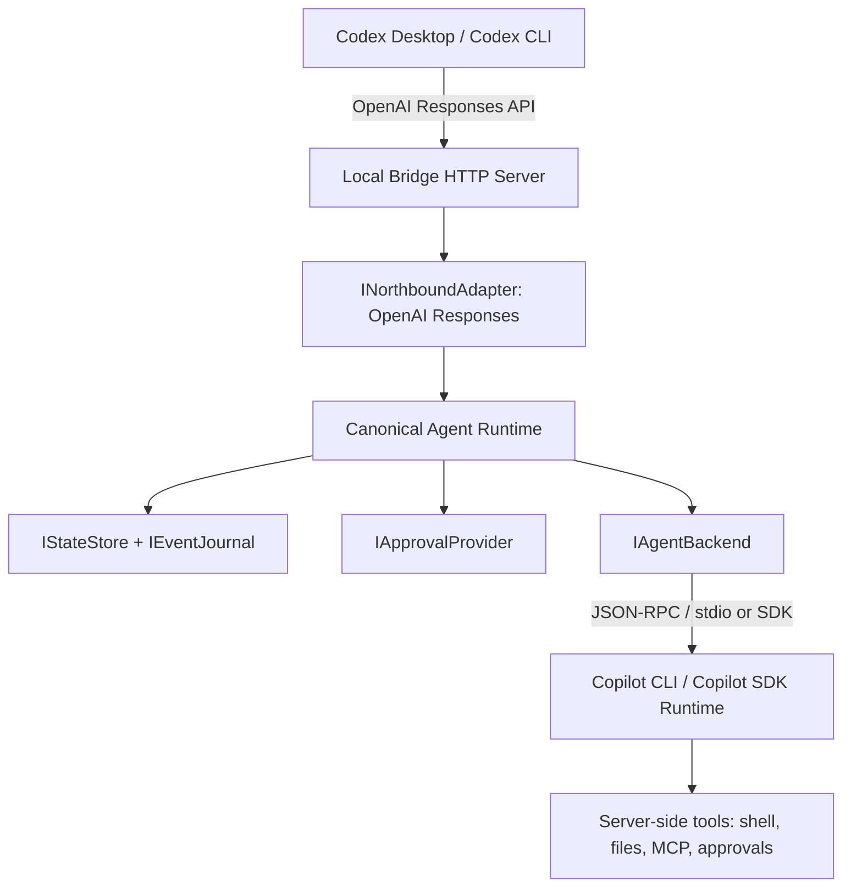

# OpenAI Responses API to Copilot/ACP Agent Bridge Research

## Executive Summary

The recommended best practice is not to build a "Copilot model provider". It is to build a **protocol bridge plus agent-runtime orchestration layer**: expose an OpenAI Responses-compatible API northbound, abstract the southbound side behind replaceable `IAgentBackend` implementations, and start with a Copilot CLI/SDK JSON-RPC/stdio agent runtime. Codex has already moved to the Responses API as its primary custom-provider wire protocol, and the `chat` wire API has been removed from the Codex codebase, so the MVP should not begin by expanding into `/chat/completions`.[^1]

The guiding principles should be **interface-first, stateful, event-journaled, security-by-default, and honest about compatibility**. Do not pretend to support tool-calling lifecycles that the backend does not provide. Copilot/ACP-style backends are closer to server-side agent execution, so tool activity should be mapped to progress events, reasoning summaries, server-side tool events, or permission requests, rather than fabricated as OpenAI client-side `function_call` events.[^2]

## Recommended Architecture



The core layer should only understand these concepts:

```text
Workspace
Thread
Turn
ClientTurnRef
IBackendSession
AgentRequest
AgentEvent
ApprovalRequest
IEventJournal
```

OpenAI, ACP, the Copilot SDK, and SQLite should all be adapters or implementations behind interfaces. For the Agent Loom MVP, Bun is the concrete runtime choice rather than a separate runtime abstraction.

## 1. Project Positioning: Agent Bridge, Not Model Provider

The project should not be defined as a "Copilot provider". A model provider usually means prompt in, text/token/tool-call out. A coding-agent runtime also involves working directories, file reads and writes, shell execution, MCP, permissions, cancellation, event streams, and multi-turn sessions. Codex custom providers now use `"responses"` as the only wire API direction, and the `chat` wire API has been hard-removed in Codex source code.[^1]

A more accurate positioning is:

```text
OpenAI Responses-compatible local API
  <-> canonical agent runtime bridge
  <-> Copilot CLI / Copilot SDK / ACP-style backend
```

This keeps the Codex-facing API stable while allowing future backend additions such as Claude Code, Gemini CLI, Local OpenAI, or a Copilot SDK backend.

## 2. Northbound API: Responses Only for MVP

The MVP northbound API should only implement:

```text
GET  /openai/v1/models
POST /openai/v1/responses
GET  /openai/v1/responses/:id
POST /openai/v1/responses/:id/cancel
```

The Codex models client requests `GET {base_url}/models` and expects a `{ "models": [...] }` response shape, with ETag-based caching support.[^3] The Responses client sends an SSE request to `POST {base_url}/responses` and sets `Accept: text/event-stream`.[^4]

Do not implement these in the first version:

```text
/chat/completions
Anthropic Messages
Gemini
MCP manager
local tool broker
custom UI
```

The hard part of the MVP is not protocol breadth. It is **state continuity, agent-event translation, and permission blocking**. Expanding the protocol surface too early makes it easy to create compatibility illusions before the core agent lifecycle is reliable.

## 3. Session and State: Stateful Bridge, Not Stateless Proxy

The recommended state mapping is:

```text
workspace_id
  -> thread_id
    -> external response_id through client_turn_refs
      -> turn_id
        -> bridge_session_id / backend_session_id
        -> run_id / process_id / event journal
```

`previous_response_id` must not be treated as a passive passthrough field. After every `response.completed`, the bridge should persist:

```text
external response_id -> turn_id
turn_id -> thread_id
turn_id -> bridge_session_id
turn_id -> workspace_id
```

When the next turn arrives with `previous_response_id`, the bridge should resolve the original thread/session and send the prompt back into the same backend session. The Responses API `Response` object includes fields such as `id`, `previous_response_id`, `status`, `output`, `usage`, and `error`, so the bridge must own the lifecycle of those objects.[^5]

Recommended SQLite tables:

```text
workspaces(id, root_path, created_at)
threads(id, workspace_id, created_at, updated_at)
turns(id, thread_id, parent_turn_id, bridge_session_id, status, model, created_at, completed_at)
client_turn_refs(protocol, external_id, turn_id, thread_id, workspace_id, created_at)
backend_sessions(bridge_session_id, thread_id, workspace_id, backend, backend_session_id, process_id, status)
events(id, turn_id, seq, kind, redacted_raw_json, canonical_json, encoded_json, created_at)
approvals(id, turn_id, bridge_session_id, status, request_json, decision_json)
```

## 4. Event Journal: Core Debugging and Reliability Asset

The bridge should persist three forms of every important event:

1. **Raw event**: the original OpenAI request and original ACP/SDK event.
2. **Canonical event**: the bridge's normalized `AgentEvent`.
3. **Encoded event**: the final Responses SSE event sent to Codex.

This is what allows the team to determine whether a bug came from:

```text
Codex request
bridge parser
backend event
permission wait
SSE encoding
client cancellation
```

OpenAI Responses streaming has explicit lifecycle, output item, content part, text delta, reasoning, function call, and built-in tool event types.[^6] ACP/agent-style event models have their own run/message/error/awaiting/cancelled/completed lifecycle events.[^7] The bridge should own its own monotonically increasing `sequence_number`; it should not assume the backend can provide OpenAI-compatible sequencing.[^2]

Recommended debug API:

```text
GET /debug/turns/:id/events
```

Broader thread, backend-session, and approval debug routes are useful later, but they should not be required for the MVP unless implementation evidence shows the single turn-event endpoint is insufficient.

## 5. Streaming Mapping: Be Honest, Do Not Fake Function Calls

Recommended canonical event model:

```ts
type AgentEvent =
  | { type: "turn.created"; turnId: string }
  | { type: "text.delta"; turnId: string; delta: string }
  | { type: "progress"; turnId: string; message: string; data?: unknown }
  | { type: "tool.observed"; turnId: string; toolName: string; input?: unknown; output?: unknown }
  | { type: "permission.required"; turnId: string; approvalId: string; data: unknown }
  | { type: "permission.resolved"; turnId: string; approvalId: string; decision: "allow" | "deny" }
  | { type: "turn.succeeded"; turnId: string; usage?: unknown }
  | { type: "turn.failed"; turnId: string; error: unknown }
  | { type: "turn.cancelled"; turnId: string }
  | { type: "turn.interrupted"; turnId: string; reason: string };
```

Recommended mapping:

| Backend/ACP event | Responses SSE |
| --- | --- |
| run created / accepted | `response.created`, `response.in_progress` |
| assistant text chunk | `response.output_item.added`, `response.content_part.added`, `response.output_text.delta` |
| message completed | `response.output_text.done`, `response.content_part.done`, `response.output_item.done` |
| tool observed after execution | reasoning summary or server-side tool event |
| permission wait | approval item / pending approval state |
| run completed | `response.completed` |
| run failed | `error`, `response.failed` |
| cancellation | `response.incomplete` or cancelled terminal response |

The most important rule is: **do not represent already-executed server-side tools as OpenAI client-side `function_call_arguments.delta/done` events**. OpenAI function-call semantics mean "the model asks the client to execute a tool, and the client sends the result back to the model". ACP/Copilot agents often execute tools themselves; the client sees results or permission requests.[^2]

For tool events:

- If the event clearly maps to a server-side built-in tool, expose it as server-side tool progress.
- If it does not map cleanly, expose it as reasoning/progress.
- If true client-side tool round-tripping is required, mark it unsupported in the MVP.
- If the client sends `tools: [...]`, the MVP should preferably return an explicit `400 unsupported_parameter` rather than pretending to support it.

## 6. Permission Model: Ask by Default

Recommended permission modes:

```text
restricted: deny high-risk actions by default
ask:       block and wait for user approval
allow-all: explicit opt-in only, limited to controlled environments
```

MVP defaults:

```text
filesystem.read = allow
filesystem.write = ask
shell.default = ask
network.default = deny or ask
destructive = deny
```

Production recommendations:

```text
evaluate by workspace policy
evaluate by command allowlist/denylist
evaluate by path scope
write approval decisions to an append-only audit log
support allow-once / allow-always / deny-once / deny-always
```

In the OpenAI Agents HITL design, tools can pause execution via `needs_approval=True` or an approval callback, produce approval items, and resume from state after a decision.[^8] ACP/agent run lifecycles also include awaiting/resume semantics, which are a good fit for external approval flows.[^9]

Each approval record should at least store:

```text
approval_id
turn_id
thread_id
workspace_id
tool/action name
risk class
request payload
decision
decided_by
decided_at
```

## 7. Local HTTP Security: Loopback by Default

This bridge is a local HTTP server plus an agent executor, so its risk profile is high. Default security policy:

```text
bind = 127.0.0.1
require Authorization: Bearer <random token>
reject Origin not in allowlist
no wildcard CORS
no secrets in logs
state-changing endpoints require auth + CSRF/origin checks
```

Production or remote mode:

```text
TLS or reverse proxy
short-lived token
route-level ACL
rate limit
request size limit
structured log redaction
```

ACP production guidance recommends using a reverse proxy for access control and security policy enforcement, and using OpenTelemetry-style tooling for debugging and telemetry.[^10] Logs should default to IDs, status, latency, and error codes only. They should avoid prompts, file contents, `Authorization`, GitHub tokens, and domain secrets.

## 8. Implementation Stack

There is an important trade-off around runtime portability. For Agent Loom's MVP, the final design intentionally chooses **TypeScript with Bun-native infrastructure**: `Bun.serve()`, `bun:sqlite`, `Bun.spawn()`, `bun test`, and `bun run`. The interface seams should be at client protocols, backend protocols, persistence, approvals, workspace resolution, and journaling; a separate runtime abstraction would be premature until a second runtime is real.

Recommended module boundaries:

```text
src/
  core/
    types.ts
    agent-events.ts
    session-manager.ts
    errors.ts

  northbound/
    openai-responses/
      adapter.ts
      schemas.ts
      sse.ts

  backends/
    copilot-sdk/
      backend.ts
    copilot-cli-acp/
      backend.ts
      process-manager.ts
      jsonrpc-client.ts

  state/
    store.ts
    sqlite-store.ts
    migrations/

  approvals/
    provider.ts
    policy-provider.ts

  server/
    app.ts
    routes.responses.ts
    routes.models.ts
    routes.debug.ts
```

Testing strategy:

```text
unit tests: canonical event mapping
contract tests: OpenAI Responses SSE shape
mock backend tests: fake ACP/SDK event stream
golden replay: raw backend events -> encoded SSE
integration: real Copilot CLI/SDK behind feature flag
crash recovery: restart bridge and continue previous_response_id chain
```

Bun's `bun:sqlite`, `Bun.serve()`, and `Bun.spawn()` are the recommended MVP implementation APIs. Bun standalone executables may be useful for distribution, and SQLite is a reasonable MVP store.[^11]

## 9. Backend Choice

The research found three major routes:

| Route | Good fit | Poor fit |
| --- | --- | --- |
| VS Code LM API / extension proxy | appearing in the VS Code model picker | headless bridge |
| Copilot SDK / CLI JSON-RPC | standalone bridge, server-side agent runtime | full low-level model control |
| private Copilot API proxy | prototyping | production, long-term maintenance, compliance-sensitive use |

VS Code's `registerLanguageModelChatProvider` is an extension API surface. It is useful for integrating with the VS Code model picker, but it is not a headless HTTP bridge.[^12] The Copilot SDK/CLI JSON-RPC route is closer to the desired agent backend, and existing Python/JS OpenAI-compatible proxy projects demonstrate useful patterns such as per-token client caching, session pruning, and tool interception.[^13] Directly calling private Copilot APIs is simpler, but it relies on undocumented interfaces and is not a suitable best-practice path because of stability and compliance risk.[^14]

## 10. MVP Roadmap

### Phase 0: Protocol Probe

Goal: confirm the real backend capabilities.

Acceptance criteria:

```text
can start backend
can initialize
can create session
can send prompt
can receive streaming text
can receive or simulate permission request
can cancel
```

### Phase 1: Minimal Responses Bridge

Goal: Codex can connect to the provider and complete a single-turn text task.

Implementation:

```text
GET /openai/v1/models
POST /openai/v1/responses
SSE: response.created -> response.output_text.delta -> response.completed
in-memory turn/event tracking for POST + GET response retrieval
```

### Phase 2: Multi-turn Session

Goal: `previous_response_id` returns to the same backend session.

Implementation:

```text
external response_id -> turn_id
turn_id -> thread_id
thread_id -> backend_session_id
workspace_id -> backend process
```

### Phase 3: Permissions and Cancellation

Goal: file writes, shell commands, and other tools can safely block for approval.

Implementation:

```text
IApprovalProvider
internal or HTTP approval API based on Phase 0 decision
POST /responses/:id/cancel
```

### Phase 4: Event Journal and Replay

Goal: every failure can be reconstructed.

Implementation:

```text
redacted request event journal
redacted backend event journal
canonical event journal
encoded SSE event journal
single turn-event debug endpoint if needed
golden replay tests
```

### Phase 5A: Recovery and Cleanup Hardening

Goal: make the bridge suitable for long-running use.

Implementation:

```text
startup recovery and process identity validation
shutdown orchestration and forced disposal
session pruning and retention semantics
```

### Phase 5B: Configuration and Packaging Hardening

Goal: make the bridge easier to operate without expanding protocol scope.

Implementation:

```text
config validation
health checks
minimal metrics
packaging
```

## 11. Anti-patterns

Avoid these:

1. **Starting a new Copilot process for every request.** Reuse by workspace/token/session and prune stale sessions.[^13]
2. **Stateless forwarding.** Coding agents require session/thread continuity.
3. **Fabricating function calls.** If the backend does not provide a client-side tool lifecycle, do not pretend it does.[^2]
4. **Supporting too many protocols in version one.** Start with Responses; do not add Anthropic, Gemini, and chat all at once.
5. **Defaulting to allow-all.** Allow-all should only be explicit opt-in.
6. **Listening on `0.0.0.0`.** A local bridge should bind to loopback by default.
7. **Logging prompts, secrets, or file contents.** Redact by default.
8. **Ignoring cancellation.** If the user disconnects the SSE stream, cancel the backend run.
9. **Skipping the event journal.** Without replay, protocol bridge bugs are nearly impossible to debug.
10. **Depending on private Copilot APIs.** They are acceptable for prototypes only, not as the product path.[^14]

## Confidence Assessment

High confidence:

- Codex custom providers should center on the Responses API, and the `chat` wire API has been removed.[^1]
- The bridge must maintain external `response_id` / `previous_response_id` references through `client_turn_refs` into canonical turn/thread/session mappings, or multi-turn agent flows will break.[^5]
- OpenAI Responses SSE and ACP/agent lifecycles have different semantics and require a canonical event model for translation.[^2]
- Permissions, event journaling, cancellation, and replay are first-class coding-agent bridge capabilities, not optional extras.[^8][^9]

Medium confidence:

- Copilot CLI/SDK JSON-RPC/stdio is the best current southbound route. Public information shows that SDKs wrap CLI JSON-RPC, but specific Copilot CLI ACP details may change during preview.[^15]
- Bun-first development is the right MVP fit for this repository; runtime portability can be reconsidered only if a second runtime becomes real.

Low confidence / requires hands-on verification:

- The exact GitHub Copilot CLI ACP method and event names may not exactly match public ACP or the Codex app-server protocol. They should be verified by capturing a real CLI handshake.
- Some OpenAI Responses API details are based on SDK type definitions rather than direct access to the official web documentation.
- Copilot SDK/CLI preview releases may break interfaces, so versions must be pinned and protected by contract tests.

## Footnotes

[^1]: Codex `WireApi::Responses` and chat wire API removal: https://github.com/openai/codex/blob/ff27d01676a93be7467b3893e82f41a7af7e1418/codex-rs/model-provider-info/src/lib.rs

[^2]: Protocol mapping research based on OpenAI Responses event types and ACP event lifecycle: `openai/openai-python/src/openai/types/responses/response_stream_event.py`, `i-am-bee/acp/python/src/acp_sdk/models/models.py:3000+`, and ACP run lifecycle docs: https://agentcommunicationprotocol.dev/core-concepts/agent-run-lifecycle.md

[^3]: Codex models endpoint client, `GET /models`, ETag, `{ models: [...] }` schema: https://github.com/openai/codex/blob/ff27d01676a93be7467b3893e82f41a7af7e1418/codex-rs/codex-api/src/endpoint/models.rs

[^4]: Codex Responses client, `POST /responses`, SSE and `Accept: text/event-stream`: https://github.com/openai/codex/blob/ff27d01676a93be7467b3893e82f41a7af7e1418/codex-rs/codex-api/src/endpoint/responses.rs

[^5]: Codex response/common types including `ResponsesApiRequest`, `ResponseCreateWsRequest`, `previous_response_id`, `ResponseEvent::Completed { response_id }`: https://github.com/openai/codex/blob/ff27d01676a93be7467b3893e82f41a7af7e1418/codex-rs/codex-api/src/common.rs

[^6]: OpenAI Python SDK Responses stream event union: https://github.com/openai/openai-python/blob/main/src/openai/types/responses/response_stream_event.py

[^7]: ACP event/run/message model reference: https://github.com/i-am-bee/acp and ACP lifecycle docs: https://agentcommunicationprotocol.dev/core-concepts/agent-run-lifecycle.md

[^8]: OpenAI Agents Python SDK Human-in-the-Loop guide: https://openai.github.io/openai-agents-python/human_in_the_loop/

[^9]: ACP awaiting/resume and external response flow: https://agentcommunicationprotocol.dev/how-to/await-external-response.md

[^10]: ACP production-grade guidance and debug/telemetry docs: https://agentcommunicationprotocol.dev/core-concepts/production-grade.md and https://agentcommunicationprotocol.dev/how-to/debug.md

[^11]: Bun standalone executables and SQLite docs: https://bun.sh/docs/bundler/executables and https://bun.sh/docs/api/sqlite

[^12]: VS Code proposed `LanguageModelChatProvider` API and Language Model API tutorial: https://raw.githubusercontent.com/microsoft/vscode/main/src/vscode-dts/vscode.proposed.chatProvider.d.ts and https://code.visualstudio.com/api/extension-guides/language-model-tutorial

[^13]: Copilot SDK OpenAI proxy references and SDK package references: https://github.com/andrea9293/copilot-sdk-openai-proxy, https://github.com/rezrov/copilot-proxy, https://registry.npmjs.org/@github/copilot-sdk, https://pypi.org/project/github-copilot-sdk/

[^14]: Private Copilot API gateway/proxy examples identified as high-risk alternatives: https://github.com/suhaibbinyounis/github-copilot-api-vscode

[^15]: GitHub Copilot SDK public preview package descriptions and transport modes from npm/PyPI: https://registry.npmjs.org/@github/copilot-sdk and https://pypi.org/project/github-copilot-sdk/
