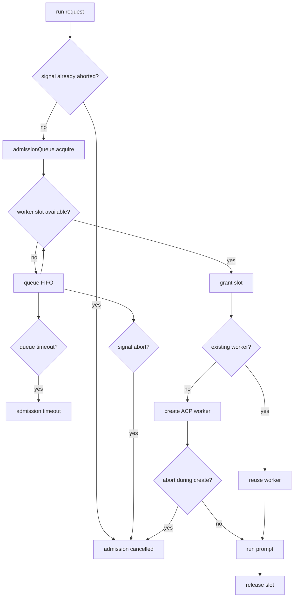

# Volare best-practice target architecture

## Status

Implemented on `lachimere/refine-arch`. PR 0 through PR 9 are complete, and follow-up review refinements have landed through `8dcec47 fix(core): prevent queued turn cancellation race`.

The remaining historical notes in this document describe the target architecture and original gaps that drove the work; they are not a list of open implementation tasks.

## Architecture intent

The target architecture is a **stateful local agent-runtime bridge**. The goal is not to make Volare a generic model proxy; the goal is to make runtime control, state, cancellation, approval, capacity, and observability explicit and maintainable.

The architecture should preserve the clean protocol-neutral seams that already exist while adding a clearer runtime control plane around capacity, approval, cancellation, policy, and worker lifecycle.

## Target architecture

```mermaid
graph TD
  subgraph Clients[Clients]
    Codex[Codex CLI / Desktop]
    FutureUI[Future UI / AG-UI]
    FutureAgent[Future MCP / A2A client]
  end

  subgraph Northbound[Northbound protocol adapters]
    Responses[OpenAI Responses adapter]
    FutureAGUI[Future AG-UI adapter]
    FutureMCPA2A[Future MCP / A2A adapter]
    ProtocolErrors[Protocol error codec]
    CapabilityProjection[Capability projection endpoint]
  end

  subgraph App[HTTP app layer]
    Auth[Bearer auth + Origin rejection]
    Routes[Route dispatch]
    SseConnection[HTTP/SSE connection setup]
    TransportErrors[Transport error envelope]
  end

  subgraph Core[Protocol-neutral runtime core]
    Threads[Thread manager]
    Turns[Turn manager]
    BackendSessions[Backend session manager]
    AgentEvents[Canonical AgentEvent stream]
    Workspace[Workspace resolver]
    ApprovalState[Approval state machine]
  end

  subgraph Control[Runtime control plane]
    RuntimeCapabilities[Runtime capability registry]
    Capacity[Active-turn capacity]
    Admission[ACP worker admission queue]
    Cancel[Cancellation state machine]
    Approval[Approval resolution pipeline]
    ContentPolicy[Workspace / content exclusion policy]
    PermissionPolicy[Tool / permission policy decisions]
    Lifecycle[Shutdown drain / idle reaper / notifier]
  end

  subgraph StateObs[State and observability]
    State[SQLite state store]
    Journal[Event journal + replay]
    Redaction[Redaction layer]
    Metrics[Metrics]
    Logs[Structured logs]
    Trace[Request / turn correlation]
    EventSchema[AgentEvent schema versioning]
  end

  subgraph Backend[Backend runtime layer]
    AgentBackend[IAgentBackend]
    Copilot[CopilotCliBackend]
    PermissionTranslator[ACP permission callback translator]
  end

  subgraph CopilotRuntime[Copilot runtime implementations]
    Process[Process runner\ncopilot --prompt]
    ACP[ACP runner\ncopilot --acp workers]
    Peer[AcpJsonRpcPeer\nNDJSON JSON-RPC]
    Probes[ACP probes\nauth / cancel / capability]
  end

  Codex --> Responses
  FutureUI --> FutureAGUI
  FutureAgent --> FutureMCPA2A

  Responses --> Auth
  FutureAGUI --> Auth
  FutureMCPA2A --> Auth
  Responses --> ProtocolErrors
  FutureAGUI --> ProtocolErrors
  FutureMCPA2A --> ProtocolErrors
  Auth --> Routes
  Routes --> SseConnection
  Routes --> TransportErrors
  Routes --> CapabilityProjection
  CapabilityProjection --> RuntimeCapabilities

  SseConnection --> Turns
  Threads --> Turns
  Turns --> AgentEvents
  Turns --> Workspace
  Turns --> ApprovalState
  Threads --> BackendSessions

  Turns <--> Capacity
  BackendSessions <--> Admission
  Turns <--> Cancel
  ApprovalState --> Approval
  Approval --> ApprovalState
  Workspace --> ContentPolicy
  Approval --> PermissionPolicy
  PermissionPolicy --> Approval
  Lifecycle --> Admission
  Lifecycle --> Approval
  Lifecycle --> Turns
  Lifecycle --> BackendSessions

  Threads <--> State
  Turns <--> State
  BackendSessions <--> State
  ApprovalState <--> State
  AgentEvents --> Journal
  Journal --> Redaction
  Journal --> EventSchema
  AgentEvents --> Metrics
  Turns --> Logs
  Routes --> Trace

  BackendSessions --> AgentBackend
  Turns --> BackendSessions
  AgentBackend --> Copilot
  AgentBackend --> RuntimeCapabilities
  AgentBackend --> PermissionTranslator
  PermissionTranslator --> PermissionPolicy
  Copilot --> Process
  Copilot --> ACP
  ACP --> Peer
  ACP --> Probes
  Probes --> RuntimeCapabilities

  classDef future fill:#eef5ff,stroke:#7aa7ff,color:#1f3a5f
  class FutureUI,FutureAgent,FutureAGUI,FutureMCPA2A,CapabilityProjection future
```

Legend: blue nodes are target-state or future extension points. Unstyled nodes represent either current components or near-term extraction targets from current components.

## Layer responsibilities

### Clients

Clients own their wire protocol expectations. Codex CLI/Desktop currently speaks OpenAI Responses-compatible HTTP/SSE. Future clients may speak AG-UI, MCP, or A2A, but they should not influence core runtime semantics directly.

### Northbound protocol adapters

Adapters translate wire protocol into protocol-neutral runtime input and translate canonical `AgentEvent` streams back into client-specific output.

Adapters should own:

- request parsing
- workspace hint extraction
- stream encoding
- stored response encoding
- protocol-specific errors
- compatibility quirks
- protocol-specific capabilities and model/catalog encoding

Adapters should not own:

- ACP method names
- Copilot CLI flags
- worker capacity
- backend cancellation details
- SQLite schema details
- runtime capacity or approval decisions

### HTTP app layer

The HTTP app should become a thin composition layer:

- authenticate and reject unsafe Origins
- route requests
- establish HTTP/SSE connections
- delegate protocol parsing/encoding to adapters
- delegate runtime semantics to the core thread/turn/backend-session managers
- attach request IDs and metrics
- return transport-level status codes and generic error envelopes

It should not remain the owner of stream lifecycle, journal writing, metrics, and protocol error encoding all in one large file. The app owns the HTTP connection and response framing boundary; an extracted stream lifecycle observer should own cancellation hooks, terminal-event observation, journal wrapping, cleanup, and timing metrics. Protocol-specific error body encoding belongs in the active northbound adapter.

### Protocol-neutral runtime core

The core owns agent-runtime semantics:

- workspace resolution
- thread lifecycle as the durable conversation
- turn lifecycle as the unit of streaming, cancellation, active-capacity counting, and terminal status
- backend session lifecycle as the per-thread backend runtime handle
- canonical `AgentEvent` model
- approval state
- backend session state
- runtime/backend capability aggregation
- cancellation semantics

Core must not leak OpenAI Responses IDs, Codex profile configuration, ACP wire methods, or Copilot model-provider details.

The core should not become a single god object. `Thread`, `Turn`, and `BackendSession` are separate concepts:

| Concept | Owns | Does not own |
|---|---|---|
| Thread | durable conversation identity and parent/continuation relationships | backend process handles |
| Turn | one request/stream/cancel lifecycle and active-turn accounting | protocol wire encoding |
| Backend session | backend runtime binding for a thread/workspace | HTTP routes or approval API decisions |

When a turn starts, the turn manager resolves or creates the backend session for that turn's thread before backend execution. A turn should never create backend processes directly; it obtains a backend session through the backend-session manager.

`BridgeSessionId` remains a bridge-owned identity that links client-visible turn/thread state to a backend session record. It is not the durable conversation (`Thread`) and not the backend protocol session ID. Future refactors may rename it, but the target architecture keeps the distinction explicit.

Runtime/backend capability reporting should be aggregated by a small registry owned at the core/control boundary. It should combine runtime capabilities, backend capabilities, and probe-derived ACP support. Adapter-specific capability projection and wire encoding belong in the northbound layer or endpoint composition layer, not in protocol-neutral core.

### Runtime control plane

The control plane makes the runtime reliable under load and under interruption:

- `maxActiveSessions` enforcement for active turns
- ACP worker admission queue
- cancellation state machine
- approval resolution pipeline
- content-exclusion and workspace policy decisions
- ACP permission and future tool-permission decisions
- lifecycle coordination for shutdown, queued admission, idle reaping, and in-process notifications

This is the highest-priority refactor area because current bugs and incidents are control-plane failures, not protocol-adapter failures.

Approval responsibilities should be split deliberately:

- Core owns durable approval state transitions (`pending -> allowed | denied | timed_out | aborted`) and records canonical approval events.
- The control plane owns the approval resolution pipeline: API decision intake, session ownership checks, waiter notification, TTL/expiry enforcement, and polling fallback.
- The control plane submits decisions to core; it should not mutate durable state through side channels.
- Approval resolution must bind decisions to `turnId`, `backendSessionId` or equivalent session ownership data, and `approvalId`. Decisions are idempotent once an approval reaches a terminal status.

Cancellation responsibilities should be split deliberately:

- Core owns turn cancellation state transitions, such as `running -> cancelling -> cancelled | interrupted | failed | already_terminal`.
- The control plane owns cancel intent routing, timeout budgets, duplicate/re-entrant cancel handling, and coordination with stream lifecycle.
- The backend owns runtime-specific cleanup (`kill`, native ACP cancel, process disposal) and returns `ICancelResult`.
- Active-turn capacity slots are released when the core observes a terminal turn event or resolves cancellation to a terminal result. A mere cancel request does not release the slot; backend cleanup completion should not keep the slot after a terminal result has been recorded.

Capacity policy should be explicit per axis:

- Active turn capacity (`maxActiveSessions`) should reject new turns with a retryable capacity error rather than queueing entire HTTP turns in memory.
- ACP worker capacity should use an admission queue because the request has already entered backend execution and a worker slot may become available quickly.
- Queued backend work must be AbortSignal-aware so client disconnect or explicit cancellation removes it from the queue.
- The existing `maxActiveSessions` name is retained for compatibility, but the target semantics are active-turn capacity rather than durable backend-session count.
- A request admitted past the active-turn gate counts as active while waiting in ACP worker admission. The admission queue must therefore be bounded and timeout-driven so active-turn slots cannot be held indefinitely by queued backend work.
- Backend cancellation is initiated by the core/control plane as a turn intent. The backend executes the runtime-specific cancellation strategy (`kill`, ACP native, or fallback), reports an `ICancelResult`, and must not mutate core turn state directly.
- Default cancellation remains kill-and-replace. ACP native cancel is a validation path only until probe evidence proves `stopReason: "cancelled"` plus safe reuse for the current runtime/version; `auto` must behave like kill when evidence is absent or unknown.
- The existing turn status `queued` is retained for pre-running turn records and should not become an unbounded HTTP queue. ACP worker admission may expose a separate queued-admission state or metric, but it should not overload durable turn status unless a schema change explicitly defines that meaning.

### State and observability

State and observability should remain cross-cutting but not business-logic owners:

- SQLite state store persists durable records
- event journal records canonical events and supports replay/debug
- structured logs expose lifecycle and timing
- metrics expose aggregate health and pressure
- request/turn IDs support correlation
- canonical event schema versions protect replay across changes; additive changes keep the same major version, while breaking event-shape changes require a replay upgrade path
- redaction is a mandatory journal/log boundary, not an optional debug feature

Hot-path observability should be measured before optimizing. Journal append cost should be measured before batching or async writes.

Observability should not own business decisions. It reports what happened, supports replay/debug, and exposes health/pressure. It should not decide approval, cancellation, or admission outcomes.

### Backend runtime layer

`IAgentBackend` is the backend semantic boundary. Today `CopilotCliBackend` is the only real backend. Future backends should not be introduced until there is a concrete product requirement.

A backend owns:

- backend session creation/resume/disposal
- streaming backend output as `AgentEvent`s
- backend cancellation
- backend capability reporting

A backend should not own HTTP routes, OpenAI response encoding, or northbound client details.

The backend seam is still valuable even with one production backend. It supports testability, keeps Copilot-specific behavior out of core, and gives future research spikes a stable integration boundary. This is not a mandate to add more production backends.

### Copilot runtime implementations

The Copilot backend has two runner modes:

- process runner: stable rollback path, one process per turn
- ACP runner: long-lived worker path, probe-gated

The custom ACP peer should stay for now because it handles Bun flush semantics, per-request timeouts, structured diagnostics, and cancellation/worker lifecycle integration that the SDK does not replace cleanly.

Type/schema imports from the official ACP SDK may be adopted incrementally if they improve compile-time safety without changing runtime transport. Runtime transport replacement remains deferred until SDK timeout, logging, Bun stream, and force-cancel needs are satisfied.

## Security and policy boundaries

Security is not one module; it is a set of non-bypassable boundaries:

| Boundary | Owner | Notes |
|---|---|---|
| Bearer auth, Origin rejection, CORS posture | HTTP app layer | Must run before route-specific handling. |
| Protocol request validation | Northbound adapter | Must reject malformed wire input before core state changes. |
| Workspace canonicalization and allowlist | Core workspace resolver | Must use canonical roots and reject unsafe explicit workspace hints. |
| Content exclusion / local access policy | Control plane | Must apply before backend prompt/tool execution when policy is available. If policy data is unavailable in an environment that requires it, fail closed or fall back to a narrower explicit allowlist; do not silently broaden access. |
| Approval decision ownership | Control plane + core | API path verifies ownership; core records durable transitions. |
| ACP permission callback translation | Backend runtime -> control plane | Backend translates ACP callback shape; control plane decides. |
| Redaction | State/observability | Journal/log writes pass through redaction and fail closed. |
| Shared-deployment identity | Future control plane | Multi-user mode requires per-user tokens and session ownership checks; shared local credentials are not acceptable. |

ACP permission callbacks should flow from the ACP peer/backend into the control-plane permission policy and approval pipeline. They should not be handled by HTTP routes and should not bypass approval ownership checks when interactive approval is required.

## Immediate architecture priorities

### 0. Record a baseline

Before changing runtime control behavior, capture a baseline for latency, cancellation, worker pressure, approval wait, and journal append cost. The baseline should include sample counts or p50/p90 values where possible. This keeps later work measurable rather than aesthetic.

### 1. Enforce `maxActiveSessions`

The configuration exists and active turn count exists, but the runtime currently needs an actual capacity gate. This should be one of the first architecture hardening PRs.

Active-turn capacity should reject new turns with a retryable capacity error rather than queueing entire HTTP turns in memory. This is intentionally different from ACP worker admission, which can safely queue once a request has already reached backend execution.

### 2. Close the approval resolution loop

Approval provider resolution exists, but the HTTP/API path is incomplete. This blocks future permission/tool brokering and should be treated as high priority.

This phase should introduce an approval waiter seam with the current polling implementation behind it. The later event-driven approval phase can then replace the waiter without rewriting the route.

### 3. Add a minimal runtime capability registry

Create an internal runtime/backend capability source of truth before exposing any new endpoint. It should aggregate runtime features, backend capabilities, and probe-derived ACP support. Adapter-specific projection can remain later, but route handlers should not become the capability registry.

### 4. Add ACP worker admission queue

Replace immediate `backend_worker_cap_exhausted` with queueing, timeout, and cancellation. The queue should be abort-signal aware and should keep a way to preserve current hard-fail behavior with timeout `0` if needed.

Queued work and in-flight worker creation must both release their slot on cancellation, timeout, startup failure, and shutdown drain.

### 5. Add ACP worker metrics and idle reaper

Expose worker pressure in `/metrics` and logs:

- active workers
- creating workers
- idle workers
- admission queue depth
- admission timeout count
- admission cancelled count

Add a background idle reaper so idle worker cleanup does not depend on the next request.

Shutdown must also be explicit: the lifecycle layer should stop accepting queued work, reject queued admissions with a documented cancellation error, cancel or drain active turns according to the configured timeout, resolve pending approval waiters to a terminal state, and flush or safely close the journal.

### 6. Split `app.ts` responsibilities

Extract incrementally:

- stream lifecycle observer
- journal wrapper
- metrics collector
- OpenAI Responses error encoder extraction into the adapter package
- route handlers

Do not rewrite the whole app at once. Each bullet should be a separate PR-sized slice unless a smaller mechanical dependency requires pairing.

### 7. Replace approval polling with event-driven await

Keep SQLite as source of truth, but add an in-process notification path for same-process decisions. Fall back to polling for cross-process or restarted cases.

## Defer

Defer these until the control plane is stable:

- production model router
- full tool-call broker
- MCP server surface
- AG-UI northbound adapter
- A2A federation
- full ACP SDK replacement
- SSE resume
- enterprise/shared-deployment content policy provider

Small seams that support future work, such as a capability registry or approval waiter interface, are not the same as implementing the full deferred feature. The deferred item is the production capability, not every enabling seam.

## Avoid

Avoid these architecture moves:

- turning Volare into a general LiteLLM/Portkey-style provider gateway
- directly calling private Copilot endpoints
- accepting provider API keys from northbound clients
- using shared Copilot credentials for multi-user bridge deployments
- running the Copilot CLI backend as a shared multi-user service without per-process workspace and identity isolation
- enabling broad CORS/browser trust
- replacing custom ACP transport before preserving timeout/flush/cancel semantics

## Phased roadmap

| Phase | Goal | Primary change | Acceptance criteria |
|---|---|---|---|
| 0 | Baseline | Measure latency, cancel, worker pressure, approval wait, journal append cost | Baseline report follows the sample minimums in `design.md` for synthetic metrics; live-Copilot metrics may use smaller samples only with explicit confidence caveats. |
| 1 | Active session cap | Enforce `maxActiveSessions` | Concurrent turn test proves over-cap requests fail with a typed `capacity_exhausted`/equivalent core error, adapters map it to retryable wire semantics, and no turn/session state leaks. |
| 2 | Approval closure | Add approval resolution route/path plus waiter seam | Pending approval can be resolved through API; wrong turn/session ownership is rejected; duplicate resolve attempts return the existing terminal decision without state change; timeout behavior still works. |
| 3 | Runtime capability registry | Add internal runtime/backend capability aggregation | Unit tests cover runtime/backend/probe capability merge and invalidation semantics; no adapter-specific wire fields enter core. |
| 4 | Worker admission | Add ACP admission queue | Concurrent worker-cap test proves FIFO drain, queued abort removal, create-time abort slot release, explicit timeout, and shutdown drain. |
| 5 | Worker observability | Add metrics + idle reaper | Metrics expose active/creating/idle/queue depth; idle worker is reaped without a new request; shutdown drains queued admissions and active turns according to documented timeouts. |
| 6 | App boundary cleanup | Split stream/journal/metrics/error responsibilities | Route/status/SSE behavior remains unchanged; OpenAI error body encoding lives in adapter code. |
| 7 | Approval wait improvement | Event-driven await with polling fallback | Same-process resolution wakes without polling delay; restart/cross-process fallback still observes SQLite decision. |
| 8 | Capability endpoint | Expose runtime/northbound capabilities | Endpoint returns a versioned, non-secret adapter projection derived from the runtime registry plus adapter capabilities. |
| 9 | SSE resume design | Design event IDs + Last-Event-ID replay | Design doc defines event ID assignment, replay cursor semantics, terminal-event idempotency, and event schema migration strategy. It must include a future test plan covering journals written under at least one prior schema version. |

## Success criteria

The architecture is improving if:

- approval requests can be resolved through a real API path
- cancellation remains deterministic under races
- active-turn over-cap returns a retryable capacity error rather than a raw 5xx
- ACP worker over-cap enters FIFO admission with timeout/cancel semantics rather than raw 5xx
- `app.ts` becomes thinner without changing behavior
- observability is non-blocking or measured before optimization
- protocol adapters remain protocol-only
- core remains free of OpenAI/Codex/ACP wire details
- backend runners remain swappable behind `ICopilotPromptRunner`
