# Volare architecture refinement design

> Purpose: document the target architecture and design decisions for review before any execution planning.
> Do not proceed to implementation planning until this design is approved.

## Status

Implemented on `lachimere/refine-arch`. The reviewed design moved through implementation, multi-round review/refine, and the late queued-cancel race fix in `8dcec47`.

This document remains the design record; completed-gap language below is historical context unless a later plan explicitly reopens it.

## Objective

Refine Volare toward a **stateful local agent-runtime bridge** architecture with clear boundaries for protocol adapters, HTTP transport, protocol-neutral runtime state, runtime control-plane concerns, observability, and backend execution.

This design is based on `plans/refine-arch/research.md` and the reviewed target architecture in `plans/refine-arch/arch.md`. The core correction from the research is that Volare should not become a generic stateless model proxy; it should first harden its local runtime control plane.

## Architecture / Approach

### High-level approach

The target architecture separates responsibilities into six layers:

1. **Northbound protocol adapters** translate client wire protocols into protocol-neutral runtime input and encode canonical runtime events back to the client.
2. **HTTP app layer** owns transport security, route dispatch, HTTP/SSE connection setup, request IDs, and transport-level status/error envelopes.
3. **Protocol-neutral runtime core** owns thread, turn, bridge session identity, backend session, approval state, workspace resolution, and canonical events. Runtime/backend capability aggregation lives at the core/control boundary.
4. **Runtime control plane** owns capacity, worker admission, cancellation coordination, approval resolution, permission/content policy, lifecycle drain, and notifier behavior.
5. **State and observability** owns durable state, event journal/replay, redaction, metrics, logs, trace correlation, and event schema versioning.
6. **Backend runtime layer** owns backend execution and Copilot-specific runtime integration behind stable runner/backend interfaces.

### Target architecture diagram

```mermaid
graph TD
  subgraph Clients[Clients]
    Codex[Codex CLI / Desktop]
    FutureUI[Future UI / AG-UI]
    FutureAgent[Future MCP / A2A client]
  end

  subgraph Northbound[Northbound protocol adapters]
    Responses[OpenAI Responses adapter]
    FutureAGUI[Future AG-UI adapter]
    FutureMCPA2A[Future MCP / A2A adapter]
    ProtocolErrors[Protocol error codec]
    CapabilityProjection[Capability projection endpoint]
  end

  subgraph App[HTTP app layer]
    Auth[Bearer auth + Origin rejection]
    Routes[Route dispatch]
    SseConnection[HTTP/SSE connection setup]
    TransportErrors[Transport error envelope]
  end

  subgraph Core[Protocol-neutral runtime core]
    Threads[Thread manager]
    Turns[Turn manager]
    BackendSessions[Backend session manager]
    AgentEvents[Canonical AgentEvent stream]
    Workspace[Workspace resolver]
    ApprovalState[Approval state machine]
  end

  subgraph Control[Runtime control plane]
    RuntimeCapabilities[Runtime capability registry]
    Capacity[Active-turn capacity]
    Admission[ACP worker admission queue]
    Cancel[Cancellation state machine]
    Approval[Approval resolution pipeline]
    ContentPolicy[Workspace / content exclusion policy]
    PermissionPolicy[Tool / permission policy decisions]
    Lifecycle[Shutdown drain / idle reaper / notifier]
  end

  subgraph StateObs[State and observability]
    State[SQLite state store]
    Journal[Event journal + replay]
    Redaction[Redaction layer]
    Metrics[Metrics]
    Logs[Structured logs]
    Trace[Request / turn correlation]
    EventSchema[AgentEvent schema versioning]
  end

  subgraph Backend[Backend runtime layer]
    AgentBackend[IAgentBackend]
    Copilot[CopilotCliBackend]
    PermissionTranslator[ACP permission callback translator]
  end

  subgraph CopilotRuntime[Copilot runtime implementations]
    Process[Process runner\ncopilot --prompt]
    ACP[ACP runner\ncopilot --acp workers]
    Peer[AcpJsonRpcPeer\nNDJSON JSON-RPC]
    Probes[ACP probes\nauth / cancel / capability]
  end

  Codex --> Responses
  FutureUI --> FutureAGUI
  FutureAgent --> FutureMCPA2A

  Responses --> Auth
  FutureAGUI --> Auth
  FutureMCPA2A --> Auth
  Responses --> ProtocolErrors
  FutureAGUI --> ProtocolErrors
  FutureMCPA2A --> ProtocolErrors
  Auth --> Routes
  Routes --> SseConnection
  Routes --> TransportErrors
  Routes --> CapabilityProjection
  CapabilityProjection --> RuntimeCapabilities

  SseConnection --> Turns
  Threads --> Turns
  Turns --> AgentEvents
  Turns --> Workspace
  Turns --> ApprovalState
  Threads --> BackendSessions

  Turns <--> Capacity
  BackendSessions <--> Admission
  Turns <--> Cancel
  ApprovalState --> Approval
  Approval --> ApprovalState
  Workspace --> ContentPolicy
  Approval --> PermissionPolicy
  PermissionPolicy --> Approval
  Lifecycle --> Admission
  Lifecycle --> Approval
  Lifecycle --> Turns
  Lifecycle --> BackendSessions

  Threads <--> State
  Turns <--> State
  BackendSessions <--> State
  ApprovalState <--> State
  AgentEvents --> Journal
  Journal --> Redaction
  Journal --> EventSchema
  AgentEvents --> Metrics
  Turns --> Logs
  Routes --> Trace

  BackendSessions --> AgentBackend
  Turns --> BackendSessions
  AgentBackend --> Copilot
  AgentBackend --> RuntimeCapabilities
  AgentBackend --> PermissionTranslator
  PermissionTranslator --> PermissionPolicy
  Copilot --> Process
  Copilot --> ACP
  ACP --> Peer
  ACP --> Probes
  Probes --> RuntimeCapabilities

  classDef future fill:#eef5ff,stroke:#7aa7ff,color:#1f3a5f
  class FutureUI,FutureAgent,FutureAGUI,FutureMCPA2A,CapabilityProjection future
```



Legend: blue nodes are target-state or future extension points. Unstyled nodes represent current components or near-term extraction targets.

### Core interaction flow

1. A client sends an HTTP request to a northbound route.
2. The HTTP app authenticates the request, rejects unsafe origins, and delegates protocol parsing to the active adapter.
3. The adapter parses wire input into protocol-neutral runtime input.
4. The runtime core resolves workspace/thread/turn/backend-session state.
5. The control plane enforces active-turn capacity and coordinates approval/cancellation/policy decisions.
6. The backend runtime executes the turn through the current runner (`process` or `acp`).
7. Backend output is normalized into canonical `AgentEvent`s.
8. State and observability persist/redact/journal/measure the event stream.
9. The adapter encodes canonical events into client-specific output.

## Interface / API / Schema Design

This design does not implement interfaces yet. It defines the target boundaries and first expected interface seams.

### New or changed interfaces

Expected future interface seams:

- `IRuntimeCapabilityRegistry` or equivalent internal capability source.
- `IApprovalWaiter` / `IApprovalNotifier` seam for replacing polling with event-driven waits.
- `IWorkerAdmissionQueue` for ACP worker admission and queue metrics.
- Extracted stream lifecycle observer for SSE cancellation/timing/journal hooks.
- Optional future schema version metadata for canonical `AgentEvent` replay compatibility.

The runtime capability registry is a boundary service shared by core/control. It is updated by backend/control-plane lifecycle and probe results, and read by adapters as a projected snapshot. Phase 3 establishes internal merge and invalidation semantics only; public schema/version commitments are deferred until the endpoint phase.

The design explicitly does **not** require immediate production `ModelRouter`, full `ToolCallBroker`, AG-UI adapter, MCP server, A2A surface, public capabilities endpoint, or full ACP SDK replacement.

### New or changed API endpoints

Near-term target endpoints:

- Volare-specific approval resolution endpoint/path to close the existing approval loop. Northbound adapters may link to or expose this control-plane path, but the endpoint shape is adapter-neutral and is not owned by OpenAI Responses.
- Adapter-neutral control-plane endpoints should use a small Volare control-plane error envelope rather than OpenAI-specific error bodies. The HTTP app owns status, headers, and request ID; the endpoint owns its non-secret error body shape.

Deferred endpoints:

- Capabilities endpoint projecting runtime/backend/adapter capabilities without leaking secrets.
- SSE resume endpoint or `Last-Event-ID` replay support.
- AG-UI/MCP/A2A northbound endpoints.

### New or changed data models / schemas

Potential future schema changes:

- Capacity errors should become typed core errors that adapters can map to retryable wire semantics. Active-turn capacity exhaustion should map to HTTP `429 Too Many Requests` with `Retry-After`, an optional millisecond retry hint, and an OpenAI-compatible `rate_limit_error` body when using the OpenAI Responses adapter.
- Approval records/resolution should bind `turnId`, `approvalId`, and backend/session ownership data; duplicate decisions after terminal status should be idempotent.
- Worker admission may expose queue state as metrics/logs rather than durable turn status.
- Canonical event schema versioning should be designed before journal replay compatibility changes.

### Contract compatibility notes

- Existing northbound OpenAI Responses behavior should remain compatible while architecture is refined.
- `maxActiveSessions` keeps its config name for compatibility, but target semantics are active-turn capacity, not durable backend-session count.
- `TurnStatus = "queued"` remains a durable pre-running turn state and should not be overloaded to mean ACP worker admission queueing without an explicit schema change.
- `BridgeSessionId` remains distinct from `Thread` and from backend protocol session IDs.
- Runtime capability aggregation belongs at the core/control boundary. Adapter-specific capability projection and wire encoding remain in the northbound layer.

## Trade-off Analysis

### Option A (chosen): Stateful local agent-runtime bridge with explicit control plane

- Summary: Keep Volare's protocol-neutral runtime core and backend seams, but make runtime control-plane responsibilities explicit and incrementally extract app/control/observability boundaries.
- Pros:
  - Matches current product reality and code evidence.
  - Preserves existing useful seams (`INorthboundAdapter`, `IAgentBackend`, `ISessionManager`, state/journal).
  - Prioritizes current reliability gaps: capacity, admission, approval, cancellation, lifecycle, and observability.
  - Avoids premature multi-provider gateway complexity.
  - Keeps Copilot ACP work probe-gated and rollback-safe.
- Cons:
  - Requires careful sequencing to avoid spreading control-plane logic across app/core/backend.
  - Does not immediately add headline features such as new backends or tool brokering.
  - Requires additional design/implementation discipline around state-machine ownership.
- Why chosen:
  - It addresses the actual failure modes found by research without over-generalizing beyond Volare's current backend and product scope.

### Option B (rejected): Generic model proxy / LLM gateway

- Summary: Refactor Volare toward LiteLLM/Portkey-style provider routing, model routing, and multi-provider proxy behavior.
- Pros:
  - Familiar industry pattern for stateless HTTP model APIs.
  - Could make adding future HTTP model providers easier.
- Cons:
  - Misclassifies Volare's core responsibilities.
  - Adds provider/routing/auth complexity before a second production backend exists.
  - Does not solve current stateful runtime gaps.
  - Risks weakening local security and credential boundaries.
- Why rejected:
  - Research confirmed Volare is not a stateless model proxy and should not adopt large gateway patterns prematurely.

### Option C (rejected): Full ACP SDK runtime replacement now

- Summary: Replace Volare's custom ACP peer with the official ACP TypeScript SDK.
- Pros:
  - Aligns with official protocol types and examples.
  - Could reduce custom parsing code over time.
- Cons:
  - Does not replace Volare's worker pool, cancellation strategy, force-kill fallback, Bun flush handling, or per-request timeout needs.
  - Adds dependency and runtime transport compatibility risks.
  - Would be a high-churn rewrite before the SDK reaches the stability Volare needs.
- Why rejected:
  - Research supports keeping the custom peer for runtime behavior while deferring full SDK adoption. Type/schema imports may be adopted later if they improve safety without changing transport semantics.

## Key Design Decisions

### Decision 1: Treat Volare as an agent runtime, not a model proxy

- Context: Volare persists durable state, runs backend sessions, journals events, manages workspace isolation, and owns cancellation/approval semantics.
- Choice: Target a stateful local agent-runtime bridge architecture.
- Rationale: This preserves the system's actual strengths and prevents importing cloud gateway complexity that does not solve current problems.

### Decision 2: Make runtime control plane explicit

- Context: Current incidents and risks cluster around capacity, cancellation, approval, worker lifecycle, and observability.
- Choice: Add a first-class control-plane layer around active-turn capacity, ACP worker admission, cancellation, approval resolution, policy, lifecycle drain, and notifiers.
- Rationale: These responsibilities are neither adapter-specific nor backend-only; they coordinate runtime behavior across core, state, and backend.

Cancellation contract:

- Core owns durable turn cancellation transitions.
- The control plane owns cancel intent routing, duplicate/re-entrant cancel handling, and timeout budgets.
- Backends execute runtime-specific cleanup and return `ICancelResult`; they must not mutate core turn state directly.
- Active-turn capacity slots are released when the core observes a terminal turn event or resolves cancellation to a terminal result. A cancel request alone does not release the slot.
- Backend cleanup completion should not keep the active-turn slot after the terminal result has been durably recorded.
- Default cancellation remains kill-and-replace. ACP native cancel is opt-in and probe-gated; `auto` must behave like kill when probe evidence is absent, unknown, stale, or does not prove `stopReason: "cancelled"` plus safe worker reuse.

Lifecycle contract:

- Stop accepting new queued work before shutdown cleanup begins.
- Reject queued admissions with a documented cancellation/shutdown error.
- Cancel or drain active turns according to the configured timeout.
- Resolve pending approval waiters to a terminal state.
- Flush or safely close the journal after terminal cleanup is recorded.

### Decision 3: Split Thread, Turn, and BackendSession in the target model

- Context: A single "session manager" concept can hide too much responsibility.
- Choice: Treat thread, turn, and backend session as distinct conceptual managers.
- Rationale: Thread owns durable conversation identity, turn owns request/stream/cancel lifecycle and active capacity, and backend session owns backend runtime binding.

Additional invariant: `BridgeSessionId` remains a bridge-owned identity that links client-visible turn/thread state to a backend session record. It is not the durable conversation (`Thread`) and not the backend protocol session ID.

### Decision 4: Use different capacity policies for active turns and ACP workers

- Context: Queuing whole HTTP turns can hide load and hold client connections indefinitely; queuing backend worker acquisition can smooth transient worker pressure.
- Choice: Reject over-cap active turns with a retryable capacity error, but queue ACP worker admission with timeout and AbortSignal cancellation.
- Rationale: This matches each axis's lifecycle and prevents unbounded in-memory turn queues.

Turns admitted past the active-turn gate continue to occupy active-turn capacity while waiting for ACP worker admission. The admission queue must therefore be bounded, timeout-driven, and AbortSignal-aware.

ACP deployments should size active-turn capacity and ACP worker capacity so admission waits are exceptional, not the normal path. If admission queue depth or wait duration is regularly non-zero under expected load, operators should raise worker capacity, lower active-turn capacity, or shorten queue timeout before treating the system as healthy.

The existing `TurnStatus = "queued"` is retained for pre-running turn records and should not be overloaded to mean ACP worker admission queueing without a schema change.

### Decision 5: Keep custom ACP runtime transport for now

- Context: Official ACP SDK is useful but does not currently cover Volare's Bun/runtime lifecycle requirements.
- Choice: Keep `AcpJsonRpcPeer` and `AcpCopilotPromptRunner` as runtime implementations; possibly adopt SDK types/schema later.
- Rationale: Avoids regressing timeout, flush, cancellation, and structured diagnostic behavior.

### Decision 6: Defer model router and full tool broker

- Context: Volare currently has one real backend and current architecture docs keep multi-provider adapters, client-side tool brokering, AG-UI/MCP/A2A surfaces, SSE resume implementation, and full ACP SDK replacement out of immediate scope.
- Choice: Do not add production model router, full tool broker, new northbound protocol surface, SSE resume implementation, or full ACP SDK runtime replacement in the first refinement wave.
- Rationale: Approval closure, capacity/admission, capability boundaries, and control-plane stability are prerequisites for safe future expansion.

### Decision 7: Measure before optimizing hot paths

- Context: Journal append, approval polling, and SSE lifecycle work can easily become speculative performance refactors.
- Choice: Capture baseline metrics before changing hot-path observability or persistence behavior.
- Rationale: This keeps optimization work evidence-based and prevents async/batching changes from trading away reliability without measured benefit.

Baseline sample guidance:

- Phase-0 architecture baseline should target at least 30 synthetic turns per runtime mode for p50/p90 latency, 20 cancellation samples, 20 approval decision samples, three worker-pressure concurrency levels (`cap`, `2x cap`, `3x cap`), and at least 1,000 journal events or 10 high-delta turns for journal append cost.
- Live Copilot samples may be smaller when cost or reliability is high, but the report must record sample count, Copilot CLI version, runtime mode, p50/p90/max, error counts, and confidence caveats.

### Decision 8: Define capacity errors as retryable capacity, not service outage

- Context: Active-turn capacity is a local concurrency limit, not a daemon lifecycle failure.
- Choice: Core should raise a typed `capacity_exhausted` or equivalent error for active-turn over-cap. The OpenAI Responses adapter should map it to HTTP `429 Too Many Requests`, include a retry hint (`Retry-After` seconds plus optional millisecond header/field), and encode an OpenAI-compatible error body with `type: "rate_limit_error"` and `code: "capacity_exhausted"`.
- Rationale: This distinguishes capacity pressure from service unavailability (`503`), preserves protocol-neutral core semantics, and gives clients a clear retry contract.

Admission and shutdown mapping:

- ACP worker admission timeout is also retryable capacity pressure. It should use a distinct typed error such as `backend_worker_admission_timeout`, mapped to HTTP `429 Too Many Requests` with retry hints and an OpenAI-compatible `rate_limit_error` body.
- Admission cancellation caused by client disconnect/AbortSignal should not be reported as a backend failure. The HTTP stream may already be gone; if a response must be generated, use a cancellation/incomplete terminal event rather than a retryable capacity error.
- Shutdown drain rejection is service lifecycle unavailability, not capacity pressure. It should use HTTP `503 Service Unavailable` with `Retry-After` when a wire response is still possible.
- These mappings belong in adapters/transport code; core and backend should surface typed errors/results, not HTTP details.

### Decision 9: Defer the public capabilities endpoint until registry scope is stable

- Context: Capability claims can depend on runtime config, backend support, probe evidence, adapter support, and daemon lifecycle.
- Choice: Build an internal runtime/backend capability registry first. A later public endpoint should expose only a versioned, non-secret adapter projection with explicit invalidation semantics and `Cache-Control: no-store`.
- Rationale: This prevents route handlers from becoming the source of truth and avoids freezing a public schema before capability sources are stable.

Illustrative future schema shape (not a frozen public contract):

```json
{
  "schema_version": "<YYYY-MM-DD or semver-like schema id>",
  "server": { "name": "volare", "version": "<package version>" },
  "protocols": {
    "openai_responses": {
      "streaming": true,
      "stored_responses": true,
      "cancel": true,
      "client_side_tool_calls": false
    }
  },
  "runtime": {
    "durable_state": true,
    "event_journal": true,
    "sse_resume": "<boolean>",
    "approval_resolution": "<boolean>",
    "max_active_turns": "<integer>"
  },
  "backend": {
    "kind": "copilot-cli",
    "runtime_modes": ["process", "acp"],
    "default_runtime_mode": "<process|acp>",
    "acp": {
      "native_cancel": {
        "support": "<unsupported|unknown|native-reusable|native-terminal-only>",
        "source": "<probe|config|unknown>",
        "observed_stop_reason": "<string|null>"
      }
    }
  },
  "security": {
    "auth": "bearer",
    "cors": "disabled",
    "origin_policy": "reject_unexpected_origins",
    "workspace_policy": "allowlist_or_projectless"
  }
}
```

### Decision 10: Treat AgentEvent schema versioning as part of SSE resume design

- Context: Event replay becomes a client-visible contract once SSE resume exists.
- Choice: Phase 9 designs event IDs, replay cursor semantics, terminal-event idempotency, and `AgentEvent` schema versioning together. Implementation should add a journal envelope version and an upcaster before exposing replay/resume as a client contract.
- Rationale: Event schema versioning is unnecessary churn before replay is a public contract, but it is mandatory before `Last-Event-ID` replay can be trusted.

SSE resume remains design-only in this refinement wave. The future implementation should use the existing durable journal as the replay source, but should not expose raw journal rows or current in-memory event arrays as the public cursor contract.

#### Event ID format

Future SSE frames should include an `id` field derived from a stable journal cursor:

```text
turn:<turn_id>:seq:<zero_based_sequence>:part:<zero_based_frame_part>
```

Rules:

- `turn_id` is the durable internal turn identifier, not a client-provided response id.
- Because `turn_id` appears in SSE event ids, it becomes observable to stream clients. Turn ids are random non-secret identifiers, but future turn-id prefix/format changes become resume-cursor compatibility changes.
- `sequence` is the persisted journal row sequence assigned at append time, starting at `0`. Upcasting must preserve cursor identity; it must not renumber, drop, split, merge, or reorder persisted cursor sequences.
- `part` is the adapter-owned zero-based SSE frame index within the frame group derived from one canonical event. A canonical event that emits one replayable SSE frame uses `part:0`; a text delta that first opens an output item and then emits a delta uses stable parts for both frames.
- Event IDs are scoped to one response/turn stream. A `Last-Event-ID` whose turn id does not match the requested response resolves to `409` or an equivalent explicit cursor mismatch error, not silent replay from another turn.
- Canonical journal events own the durable `seq`, and adapters own stable `part` numbering for replayable SSE frames derived from each event. Every replayable SSE frame derived from a canonical event carries an id. Adapter prologue frames such as `response.created` and `response.in_progress` carry no durable event id. `[DONE]` remains a stream sentinel, not a journal event.
- OpenAI Responses `sequence_number` remains connection-local and resets to `0` on each fresh HTTP connection, including resumed streams. Durable resume correctness depends on SSE `id`, not on OpenAI `sequence_number` continuity across reconnects.

#### `Last-Event-ID` replay semantics

Future `POST /responses` streaming resume should support `Last-Event-ID` only when the request also identifies the same durable response/turn, either through an explicit stored response id or a resumable stream endpoint. Replay starts strictly after the acknowledged id:

1. Parse and validate `Last-Event-ID`.
2. Resolve the target response id to a durable turn id.
3. Reject missing, malformed, cross-turn, future (`seq > max(seq)`), non-emitting, out-of-range `part`, or pruned cursors explicitly. Cursor validation must prove that `(seq, part)` exactly matches a replayable SSE frame id the adapter would have emitted for that canonical event.
4. Load journal envelopes for the turn using a SQL cursor filter (`WHERE turn_id = ? AND seq >= ?`) when no adapter state bootstrap is required. The first loaded sequence may need intra-event frame filtering by `part`. Avoid loading whole long-turn journals only to discard most rows.
5. Use a resume-aware adapter entry point rather than the normal one-shot `encodeStream`. The adapter must either:
   - fast-forward over the full upcast canonical history before `last_sequence`, updating any state needed to encode later frames while emitting nothing; or
   - load a stored response snapshot plus enough prior canonical context to produce complete resumed terminal frames.
6. Emit only SSE frames whose `(seq, part)` cursor is strictly after `Last-Event-ID`, plus any adapter-required stream sentinel.

If the stream disconnected before the first event id was observed, clients should retry without `Last-Event-ID` and receive a fresh stream from sequence `0`. If the journal was pruned or contains a retention tombstone, resume should return an explicit non-secret expiry error; it should not fall back to partial in-memory replay.

Browser `EventSource` clients can automatically retry with the same `Last-Event-ID`. Cursor mismatch, expiry, and corruption errors should therefore be documented as terminal client errors: clients must close the stream and start a new request without the stale cursor. Implementations for auto-retrying clients must use a non-2xx terminal HTTP response, such as `409` or `410`, rather than a `200` stream that can silently reconnect forever.

Pruned-turn detection must not rely solely on the `seq > last_sequence` replay query. Current retention pruning deletes prior rows and writes a security tombstone at sequence `0`; a resumed request with `Last-Event-ID` above `0` would otherwise see an empty suffix and look "caught up." Implementations must check for a retention tombstone separately before or alongside cursor walking.

Adapter prologue frames are emitted on every fresh HTTP connection, including resumed streams, and are not gated by `Last-Event-ID`. They do not carry durable event ids and must not affect the durable cursor.

#### Terminal event idempotency

Terminal semantics should be monotonic and idempotent:

- Each turn has at most one durable terminal canonical event among `turn.succeeded`, `turn.failed`, `turn.cancelled`, or `turn.interrupted`.
- Replay must never synthesize a second terminal event when one exists in the journal.
- If a reconnect supplies a cursor before the terminal event, replay emits all remaining replayable SSE frames in `(seq, part)` order, including exactly one terminal frame group and exactly one `[DONE]`.
- If a reconnect supplies the last part of the terminal event's frame group, the server emits adapter prologue frames for the fresh HTTP connection, then `[DONE]`, and closes. It must not re-emit `response.completed`, `response.failed`, `response.incomplete`, assistant deltas, or another terminal business frame.
- Terminal state in SQLite remains the authority for stored-response snapshots, but SSE resume uses journal sequence ids as the replay cursor authority.
- The canonical terminal event must be appended in the same SQLite transaction as the durable terminal `turns.status` transition, or strictly before the terminal status is made visible. A terminal `turns.status` without a terminal journal envelope is a corruption condition for resume and should return a non-secret `journal_corrupted`-style error rather than silently synthesizing an event.
- Security-kind journal rows whose redacted canonical payload is a terminal `AgentEvent` count as the canonical terminal event for replay/idempotency. Retention tombstones remain expiry markers, not terminal business events.

Current implementation note: the existing hot path updates `turns.status` in `DurableSessionManager.streamTurn` and appends canonical events later through the HTTP-layer journal wrapper. Before SSE resume is enabled, terminal event persistence must move into the same state/journal transaction as the terminal turn-status transition, or the status transition must happen only after the terminal journal row has been durably appended.

#### Journal envelope and upcaster strategy

Target envelope direction:

```ts
interface JournalEnvelopeV1 {
  schemaVersion: "1.0";
  turnId: string;
  sequence: number;
  eventType: string;
  emittedAt: number;
  payload: AgentEvent;
}
```

Implementation guidance:

- Add an `envelope_schema_version` column to the `events` table before enabling client-visible resume. This avoids confusion with the existing database-wide `schema_version` table. Existing rows are read as envelope schema version `"0"` by default; new canonical rows are written with `"1.0"`. The rest of the envelope is materialized from existing row fields (`turn_id`, `seq`, `created_at`, and redacted canonical payload) rather than duplicating those fields into another raw JSON blob.
- The envelope-schema migration must bump `CURRENT_SCHEMA_VERSION`, add a new migration in `src/state/migrations.ts`, and default existing rows to `"0"` without rewriting redacted payloads.
- Keep existing unversioned journal rows readable through an upcaster that treats them as `schemaVersion: "0"` and converts them to the current `AgentEvent` shape.
- Upcasters are pure, deterministic functions from older envelope/payload shapes to the current canonical shape. They may add defaulted metadata but must not invent assistant text, tool output, approval decisions, or terminal outcomes.
- Breaking changes to canonical event payloads require a new major envelope version and an upcaster before deployment. Additive fields can stay within the same major version when older readers ignore them safely.
- Redaction remains mandatory before envelope persistence. Upcasters must operate on already-redacted persisted payloads and must not rehydrate raw backend frames.

#### Migration and test strategy

Before enabling SSE resume:

- Add golden tests for replaying a journal with at least one prior unversioned event shape through the upcaster.
- Add tests that resume from the beginning, from a middle text delta, from immediately before the terminal event, and from immediately after the terminal event.
- Add negative tests for malformed cursor, missing cursor target, cross-turn cursor, pruned journal/tombstone, and sequence gaps.
- Add negative tests for future cursors (`seq > max(seq)`), out-of-range frame parts (`part >= frame_count` for that canonical event), non-emitting canonical events, and terminal `turns.status` rows that lack a terminal journal envelope.
- Add adapter-level tests proving prologue re-emission, frame-part cursor resume within a multi-frame canonical event, connection-local OpenAI `sequence_number` reset, no duplicate/skipped terminal events, and exactly one `[DONE]` on resumed streams.
- Add a replay test where the terminal event is a security-kind redaction-failure row with a terminal canonical payload.
- Add restart tests proving resume works when in-memory events are empty and only SQLite journal rows are available.
- Add tests proving `runtime.sse_resume` in `/capabilities` remains `false` until the envelope-schema migration, at least one version-0 upcaster, and the terminal-status/journal atomicity fix exist.
- Keep SSE resume implementation out of PR9; PR9 approval is a design gate for a later implementation phase.

### Decision 11: Source enterprise content exclusion through a policy provider

- Context: Copilot CLI / Agent mode cannot be assumed to enforce GitHub content exclusion for a local bridge.
- Choice: Future enterprise/shared deployment support should introduce an `IContentPolicyProvider` or equivalent that evaluates workspace files, prompt attachments, and workspace context before backend execution. Sources should be layered: organization/enterprise policy source when available, repository policy file, runtime allowlist, built-in denylist, and per-principal/session identity.
- Rationale: Content exclusion is a bridge responsibility in this architecture and must fail closed when required policy data is unavailable.

Roadmap placement: this is deferred until an enterprise/shared-deployment requirement is committed, or until Volare introduces a feature that reads workspace content outside the already allowed/projectless paths. The near-term design only preserves the boundary and fail-closed invariant.

Policy behavior:

- Single-user local dogfooding may warn and fall back to local policy when remote policy sources are unavailable.
- Enterprise/shared mode must fail closed or fall back to a narrower explicit allowlist.
- Policy decisions should be auditable without logging raw secret content or sensitive paths.

## Impact Assessment

### Affected modules / services

Future implementation phases will likely affect:

- `src/server/app.ts`
- `src/core/durable-session-manager.ts`
- `src/core/types.ts`
- `src/approvals/provider.ts`
- `src/backends/copilot-cli/acp-runner.ts`
- `src/runtime/server.ts`
- `src/events/*`
- `src/state/*`
- tests around server app, approvals, state, runtime, and ACP runner

### Public API / schema compatibility

Near-term refinement should preserve existing OpenAI Responses compatibility. New API surfaces such as approval resolution should be additive. Capacity errors should be explicitly mapped by the active adapter rather than leaking internal error objects. Public capabilities remain deferred until internal registry semantics are stable.

### Data migration needs

Most early phases should not require schema migrations. SSE resume, event schema versioning, or persistent admission/capability state may require migration planning later.

### Performance implications

Expected positive impacts:

- bounded queue/backpressure instead of raw ACP cap failures
- worker pressure observability
- less journal/metrics coupling in the HTTP hot path after extraction
- fewer unnecessary SQLite polling cycles after event-driven approval wait

Risks:

- admission queues can increase request duration if not timeout-bounded
- event-driven approval wait needs polling fallback for restart/cross-process cases
- journal batching/async writes must not lose terminal events

### Security considerations

The design preserves and strengthens:

- bearer auth before route handling
- Origin rejection and disabled CORS
- workspace canonicalization and allowlists
- local content-exclusion / access policy before backend execution
- redaction as a mandatory journal/log boundary
- per-user tokens and session ownership for future shared deployments
- no reliance on private Copilot endpoints
- shared/multi-user deployments require per-user tokens and must not run the Copilot CLI backend with ambient host filesystem access without process/workspace isolation
- content/access policy must fail closed, or fall back to a narrower explicit allowlist, when required policy data is unavailable

## Open Questions

No blocking design questions remain. Remaining execution-time details, such as exact header names for retry milliseconds or the final content-policy source integration, should be resolved in the relevant phase plans without changing these design decisions.

## Review Notes / Annotations

Review completed against `plans/refine-arch/arch.md` with both Claude xhigh and GPT high-reasoning passes. Material comments were incorporated:

- Stream lifecycle ownership split from HTTP connection ownership.
- Thread/Turn/BackendSession separated to avoid a session-manager god-node.
- Approval state ownership separated from approval resolution pipeline.
- Active-turn capacity and ACP worker admission policies differentiated.
- Capability registry moved to runtime/backend aggregation with adapter projection outside core.
- Security and policy boundaries made explicit.
- ACP permission callback translation routed through backend/control-plane boundary.
- Shutdown/lifecycle and create-time admission cancellation made explicit.
- Roadmap acceptance criteria made testable.
- `BridgeSessionId`, `queued` turn status, cancellation slot release, and schema versioning clarified.
- Default kill cancellation, content-policy fail-closed behavior, lifecycle drain ordering, active-turn/admission accounting, and baseline-before-optimization were carried from `arch.md` into this design.
- Open questions were resolved into long-term design decisions for capacity error mapping, deferred capability schema, event schema versioning, baseline sample guidance, and enterprise content policy source.

After approval, execution planning should use the phased roadmap in `plans/refine-arch/arch.md` as the starting point rather than recreating phases from scratch.

## Approval

- [x] Design approved by: @LaChimere
- Date: 2026-06-07
