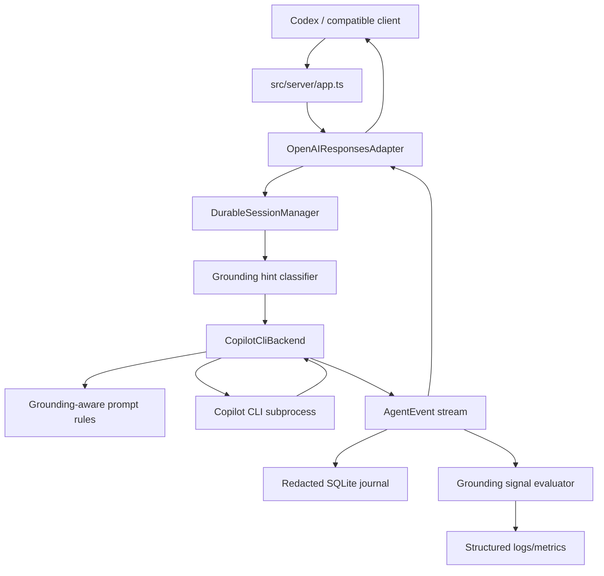

# Design Document

## Objective
- Solve Volare's long-term grounding-quality gap while preserving its identity as a local, secure, protocol-neutral bridge.
- Link to research: `plans/research-grade-runtime/research.md`

The target is not to clone ChatGPT web, build a full RAG platform inside Volare, or solve one domain such as 13F research. The target is to make source-grounded, tool-dependent, and externally factual answers **observable, source-aware, explicitly opt-in for retrieval capability, and auditable** so the bridge can distinguish "transport succeeded" from "the answer had grounding evidence."

## Non-goals

- No 13F-specific pipeline, finance-specific implementation, or hard-coded domain workflow.
- No Volare-owned search provider, browser/fetch tool, crawler, embedding store, vector database, reranker, document chunker, or full RAG/deep-research pipeline in this design.
- No default enablement of Copilot builtin MCPs or other opaque tool surfaces.
- No answer rewriting, answer blocking, or hidden second-pass correction by Volare.
- No per-domain backend routing in the initial design.
- No new persistence of raw prompts, raw tool output, source excerpts, stderr, or sensitive source metadata. Existing conversation/text-delta persistence is not changed by this design.
- No tool broker interface until there is a concrete observed producer and consumer for tool calls.
- No new browser-origin access path; CORS remains disabled and local HTTP endpoints remain bearer-authenticated.

## Architecture / Approach

### High-level approach

Adopt a staged bridge evolution:

1. **Measure grounding-adjacent signals before changing behavior**
   - Add non-content fields such as source counts, citation-like output markers, tool-observation counts, and prompt/history size buckets.
   - Use this to establish a baseline for failing examples before prompt or MCP behavior changes.
2. **Improve prompt/docs hygiene without changing capability**
   - Add source-grounding instructions when a conservative grounding hint says a task depends on external facts.
   - Document that prompt instructions alone do not create source grounding.
3. **Add explicit retrieval/tool capability gates**
   - Keep secure defaults.
   - Add one security-relevant MCP capability flag instead of a broad "research mode" that could imply accidental grants.
4. **Introduce minimal protocol-neutral provenance only when there is a producer**
   - Add source references only after typed, fail-closed redaction exists and a concrete Volare-observable source producer exists.
   - Map source references to OpenAI Responses metadata only in the OpenAI adapter.
5. **Observe real Copilot tool frames before designing a broker**
   - Capture and fixture Copilot CLI JSON frames under opt-in MCP mode.
   - Add lifecycle events only after the producer shape and redaction path are proven.
6. **Use conservative grounding hints and non-blocking signal evaluation**
   - Keep classifier/evaluator logic small and pure.
   - Emit warning codes and counts, not subjective answer-quality verdicts.

### Key components / layers involved

| Layer | Current role | Proposed role |
|---|---|---|
| `src/server/app.ts` | HTTP/SSE/metrics | Add safe aggregate grounding/capability counters; keep request content redacted |
| `src/northbound/openai-responses/` | OpenAI/Codex protocol parsing/encoding | Preserve additive source metadata when safe; keep wire details out of core |
| `src/core/` | Protocol-neutral state/events/types | Own minimal source refs, grounding hints, and grounding signals |
| `src/backends/copilot-cli/` | Copilot subprocess prompt/spawn/output parsing | Add MCP capability flag handling, tool-frame probes, and grounding summary logging |
| `src/events/` | Durable redacted journal | Add typed source/tool redaction before persisting new provenance fields |
| `src/runtime/server.ts` | Production dependency wiring | Wire config, classifier/evaluator pure helpers, and logging |
| Docs | User operations/config | Explain MCP capability boundaries, unmediated tool caveats, and debugging limits |

### Interaction / data flow



## Interface / API / Schema Design

### Minimal source references

Add source references only after the reserved metadata guard is in place, typed redaction exists, and a concrete Volare-observable source producer exists. Keep the first shape intentionally narrow and discriminated; do not add excerpts, free-form metadata, or document spans in the MVP.

```ts
export type SourceRefId = string;
export interface IUrlSourceRef {
  id: SourceRefId;
  kind: 'url';
  url: string;
  title?: string;
  retrievedAtMs?: number;
}

export interface IWorkspaceSourceRef {
  id: SourceRefId;
  kind: 'workspace';
  path: string; // workspace-relative path only
  title?: string;
}

export type SourceRef = IUrlSourceRef | IWorkspaceSourceRef;
```

Rules:

- `workspace` paths must be workspace-relative, never absolute local paths.
- `workspace` source producers must reject absolute paths, `..` segments, NUL/control characters, mixed-separator escape attempts, and any path that fails a `path.resolve(workspaceRoot, candidate)` containment check; workspace refs are advisory and Volare must not dereference them during redaction/logging/encoding/replay/debug emission. Producers that dereference workspace paths must perform realpath/symlink containment checks.
- URL source refs must allow only `http` and `https`, reject `username:password@host` userinfo, and strip credential-like query/hash values while preserving non-secret audit value.
- `id` is unique within a turn and must be stable across journal replay for that turn. MVP source IDs use `source_<uuid-v4>`, are generated at source-production time, and are persisted with the event; replay uses persisted IDs and does not regenerate them.
- `title` is optional, capped at 256 UTF-8 bytes, has control characters/newlines/ANSI escapes stripped, is neutralized for markdown/HTML/log-forging injection, and must pass typed source redaction including credential/secret-substring redaction.
- `url` is capped at 2 KiB after redaction. A turn persists at most 100 source refs and at most 64 KiB of serialized sanitized source-ref payload; excess refs are truncated with an explicit count/byte marker in metadata/logs rather than persisted individually.
- `retrievedAtMs` uses Unix epoch milliseconds internally; logs may bucket or reduce precision.
- Tool-output source refs, excerpts, spans, confidence scores, and provider metadata are deferred until a concrete renderer/provenance need exists.

### Agent output extension

The MVP only adds optional `sources` to the existing core output shape. Existing `items` and `metadata` fields must not become source/provenance escape hatches.

```ts
export interface ISourceRefTruncation {
  originalCount: number;
  persistedCount: number;
  reason: 'source_count_limit' | 'source_byte_limit';
}

export interface IAgentOutput {
  text?: string;
  items?: unknown[]; // existing; not used for source refs
  metadata?: Record<string, unknown>; // existing; not used for source refs
  sources?: SourceRef[];
  sourceTruncation?: ISourceRefTruncation;
}
```

### Tool lifecycle events

Do not introduce `tool.called`, `tool.succeeded`, or `tool.failed` until Copilot CLI tool-frame fixtures exist and typed redaction is in place.

Before adding these events, the design must specify:

- `callId` uniqueness scope.
- Exactly one terminal event per call.
- Event ordering and replay behavior.
- Whether legacy `tool.observed` is replaced or kept.
- Metric counting rules when both old and new event names exist.
- Size caps and truncation markers for any tool output.
- Approval/audit behavior for tool calls owned by Volare.

If unmediated tooling is enabled, Volare should emit a **non-content provenance warning** for the turn rather than pretending tool provenance exists, even if some tool frames become observable later.

### Grounding hints

Use a conservative hint rather than a broad domain taxonomy.

```ts
export type RequestDomainHint = 'code' | 'external_research' | 'general';

export interface IRequestGroundingHint {
  domain: RequestDomainHint;
  needsSourceGrounding: boolean;
}

export function classifyRequestGrounding(input: IAgentInput): IRequestGroundingHint;
```

Rules:

- Multi-match prompts choose the most conservative hint: if any part requires external factual grounding, `needsSourceGrounding` is true.
- Unknown prompts fall back to `general` with `needsSourceGrounding=false`.
- The MVP classifier is intentionally simple:
  - code-edit/debug/build/test requests -> `domain='code'`, `needsSourceGrounding=false`
  - requests containing fresh/current/recent/external factual lookup language such as "search", "recent", "latest", "compare public filings", "fetch", "browse", "source", or equivalent Chinese terms such as "搜索", "最近", "最新", "披露" -> `domain='external_research'`, `needsSourceGrounding=true`
  - mixed prompts choose `external_research` when any subtask requires external facts
  - otherwise -> `domain='general'`, `needsSourceGrounding=false`
- Keep the first implementation as a pure helper; promote it to an interface only when a second implementation exists.

### Grounding signals

Emit signals, not answer-quality verdicts.

```ts
export type GroundingWarningCode =
  | 'NEEDS_SOURCES_NO_SOURCES'
  | 'UNMEDIATED_TOOLING_ENABLED'
  | 'CITATION_LIKE_TEXT_WITHOUT_SOURCES';

export interface IAnswerGroundingSignals {
  domain: RequestDomainHint;
  needsSourceGrounding: boolean;
  citationLikeOutputCount: number;
  sourceCount: number;
  toolObservedCount: number;
  unmediatedToolingEnabled: boolean;
  evaluatedByteCount: number;
  truncated: boolean;
  warningCodes: GroundingWarningCode[];
}

export function evaluateAnswerGrounding(args: {
  outputText?: string;
  hint: IRequestGroundingHint;
  sourceCount: number;
  toolObservedCount: number;
  unmediatedToolingEnabled: boolean;
}): IAnswerGroundingSignals;
```

Rules:

- No `good` / `partial` / `poor` labels in the MVP.
- Warning codes are string unions, not free-form strings that could echo user prompt content.
- Emit signals for all domains; only warning thresholds differ by hint.
- Phase 0 introduces only the raw output scanner that produces counts and truncation fields. Phase 1 wraps that scanner with `classifyRequestGrounding` and `evaluateAnswerGrounding` to produce warning codes.
- `evaluateAnswerGrounding` truncates internally before scanning. It evaluates at most the first 256 KiB of UTF-8 output bytes in the MVP, sets `truncated=true` when it skips the remainder, reports `evaluatedByteCount`, and uses only linear-time regexes or string scans with per-pattern match caps. `truncated=true` is a known false-negative risk for citation-like detection and must be documented in log/ops interpretation.

### New or changed API endpoints

- No new endpoint is required.
- Extend `/metrics` with safe aggregate counters:
  - `turns_total`
  - `turns_with_zero_tools_total`
  - `turns_with_sources_total`
  - `turns_with_citation_like_output_total`
  - `turns_with_grounding_warnings_total`
  - `turns_unmediated_total`
- Metrics remain process-local JSON counters unless a later design explicitly adopts Prometheus format.
- `/debug/turns/:id/events` can continue serving redacted journal events, but docs must state that source-bearing events reveal source history even after content redaction.
- `/metrics` counters must remain aggregate-only in the MVP: do not break them down by prompt text, domain hint, source URL, or individual warning code. `turns_with_grounding_warnings_total` counts content-grounding warnings only (`NEEDS_SOURCES_NO_SOURCES`, `CITATION_LIKE_TEXT_WITHOUT_SOURCES`); `UNMEDIATED_TOOLING_ENABLED` contributes to `turns_unmediated_total`.
- Increment counters exactly once from accepted live terminal turn handling; auth failures, parse failures, rejected requests, GET handlers, debug reads, and journal replay must not mutate turn counters.

### Configuration

Use one security-relevant MCP capability flag in the initial implementation:

```text
VOLARE_COPILOT_MCP_MODE=disabled|unmediated
```

Rules:

| MCP mode | Permission mode | Startup behavior |
|---|---|---|
| `disabled` | `restricted`, `web`, or `full` | allowed |
| `unmediated` | `restricted` | invalid config |
| `unmediated` | `web` or `full` | allowed only as explicit local-developer risk acceptance; start with high-visibility warning |

- Default is `disabled`.
- `unmediated` conditionally removes `--disable-builtin-mcps`.
- `unmediated` does **not** mean Volare mediates Copilot internal tool calls.
- `unmediated` must log one WARN-level startup line and per-turn audit fields explaining that Copilot internal MCP actions are not evaluated by Volare's `IApprovalProvider`.
- Do not add `VOLARE_RESEARCH_MODE` in the MVP. If a future behavior-profile flag is added, it must not implicitly grant MCP capability.

### OpenAI Responses compatibility

- Core source refs remain protocol-neutral.
- MVP client propagation uses additive response metadata for sources when supported by the OpenAI Responses encoder.
- Source metadata must live under a reserved namespace such as `volare.sources` and must not merge into request/client metadata.
- The OpenAI Responses request parser must strip client-supplied `metadata.volare`, `metadata["volare.*"]`, `client_metadata.volare`, and `client_metadata["volare.*"]` at parse time and emit a structured WARN with key paths but no values, before metadata enters core state or the journal; matching uses the Phase 3 NFKC/case-fold/trim rules, and the response encoder is the sole writer of `volare.sources`.
- The encoded metadata shape is:
  ```json
  {
    "volare.sources": {
      "version": 1,
      "items": [
        {
          "id": "source_...",
          "kind": "url",
          "url": "https://example.com/path?safe=value",
          "title": "Optional redacted title",
          "retrieved_at_ms": 1710000000000
        }
      ],
      "truncation": {
        "original_count": 120,
        "persisted_count": 100,
        "reason": "source_count_limit"
      }
    }
  }
  ```
  `truncation` is omitted when no truncation occurred. Workspace sources use `path` instead of `url`. Client metadata must never override or merge into this namespace.
- Inline annotations are deferred until source spans and client rendering behavior are verified.
- If the client ignores metadata after conditional Phase 5 proceeds, Volare still records redacted source refs internally and exposes aggregate grounding metrics.

### Redaction and persistence contract

New source/tool fields are not allowed to rely on generic key-name redaction.

Requirements before merging source/tool provenance:

- Add typed redactors such as `redactSourceRef` and future `redactToolEvent`.
- Fail closed if an event variant has no typed redaction branch.
- Apply the same typed source sanitizer before both journal persistence and live/encoded wire emission; adapters must not emit unsanitized source refs.
- Redact or summarize any future `excerpt`, `output`, `partialOutput`, `errorMessage`, or provider metadata before journal persistence.
- Strip credential-like URL parameters and reject URL userinfo while preserving non-secret query/hash data needed for source audit. Credential-like names include at least `authorization`, `token`, `access_token`, `refresh_token`, `api_key`, `apikey`, `key`, `secret`, `password`, `signature`, `sig`, and `x-amz-*`; value-side secret patterns such as JWTs, GitHub tokens, AWS access keys, private-key blocks, and signed URL signatures must be summarized.
- Harden the generic `url`/`uri` redaction path as well as typed source redaction: generic URL redaction must strip username/password userinfo and safely summarize unsupported schemes such as `file:` or `data:`.
- Cap persisted provenance payloads with a byte budget and `truncated: true` marker if output-like fields are introduced later.
- Keep source persistence limited to minimal refs by default; raw excerpts remain out of scope.

## Trade-off Analysis

### Option A (chosen): staged grounding observability and provenance
- Summary: Improve Volare as a bridge by adding grounding observability, explicit MCP capability gating, minimal provenance, real tool-frame probing, conservative hints, and non-blocking signal evaluation.
- Pros:
  - Preserves secure defaults and local bridge identity.
  - Avoids building a full research stack.
  - Gives measurable before/after checkpoints.
  - Keeps core runtime protocol-neutral.
  - Defers abstractions until real producer data exists.
- Cons:
  - Does not instantly match ChatGPT web quality.
  - Some source/tool quality still depends on Copilot CLI capabilities.
  - Requires multiple PRs and careful validation.
- Why chosen:
  - Best balances long-term best practices with Volare's current scope and security model.

### Option B (rejected): globally re-enable Copilot builtin MCPs
- Summary: Remove `--disable-builtin-mcps` by default.
- Pros:
  - Likely immediate improvement for some web/research tasks.
  - Small code change.
- Cons:
  - Opaque network/tool actions outside Volare's approval and journal visibility.
  - Breaks current security expectations.
  - Does not add citations, source schema, evaluator, or tool observability.
- Why rejected:
  - High risk for a default behavior change. Use explicit opt-in capability instead.

### Option C (rejected): build a full Volare-owned research/RAG engine now
- Summary: Add search providers, browser/fetch, document store, embeddings, reranker, source curator, and writer pipeline directly into Volare.
- Pros:
  - Could approach ChatGPT-web/deep-research quality for research tasks.
  - Full control over provenance and source ranking.
- Cons:
  - Major scope expansion beyond a local bridge.
  - Adds external dependencies, network policy, credentials, storage, and ranking complexity.
  - Risks delaying smaller high-confidence improvements.
- Why rejected:
  - Over-designs the current problem. Start with bridge-appropriate observability/provenance seams.

### Option D (rejected for now): route grounded tasks to a separate hosted backend
- Summary: Add a non-Copilot backend for source-grounded web/data/research tasks.
- Pros:
  - Potentially best quality improvement if paired with a web-search backend.
  - Avoids forcing Copilot CLI to handle non-code research.
- Cons:
  - Adds auth/cost/configuration complexity.
  - Changes Volare's product boundary.
  - Requires new privacy/security review.
- Why rejected for now:
  - Reasonable future option, but not the first bridge-layer fix.

### Option E (rejected for MVP): define a tool broker before observing tools
- Summary: Add `IToolBroker`, `IToolCall`, and `IToolResult` before real tool-frame data exists.
- Pros:
  - Creates an obvious future extension point.
- Cons:
  - Risks dead interfaces and guessed invariants.
  - Confuses Copilot internal MCP observation with Volare-owned tool execution.
  - Needs approval/redaction/audit design that is not yet justified by a concrete producer.
- Why rejected for MVP:
  - Probe real Copilot frames first; add a broker only when there is a concrete caller, executor, and approval policy.

## Key Design Decisions

- Decision 1: Grounding telemetry before behavior changes.
  - Context: Current logs prove transport success but not answer grounding.
  - Choice: Add safe grounding-summary fields and aggregate counters first.
  - Rationale: We need before/after evidence before prompt or MCP capability changes.

- Decision 2: MCP capability is explicit, narrow, and security-relevant.
  - Context: Builtin MCPs are disabled for security/provenance reasons.
  - Choice: Add `VOLARE_COPILOT_MCP_MODE` only; no broad research-mode flag in the MVP.
  - Rationale: Capability grants should be named precisely and validated against permission mode.

- Decision 3: Provenance belongs in core; wire encoding belongs in adapters.
  - Context: Volare may support multiple northbound protocols over time.
  - Choice: Add minimal `SourceRef` in `src/core/`; encode OpenAI metadata in `src/northbound/openai-responses/`.
  - Rationale: Matches repository boundaries and avoids leaking OpenAI wire details into core.

- Decision 4: Redaction is a precondition, not a follow-up.
  - Context: Current generic redaction does not cover future source/tool fields safely.
  - Choice: Typed, fail-closed redaction must land in the same PR as new source/tool persistence.
  - Rationale: Avoids source history, local paths, tool output, and signed URL leakage.

- Decision 5: Tool broker is deferred until real producers exist.
  - Context: Copilot CLI currently emits text deltas to Volare; observed logs had zero `tool.observed` events.
  - Choice: Capture tool-frame fixtures before defining broker execution contracts.
  - Rationale: Prevents dead code and guessed abstractions.

- Decision 6: Evaluator emits signals, not judgments.
  - Context: Volare is a bridge and should not silently grade, block, or rewrite answers.
  - Choice: Emit counts and warning codes only.
  - Rationale: Preserves transparency while making quality failures observable.

## Phased Design

### Phase 0 — Grounding observability baseline
- Add raw grounding-adjacent counters only; do not add the classifier, warning-code evaluator, prompt changes, Copilot CLI arg changes, or answer output changes in this phase.
- Add a raw output scanner for citation-like markers and truncation only. MVP citation-like markers are markdown links with `http(s)` URLs, bare `http(s)` URLs, and numeric/footnote reference markers such as `[1]`.
- Harden generic URL redaction so existing `url`/`uri` fields strip username/password userinfo and safely summarize unsupported schemes such as `file:` or `data:`.
- Extend existing backend completion logging, rather than adding a duplicate event, with safe fields:
  - `toolObservedCount`
  - `sourceCount` (expected to remain `0` until conditional Phase 5 adds source producers)
  - `citationLikeOutputCount`
  - `groundingEvaluatedByteCount`
  - `groundingTruncated`
  - existing `promptSizeBucket` and `historyMessagesBucket` remain backend telemetry, not quality verdicts.
- Extend `/metrics` with aggregate grounding counters.
- Do not change prompts, Copilot CLI args, or answer output.
- Validation:
  - Unit tests for raw grounding-count extraction.
  - Unit tests that output scanning is capped at 256 KiB and sets `groundingTruncated`.
  - Unit tests that generic URL redaction strips userinfo and summarizes unsupported schemes.
  - Integration test for `/metrics` counters if feasible.
  - Baseline at least 10 prompts covering code-only, external-fact, mixed, and general tasks, including the known failing sample; the exact corpus should be written in the implementation plan and seeded from `research.md`.
- Rollback:
  - Remove/ignore added log fields and counters; no schema migration.

### Phase 1 — Prompt and docs hygiene
- Add the minimal pure grounding classifier and grounding-signal evaluator described above.
- Add backend completion fields:
  - `groundingDomain`
  - `needsSourceGrounding`
  - `unmediatedToolingEnabled`
  - `groundingWarningCodes`
- Phase 1 warning-code reachability:
  - reachable: `NEEDS_SOURCES_NO_SOURCES`, `CITATION_LIKE_TEXT_WITHOUT_SOURCES`
  - reserved for Phase 2+: `UNMEDIATED_TOOLING_ENABLED`
- Add conservative source-grounding rules when `needsSourceGrounding` is true.
- Example prompt rule:
  - "For externally factual claims, cite sources with URL-bearing markdown links when available, include relevant dates/version context, and explicitly state when source grounding was not available."
- Inject grounding rules after existing context-provenance rules and before user/system-supplied instructions, so Volare's bridge safety rules remain higher priority.
- Document the gap between permission mode, MCP capability, and actual research quality.
- Add operations docs for interpreting Python/certificate/tool-output issues as backend/tool-content issues unless Volare transport logs show a failure.
- Validation:
  - Unit tests for classifier examples and multi-match precedence.
  - Unit tests for warning-code reachability.
  - Unit tests for prompt helper output.
  - Snapshot/fixture inspection of generated backend prompt.
  - Compare grounding counters against the Phase 0 baseline. Acceptance is that signals are emitted and no code-only regressions appear; prompt-only improvements are directional evidence, not a release gate or proof of solved grounding.
- Rollback:
  - Feature-gate or remove prompt additions; no state migration.

### Phase 2 — Explicit MCP capability opt-in
- Add `VOLARE_COPILOT_MCP_MODE=disabled|unmediated`.
- Conditionally omit `--disable-builtin-mcps` only when `VOLARE_COPILOT_MCP_MODE=unmediated`.
- Enforce the compatibility matrix:
  - `unmediated + restricted` is invalid config.
  - `unmediated + web/full` starts with WARN logging.
- Treat `VOLARE_COPILOT_MCP_MODE=unmediated` as explicit local-developer risk acceptance; do not recommend it as a default deployment setting.
- Feed `unmediatedToolingEnabled=true` into grounding evaluation and emit `UNMEDIATED_TOOLING_ENABLED` on every turn when MCP mode is `unmediated`, regardless of whether any tool frame is observed.
- Persist non-content per-turn audit fields for every accepted turn: `copilotMcpMode`, `copilotPermissionMode`, and `unmediatedToolingEnabled`. Only the `UNMEDIATED_TOOLING_ENABLED` warning code is gated to `unmediated`.
- Store these audit fields in exactly one dedicated server-owned `turn.audit` structured log record per accepted turn, emitted at the same accepted-live-turn boundary that increments `turns_total`, after auth/parse/config validation and before backend spawn. Backend completion logs may keep ordinary completion summaries, but the exactly-once audit invariant counts only `turn.audit` records. `turn.audit` includes server-owned correlation IDs (`sessionId`, `turnId`, and response/request ID if available) and no prompt text, workspace paths, client metadata, source refs, tool output, or other client-derived fields. Journal replay must not emit `turn.audit`. Do not store audit fields in client-derived `requestMetadata`, SSE/live event frames, debug event payloads, or OpenAI response metadata. A durable `security` journal mirror is deferred unless a later design defines sink semantics.
- Docs must state that Volare approvals do not mediate Copilot internal MCP actions.
- Validation:
  - Unit tests for config parsing and invalid combinations.
  - Unit tests for Copilot CLI args in disabled/unmediated modes.
  - Unit tests that per-turn audit fields are emitted and redacted.
  - Manual smoke test with MCP mode disabled/unmediated.
- Rollback:
  - Set `VOLARE_COPILOT_MCP_MODE=disabled` and restart; no state migration.

### Phase 3 — Reserved metadata namespace guard
- Strip client-supplied `metadata.volare` and `client_metadata.volare` namespace keys at parse time, with a structured WARN containing key paths but no values, before metadata enters core state, request journals, or response metadata assembly.
- Matching uses NFKC normalization, case-folding, and surrounding-whitespace trimming for the ASCII `volare` namespace. Unicode confusables that do not normalize to ASCII `volare` are treated as ordinary client metadata and cannot override server-owned ASCII `volare.sources`.
- This standalone guard must land before any server-owned `volare.sources` response metadata is introduced.
- Validation:
  - Adapter tests that `metadata.volare`, `metadata["volare.*"]`, `client_metadata.volare`, and `client_metadata["volare.*"]` case/fullwidth/nested/array variants are stripped before `turn.created` persistence with key-path-only WARN logging.
  - Tests that safe non-Volare metadata remains compatible and cannot override server-owned metadata.
- Rollback:
  - Remove the guard only if no server-owned `volare.*` response metadata has shipped; otherwise preserve the guard for compatibility and spoofing protection.

### Phase 4 — Copilot tool-frame schema probe
- Under explicit unmediated MCP mode, capture Copilot CLI `--output-format json` frames in test fixtures through a helper that applies the same production redactor before writing files.
- Update parsing tests to distinguish text deltas from non-text structured frames.
- If stable tool-call frames exist, draft lifecycle event contracts from observed data.
- If no stable frames exist, keep only the unmediated tooling grounding warning and do not invent tool lifecycle events.
- Validation:
  - Fixtures for representative text-only and unmediated-MCP turns.
  - Fixture capture fails closed: if the production redactor throws or the post-write scanner finds a secret/path pattern, the candidate fixture is deleted and the test/CI step fails.
  - CI check that fixtures contain no absolute local paths, bearer tokens, signed URLs, or secret-looking values such as JWTs, AWS `AKIA`/`ASIA` keys, GitHub `ghp_`/`gho_` tokens, private-key blocks, `X-Amz-Signature`, `sig`, or `https://user:pass@`.
  - Tests proving unknown structured frames are not silently treated as answer text.
  - Tests proving no raw frame payload is journaled.
  - Expected output may be only fixtures, parsing tests, and a decision record; runtime code changes are not required if no stable frames exist.
- Rollback:
  - Disable frame capture/probing without affecting MCP disabled mode.

### Conditional Phase 5 — Minimal source refs with fail-closed redaction
- Implement source refs only after a concrete source producer exists or is implemented in the same PR. Acceptable MVP producers must be Volare-observable and testable, such as stable Copilot tool frames from Phase 4 or a separately approved bridge-owned producer; do not derive source refs merely from citation-like answer text.
- Add minimal URL/workspace `SourceRef` union and optional `sources?: SourceRef[]` to `IAgentOutput`.
- Add typed source redaction before any source refs are written to the journal, logs, debug responses, SSE/live frames, replay output, or OpenAI encoding.
- Add source-aware URL redaction that strips credential-like parameters without destroying audit-useful public query/hash data.
- MVP OpenAI Responses encoding uses additive response metadata for sources when supported; inline annotations are deferred.
- Do not add tool-output source refs, excerpts, spans, free-form source metadata, or tool output payload persistence.
- Validation:
  - Redaction tests for URL and workspace source refs.
  - Tests that URL refs reject non-HTTP(S) schemes and userinfo.
  - Tests for source count caps, 64 KiB source-byte cap, title byte caps, URL byte caps, and source truncation markers.
  - Tests that absolute workspace paths, `..` segments, NUL/control characters, mixed separators, and paths resolving outside the workspace root are rejected by the producer and revalidated by typed redaction.
  - Journal replay tests for old events without sources, new events with sources, and interleaved old/new events.
  - Replay must revalidate and re-redact source refs before re-emission using current redaction rules.
  - Adapter encoding tests for additive metadata, legacy pre-guard spoofed journal metadata, and exact snake_case wire shape.
  - Client behavior check for whether Codex/Desktop renders response metadata sources; if not, treat client-visible citations as deferred and keep source refs primarily internal/diagnostic.
- Rollback:
  - Existing old events remain valid because `sources` is optional.
  - Source-bearing events remain the same event kind and replay must tolerate the optional field. Rollback disables source emission rather than requiring a database migration; do not add a new journal kind in this phase.

### Optional follow-up — Grounding signal refinement
- Refine classifier keywords and warning thresholds using Phase 0-4 metrics.
- Keep the implementation as a pure helper unless multiple implementations justify an interface.
- Use the hint only for prompt rules and warning thresholds; do not switch backends.
- Never block, rewrite, or suppress the answer.
- Validation:
  - Unit tests for code-only, external-fact, mixed, and unknown prompts.
  - Unit tests for warning-code thresholds.
  - Compare warning rates before/after Phase 1 and Phase 2.
- Rollback:
  - Fall back to the Phase 1 classifier/evaluator; no state migration.

### Deferred — Volare-owned tool broker
- Preconditions:
  - Stable observed tool-frame schema or a concrete client-side tool execution requirement.
  - Approval semantics defined for tool categories.
  - Typed redaction for tool input/output.
  - Audit/replay behavior defined.
- Future broker contract must include:
  - workspace context
  - approval/audit context
  - abort signal
  - discriminated success/failure result
  - output byte caps and truncation markers
- This is intentionally not part of the MVP phase plan.

## Impact Assessment

- Affected modules / services:
  - `src/backends/copilot-cli/backend.ts`
  - `src/core/types.ts`
  - `src/core/grounding-classifier.ts` (new, or pure helper co-located with backend prompt code)
  - `src/core/answer-grounding-evaluator.ts` (new, or pure helper)
  - `src/server/config.ts`
  - `src/runtime/server.ts`
  - `src/server/app.ts`
  - `src/northbound/openai-responses/adapter.ts`
  - `src/events/redaction.ts`
  - `src/events/sqlite-event-journal.ts`
  - `docs/architecture.md`
  - `docs/configuration.md`
  - `docs/codex-integration.md`
  - `docs/operations.md`
- Public API / schema compatibility:
  - Existing OpenAI Responses endpoints stay compatible.
  - Conditional Phase 5 source refs are optional and additive.
  - Inline annotations are deferred until client support and span mapping are verified.
- Documentation compatibility:
  - `docs/architecture.md` must clarify that `VOLARE_COPILOT_MCP_MODE=unmediated` is passthrough capability exposure, not a full MCP manager or bridge-owned tool execution.
  - `docs/codex-integration.md` and `docs/configuration.md` must align with current permission args, including `web -> --allow-all-urls`, `full -> --allow-all`, and `restricted -> no non-interactive grant flag`.
  - Any future Volare-owned tool broker would require a separate architecture amendment and design approval; the deferred section here is not pre-approval.
- Data migration needs:
  - None for phases 0-4.
  - None for conditional Phase 5 if source refs remain optional fields in existing event payloads.
  - Add a migration only if a later phase introduces a new indexed journal column or event kind.
- Performance implications:
  - Phase 0 regex/count extraction must scan at most the first 256 KiB of UTF-8 output bytes, use linear-time patterns, and cap per-pattern matches.
  - Prompt additions are negligible.
  - MCP unmediated mode may increase backend duration and network activity.
  - Tool-frame probing must not persist large payloads.
- Security considerations:
  - MCP mode is explicit opt-in, named `unmediated` when it removes `--disable-builtin-mcps`, and invalid with `restricted` permission mode.
  - `IApprovalProvider` does not mediate Copilot internal MCP actions.
  - Source/tool redaction must fail closed.
  - OpenAI Responses `metadata.volare` / `client_metadata.volare` are server-owned; client-supplied values in those namespaces must be stripped with a structured WARN that logs key paths but no values.
  - Debug events become more sensitive once source refs exist; docs and retention guidance must reflect that.
  - `/metrics` must stay aggregate-only and must not expose per-domain or per-warning-code labels in the MVP.

## Open Questions
- Can Copilot CLI's `--output-format json` expose stable tool-call frames that Volare can observe without relying on private APIs?
- Which builtin MCP servers are enabled by Copilot CLI, and what network/filesystem behavior do they have under `web` vs. `full` permission modes?
- Does Codex/Desktop render response metadata sources usefully, or are internal-only source refs the first practical milestone?
- Should future source persistence be configurable separately if source history becomes too sensitive for some users?
- What exact output-size budget should future tool-frame capture use?
- Should `/debug/turns/:id/events` require an additional opt-in or response-shaping mode before exposing full source refs, beyond existing bearer auth?

## Review Notes / Annotations
- Review pass 1 incorporated:
  - Explicit non-goals.
  - Phase order changed so observability precedes prompt behavior.
  - Removed broad `VOLARE_RESEARCH_MODE`; kept only explicit MCP capability flag.
  - Added MCP/permission compatibility matrix.
  - Replaced broad domain taxonomy with conservative grounding hints.
  - Replaced quality labels with grounding signals and warning codes.
  - Narrowed `SourceRef` and removed excerpts/free-form metadata/spans from MVP.
  - Made typed fail-closed redaction a precondition for source/tool provenance.
  - Deferred tool broker until real tool-frame data or client-side tool execution exists.
- Review pass 2 incorporated:
  - Clarified that existing conversation/text-delta persistence is unchanged; the no-raw-persistence rule applies to new provenance/tool artifacts.
  - Removed Copilot-specific MCP mode from core-facing grounding signal types.
  - Deferred tool-output source refs until tool lifecycle contracts exist.
  - Added stricter workspace source path invariants and mixed-version replay validation.
  - Addressed classifier/evaluator dependency ordering; a later pass split raw scanning into Phase 0 and classifier/evaluator behavior into Phase 1.
  - Added a 256 KiB evaluator scan cap and fixture-capture redaction requirements.
- Review pass 3 incorporated:
  - Replaced MCP-specific warning-code/type wording with protocol-neutral tooling provenance wording.
  - Changed grounding evaluation to accept `outputText` and `sourceCount` rather than depending on source refs.
  - Reserved `volare.sources` as server-owned metadata and required stripping client-supplied `metadata.volare` / `client_metadata.volare` keys.
  - Added URL source invariants for HTTP(S)-only refs and no userinfo.
  - Marked later warning codes as phase-gated and made grounding signal refinement an optional follow-up.
- Review pass 4 incorporated:
  - Shrunk Phase 0 to raw counters and generic URL-redaction hardening; classifier/warning-code behavior moved to Phase 1.
  - Renamed MCP mode value to `unmediated` and required per-turn non-content audit fields.
  - Added concrete URL credential patterns, source count/title/URL caps, and source sanitizer-before-wire requirements.
  - Clarified server-owned metadata stripping must happen at parse time before core state/journaling.
  - Split the source work into source/redaction and adapter/metadata sub-PRs; pass 6 later made those conditional on a concrete producer.
  - Added architecture-doc and Codex permission-doc alignment to implementation impact.
- Review pass 5 incorporated:
  - Tightened implementation planning criteria for metrics exactly-once tests, baseline corpus evidence, reserved metadata spoofing protection, source wire shape, audit persistence, fixture redaction, and Phase 1 sub-PR sizing.
  - Initially moved the reserved `volare.*` request-metadata guard into the source phase as a precondition before source emission; pass 6 later promoted it to standalone Phase 3.
  - Chose strip-with-WARN semantics for reserved metadata, clarified source title secret redaction, disabled/unmediated per-turn audit behavior, and persisted source IDs.
- Review pass 6 incorporated:
  - Promoted the reserved metadata guard to a standalone Phase 3.
  - Moved source refs and OpenAI source metadata to conditional Phase 5, gated on a concrete Volare-observable source producer to avoid dead provenance infrastructure.
  - Replaced `groundingEvaluatedCharCount` with `groundingEvaluatedByteCount`, split unmediated capability counts from content-grounding warnings, and tightened replay/audit/source-byte/client-rendering acceptance criteria.

## Approval
- [ ] Design approved by:
- Date:
