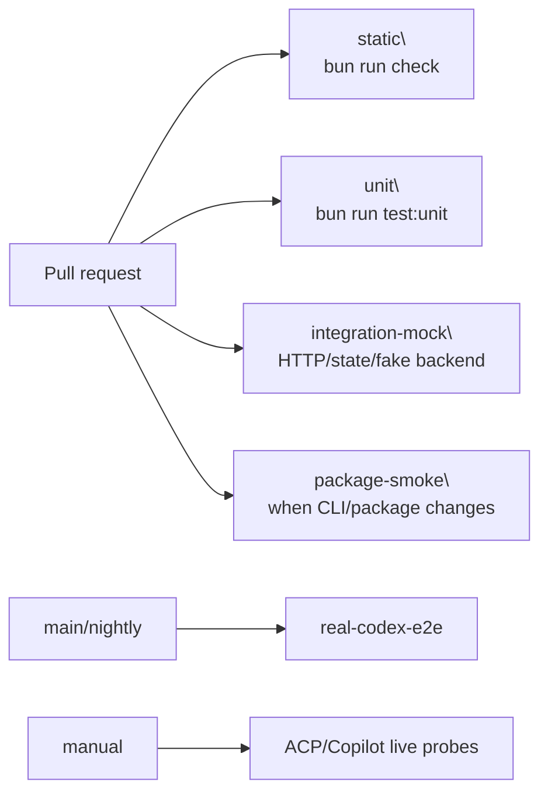

# Volare testing architecture

## Architecture intent

Volare's tests should become a **contract-driven runtime test architecture**. The goal is not simply to increase test count; the goal is to make every important runtime boundary explicit, reusable, and verifiable:

- protocol compatibility at the OpenAI Responses/Codex boundary
- HTTP transport security and error envelopes
- streaming/SSE behavior and future resume contracts
- durable SQLite state and journal replay
- approval, cancellation, capacity, and admission control-plane behavior
- backend runner/process behavior
- security/privacy non-leakage
- CLI/config and real-client interoperability

The current test suite already covers many of these concerns. The target architecture formalizes the layers and introduces shared harnesses gradually, only where repeated setup already exists or a new feature needs the same helper in more than one place. This should reduce duplicate setup, fragile sleeps, inconsistent fake backends, and one-off redaction assertions without creating unused harness files.

## Target test stack

```mermaid
graph TD
  subgraph Product[Volare product surfaces]
    CLI[CLI / package entrypoint]
    HTTP[HTTP app + OpenAI-compatible routes]
    Control[Volare control-plane routes]
    Runtime[Core runtime + control plane]
    Backend[Copilot backend / ACP runner]
    State[SQLite state + event journal]
  end

  subgraph TestLayers[Test layers]
    Unit[Unit tests]
    Component[Component tests]
    HTTPIT[HTTP integration tests]
    Durability[Durability integration tests]
    BackendIT[Backend integration tests]
    RealCLI[Real CLI E2E]
    Golden[Golden / contract tests]
    Security[Security and privacy tests]
  end

  subgraph Harness[Shared test support]
    AppHarness[app-harness]
    DurableHarness[durable-harness]
    SseHarness[sse helpers]
    FakeBackends[fake backends]
    FakeAcp[fake ACP process]
    Assertions[assertions]
    Redaction[security assertions]
    Snapshots[snapshot normalizers]
  end

  CLI --> RealCLI
  HTTP --> HTTPIT
  Control --> HTTPIT
  Runtime --> Unit
  Runtime --> Component
  Backend --> BackendIT
  State --> Durability
  HTTP --> Golden
  State --> Golden
  HTTP --> Security
  Backend --> Security

  AppHarness --> HTTPIT
  DurableHarness --> Component
  DurableHarness --> Durability
  SseHarness --> HTTPIT
  SseHarness --> Golden
  FakeBackends --> Component
  FakeBackends --> HTTPIT
  FakeAcp --> BackendIT
  Assertions --> Unit
  Assertions --> HTTPIT
  Redaction --> Security
  Snapshots --> Golden
```

## Layer responsibilities and ownership rules

### Unit tests

Unit tests verify local decisions and invariants without relying on real HTTP servers, real processes, or file-backed durable state.

Good unit targets:

- `ApprovalProvider`
- `DefaultApprovalPolicy`
- `WorkerAdmissionQueue`
- `RuntimeCapabilityRegistry`
- `OpenAIResponsesAdapter`
- redaction
- config parsing
- workspace resolver
- core usage/grounding helpers

Unit tests should be deterministic and fast. They should not spawn real Codex/Copilot processes and should avoid arbitrary sleeps except where testing timeout behavior with very small controlled intervals.

Unit tests may compose a small number of in-memory collaborators when that keeps a module's invariant clear. Do not create a separate component test for the same behavior unless the test proves wiring between independently owned modules.

### Component tests

Component tests verify one internal seam across multiple modules without real sockets:

- `DurableSessionManager + SQLiteStateStore + fake backend`
- `ApprovalProvider + SQLiteStateStore + journal behavior`
- `CopilotCliBackend + fake runner`

These tests are where most protocol-neutral runtime-control wiring belongs: active-turn capacity, approval resolution, state recovery, and backend-session lifecycle. They should not duplicate detailed backend-runner process behavior that is already owned by backend integration tests.

### HTTP integration tests

HTTP integration tests use `createApp` and `fetch` to verify route behavior:

- bearer auth and Origin rejection
- OpenAI `/openai/v1` and `/v1` routes
- `/responses`, `/responses/:id`, `/cancel`
- `/healthz`, `/metrics`, `/capabilities`, `/debug`
- OpenAI error envelope vs Volare control-plane error envelope
- SSE stream setup and cancellation behavior

These tests should use fake backends and in-memory state by default.

### Durability integration tests

Durability tests verify file-backed SQLite and restart semantics:

- close/reopen database
- `migrate()` idempotency
- `PRAGMA integrity_check`
- startup recovery
- stored response replay after restart
- approval/turn/session recovery
- retention tombstones
- corrupted journal rows
- future `envelope_schema_version` upcaster compatibility

This layer should use real temporary SQLite files, not only `:memory:`.

### Backend integration tests

Backend tests verify process/runner behavior behind fake processes:

- process runner stdout/stderr parsing
- process identity validation
- ACP initialize/session/new/session/prompt flows
- ACP auth retry
- ACP native cancel classifications
- admission FIFO/timeout/abort/shutdown
- idle reaper and admission pressure
- spawn/startup/process-exit cleanup

This layer should use injected process spawners, not real Copilot CLI.

ACP runner tests, fake ACP process behavior, worker admission, process identity, process exits, and native cancellation belong primarily in this layer. A component test may touch these only to prove the `IAgentBackend` boundary integrates with core state.

### Real CLI E2E tests

Real E2E tests should be few but valuable:

- real Codex CLI invokes Volare through generated config
- `/openai/v1` and `/v1` base paths work
- workspace allowlist and projectless isolation hold
- no unrelated repository context leaks into the backend
- packaged Volare binary starts and reports help/version when package behavior changes

These tests are slower and should be isolated from the fast deterministic CI lane.

### Golden / contract tests

Contract tests lock stable external and replay formats:

- raw OpenAI SSE frames
- parsed SSE event sequence
- OpenAI error envelope bodies and retry headers
- Volare control-plane error envelope bodies
- `/capabilities` schema version and field groups
- stored response snapshots
- future journal envelope and upcaster outputs

Golden tests must normalize dynamic ids, timestamps, paths, durations, and platform separators.

Golden tests are for stable wire, schema, and replay artifacts. They should not snapshot transient implementation behavior such as queue scheduling, idle-reaper timing, or internal active counts unless those counts are part of a documented public contract.

### Security and privacy tests

Security/privacy tests should assert that sensitive data never leaks through:

- HTTP responses
- SSE frames
- stored responses
- capabilities
- metrics
- debug events
- structured logs
- CLI stdout/stderr
- subprocess environment

They should use a shared realistic corpus of fake tokens, API keys, private keys, workspace paths, `.env` paths, and raw ACP frame markers.

## Shared harness design

### `tests/support/app-harness.ts`

Responsibilities:

- create `createApp` test instances
- default auth headers
- `request(path, init)`
- `postJson`
- optional real socket server on `127.0.0.1:0`
- health polling for socket tests
- cleanup finalizers

### `tests/support/durable-harness.ts`

Responsibilities:

- in-memory SQLite fixture
- file-backed SQLite fixture
- reopen/restart simulation
- `SQLiteStateStore` + `SQLiteEventJournal` wiring
- `assertSqliteHealthy`
- raw row/event insertion helpers for corruption tests
- golden journal fixture loading

### `tests/support/sse.ts`

Responsibilities:

- parse raw SSE text
- parse chunked `Uint8Array` streams
- detect `[DONE]`
- `readSseUntil`
- assert event type sequence
- future cursor/frame-id assertions

### `tests/support/fake-backends.ts`

Responsibilities:

- successful backend
- blocking backend
- failing backend
- capturing backend
- permission-required backend
- deferred-cancel backend
- terminal-then-hanging backend

### `tests/support/fake-acp-process.ts`

Responsibilities:

- fake ACP process with scripted JSON-RPC frames
- auth-required session creation
- wrong stop reason
- cancelled stop reason
- reuse-verification contamination
- never-ending prompt
- late deltas after cancellation
- spawn/process exit control

### `tests/support/assertions.ts`

Responsibilities:

- `expectOpenAIError`
- `expectControlPlaneError`
- `expectStoredResponse`
- `expectCapabilitiesShape`
- `expectNoDuplicateTerminalEvents`

### `tests/support/security-assertions.ts`

Responsibilities:

- `SECRET_CORPUS`
- `PATH_CORPUS`
- `RAW_PAYLOAD_CORPUS`
- `expectNoSensitiveData`

This helper should be used across logs, metrics, capabilities, debug events, SSE frames, stored responses, and CLI output.

The corpus is for **injected sentinel values**: tests seed known fake secrets/paths/raw markers into inputs, then assert those exact sentinels do not appear in specific output surfaces. Avoid broad regex scans over arbitrary output unless the regex comes from an existing redaction boundary and has a targeted false-positive test.

### `tests/support/snapshots.ts`

Responsibilities:

- normalize ids
- normalize timestamps/durations
- normalize temporary paths
- normalize path separators
- redact sensitive strings
- compare golden files

## Existing-to-target mapping

The first implementation step should not move every test file. Start by mapping the current layout to the target layers:

| Current location | Near-term role | Future split trigger |
|---|---|---|
| `tests/unit_tests/core/` | Unit + component runtime semantics | Move only socket/server cases out if they appear |
| `tests/unit_tests/server/app.test.ts` | HTTP integration despite living under `unit_tests` today | Split when `app-harness.ts` exists and route groups can move safely |
| `tests/unit_tests/backends/acp-copilot-prompt-runner.test.ts` | Backend integration | Keep here; extract fake process only after a second consumer appears |
| `tests/unit_tests/state/` and `tests/unit_tests/events/` | Unit/component state and journal tests | Add file-backed durability tests under `integration_tests/state/` |
| `tests/integration_tests/codex-cli-provider.test.ts` | HTTP/config integration | Keep as mock integration |
| `tests/integration_tests/codex-cli-e2e.test.ts` | Real Codex CLI E2E | Move to a dedicated script/lane when CI splits |

Until CI scripts are split, names such as `integration-mock` and `real-codex-e2e` are target lanes, not existing commands.

## Capability-to-test matrix

Legend: `P` = layer-level primary coverage for that boundary, `S` = secondary/regression coverage, blank = usually not needed. Some boundaries intentionally have more than one `P` because different layers own different facets; for example approval unit tests own policy/timeout decisions, while HTTP integration owns the route/error envelope.

| Capability / boundary | Unit | Component | HTTP integration | Durability | Backend | E2E | Golden contract | Security/privacy |
|---|---:|---:|---:|---:|---:|---:|---:|---:|
| OpenAI Responses parse/encode | P |  | S |  |  | S | P | S |
| SSE stream lifecycle | S |  | P |  |  | S | P | S |
| Active-turn capacity | P | P | S |  |  |  |  | S |
| Approval resolution/waiting | P | P | P | S |  |  |  | S |
| ACP worker admission | P | S |  |  | P |  |  | S |
| ACP native cancellation | S |  |  |  | P |  |  | S |
| Idle reaper / worker metrics | P |  | S |  | P |  | S | S |
| SQLite state/recovery | S | P | S | P |  |  | P | S |
| Capabilities projection | P |  | P |  |  |  | P | P |
| Workspace isolation | P | S | P |  |  | P |  | P |
| CLI/config writing | P |  |  |  |  | P | P | S |
| Security/privacy no-leak | S | S | P | S | S | S |  | P |

## CI architecture

Recommended lanes:

| Job | Trigger | Required | Purpose |
|---|---|---|---|
| `static` | every PR | yes | Biome + TypeScript |
| `unit` | every PR | yes | fast deterministic module tests |
| `integration-mock` | every PR | yes | HTTP/state/SSE/fake backend behavior |
| `package-smoke` | CLI/package changes | yes | compiled binary / bunx behavior |
| `real-codex-e2e` | main/nightly/manual | maybe | real Codex compatibility |
| `live-copilot-probes` | manual/nightly | no | external Copilot/ACP behavior |

CI should upload logs/artifacts on failure, set job-level timeouts, and avoid broad retries. Real Codex/Copilot checks should be separated from deterministic PR gates unless they become highly stable and pinned.

Before Phase 4 can be implemented, add exact scripts such as:

- `test:integration:mock`
- `test:e2e:codex`
- `test:package-smoke`

The real Codex CLI version should be pinned or recorded for release-blocking jobs. A nightly `latest` compatibility job may exist, but failures there should open a labeled issue and block the next release only after triage.

## Prioritized rollout

### Phase 1: Document the current testing contract

Create `docs/testing.md` with:

- test layers
- command matrix
- fixture rules
- golden/snapshot rules
- no-secret assertions
- CI lane definitions

This first document should describe current commands and existing file locations honestly. Future sections may be added as support harnesses and CI scripts land.

Do not document target-only script names such as `test:integration:mock`, `test:e2e:codex`, or `test:package-smoke` as if they exist. Mention them only as planned lanes until the scripts are added.

### Phase 1.5: Separate deterministic integration from real Codex E2E

Before extracting larger harnesses, split the current mixed integration command so deterministic HTTP/config integration can run without requiring a real `codex` binary:

1. Add `test:integration:mock` for integration tests that use fake/mock backends and local app/server fixtures.
2. Add `test:e2e:codex` for the real Codex CLI E2E file.
3. Keep `test:integration` as an aggregate during transition, or update CI explicitly to call both lanes where appropriate.

This prevents harness work from being gated by an external CLI while still preserving real-client coverage.

### Phase 2: Extract support harnesses

Create the first support helpers:

1. `tests/support/sse.ts`
2. `tests/support/app-harness.ts`
3. `tests/support/durable-harness.ts`
4. `tests/support/assertions.ts`
5. `tests/support/security-assertions.ts`

Do not create a harness file until at least two existing tests or one imminent feature clearly need it. The first extraction should be mechanical: move duplicated helpers without changing behavior.

### Phase 3: Add highest-risk missing contract suites

1. file-backed SQLite restart/recovery
2. raw SSE byte/golden tests
3. approval end-to-end flow
4. capabilities/schema golden
5. secret/path leakage corpus across all output surfaces

Defer `envelope_schema_version` fixture loaders and upcaster golden files until the first actual event-envelope migration is implemented. Until then, keep the design in `plans/refine-arch/design.md` as the contract.

### Phase 4: CI split

Split current all-in-one validation into explicit jobs:

- `static`
- `unit`
- `integration-mock`
- `package-smoke`
- `real-codex-e2e`
- optional/manual live probes

## Non-goals

- Do not replace Bun test.
- Do not introduce a heavy test framework unless a concrete gap appears.
- Do not make real Codex/Copilot calls required for every fast PR gate.
- Do not snapshot raw secrets, raw ACP payloads, or local paths.
- Do not create brittle golden tests without normalization.

## Success criteria

The testing architecture is successful when:

- new runtime features can be mapped to a known test layer and matrix row;
- repeated app/state/backend setup lives in `tests/support/`;
- SSE and error-envelope behavior is locked by contract tests;
- durable state changes include migration/restart/replay coverage;
- every public/debug/log/metric surface can run `expectNoSensitiveData`;
- CI failures identify which layer failed instead of failing one monolithic job.
