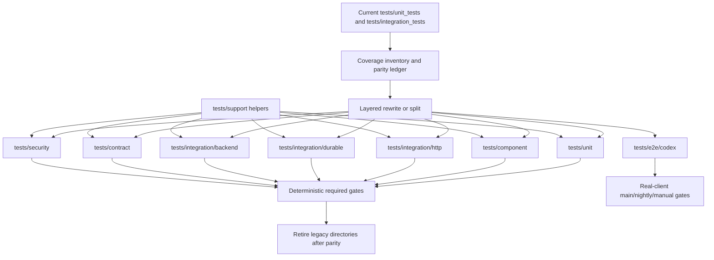

# Volare testing architecture design

> Purpose: define the reviewable design for rebuilding Volare's tests into a clear layered test system without losing existing coverage.

## Status

Implemented on `lachimere/refine-arch`. PR 0 through PR 10 completed the coverage-preserving structural rewrite; subsequent review/refine cleanup in `bda4743` reduced helper duplication, added missing unit/security coverage, and aligned CI/release docs.

Historical migration sequencing below is retained as the design record. The current contributor-facing commands and lane ownership live in `docs/testing.md`.

## Objective

Design a testing system that protects Volare's runtime contracts across protocol compatibility, HTTP/SSE streaming, durable state, approvals, cancellation, ACP worker lifecycle, CLI integration, and security/privacy boundaries.

The architecture in `plans/testing-architecture/arch.md` remains the target layer model. This design strengthens the migration strategy from "keep current directories and evolve gradually" to **coverage-preserving structural rewrite**: create the new test layout, migrate or rewrite every existing case into its correct layer, prove parity, then retire the legacy `tests/unit_tests` and `tests/integration_tests` layout.

Where this document is more specific than `arch.md`, it is authoritative for migration sequencing, script rollout, parity ledger rules, and legacy directory retirement. `arch.md` remains authoritative for the target test layers, capability matrix, and runtime boundary ownership.

## Architecture / Approach

### High-level approach

The test suite should be organized by **runtime boundary and verification level**, not by historical directory names. The desired end state is a clean test tree where the path communicates the test's responsibility:

```text
tests/
  unit/
  component/
  integration/
    http/
    durable/
    backend/
  e2e/
    codex/
  contract/
    openai/
    journal/
    capabilities/
  security/
  support/
  fixtures/
```

This is a rewrite of the test structure, not a deletion-and-reimplementation of coverage. Existing tests remain the safety net until each case has an equivalent or better home in the new layout.

Target layers:

1. **Unit tests** for pure local decisions and invariants.
2. **Component tests** for protocol-neutral internal seams.
3. **HTTP integration tests** for `createApp`/route/SSE behavior.
4. **Durability integration tests** for file-backed SQLite, restart, migration, and replay.
5. **Backend integration tests** for fake process / ACP runner behavior.
6. **Real CLI E2E tests** for real Codex/client interoperability.
7. **Golden / contract tests** for wire, schema, and replay artifacts.
8. **Security/privacy tests** for no-leak and boundary behavior.

Migration principles:

- Inventory current coverage before moving files.
- Rewrite or split tests by target responsibility, not by mechanical file moves.
- Keep legacy and target tests side-by-side only during migration.
- Require a parity ledger before deleting any legacy test file.
- Extract support harnesses when they unblock migrated tests, not after all migration is complete.
- Split deterministic CI lanes from real-client E2E early enough that external CLI drift does not block the rewrite.

### Data flow



## Interface / API / Schema Design

### Target package scripts

Target scripts should reflect the new layout. The JSON below is the post-Phase-5 end state; intermediate `package.json` shapes are described in the rollout phases. Target scripts should be introduced when their target path contains tests, so path drift fails loudly instead of passing silently.

```json
{
  "test:unit": "bun test tests/unit",
  "test:component": "bun test tests/component",
  "test:integration:http": "bun test tests/integration/http --timeout=30000",
  "test:integration:durable": "bun test tests/integration/durable --timeout=30000",
  "test:integration:backend": "bun test tests/integration/backend --timeout=30000",
  "test:integration": "bun run test:integration:http && bun run test:integration:durable && bun run test:integration:backend",
  "test:contract": "bun test tests/contract",
  "test:security": "bun test tests/security",
  "test:e2e:codex": "bun test tests/e2e/codex --timeout=60000",
  "test:package-smoke": "bun run scripts/test-package-smoke.ts",
  "test": "bun run test:unit && bun run test:component && bun run test:integration && bun run test:contract && bun run test:security"
}
```

Compatibility rules:

- Do not rely on a non-existent Bun `--exclude` flag.
- Avoid `--pass-with-no-tests` for explicit target scripts once they are added; an empty or wrong path should fail.
- During migration, keep temporary legacy scripts such as `test:legacy:unit` and `test:legacy:integration` if needed to preserve full coverage.
- Until every legacy ledger entry is terminal, aggregate `test` and `ci` scripts must run all still-active legacy lanes plus populated target lanes. Do not switch either aggregate to the post-Phase-5 script shape early.
- Before deterministic rewrites start, add temporary split scripts for current integration files so mock integration can run without real Codex on `PATH`.
- Real Codex E2E should stay outside the default fast `test` script until it is stable enough to promote. When the script is explicitly invoked, missing `codex` should fail loudly unless a non-required lane intentionally sets an explicit skip flag such as `VOLARE_SKIP_REAL_CODEX=1`.
- Package smoke must preserve both compiled-binary startup and packed package / `bunx` install behavior.

### Package smoke implementation contract

`test:package-smoke` should be implemented as a cleanup-safe Bun script rather than a long inline shell pipeline. It must:

- run `bun run package`;
- verify the compiled binary starts;
- create a real package tarball with `npm pack`, install it in a temporary directory, and run `bunx --bun volare help`;
- clean up the generated tarball and temporary install directory on success or failure;
- avoid committing or leaving generated package artifacts in the repository checkout.

### Current-to-target migration map

Each legacy file should be either rewritten into one target layer, split across multiple target layers, or explicitly retired with a reason in the parity ledger.

| Current location | Target home | Migration rule |
|---|---|---|
| `tests/unit_tests/core/` | `tests/unit/` and `tests/component/` | Split pure invariants from cross-module runtime seams |
| `tests/unit_tests/server/app.test.ts` | `tests/integration/http/` plus possibly `tests/contract/openai/` and `tests/security/` | Rewrite around `app-harness` and `sse` helpers; extract stable envelope/SSE assertions into contract tests |
| `tests/unit_tests/server/shutdown.test.ts` | `tests/component/` plus future `tests/integration/durable/` where file-backed recovery is involved | Keep shutdown orchestration and notifier/store seams as component coverage; move file-backed restart/recovery only when durable harness exists |
| `tests/unit_tests/backends/acp-copilot-prompt-runner.test.ts` | `tests/integration/backend/` | Keep fake-process ownership here; extract `fake-acp-process` only when migration creates repeated setup |
| `tests/unit_tests/backends/*` | `tests/unit/`, `tests/component/`, or `tests/integration/backend/` | Classify by whether the case verifies pure backend logic, core/backend seam, or process lifecycle behavior |
| `tests/unit_tests/state/`, `tests/unit_tests/events/` | `tests/unit/`, `tests/component/`, `tests/integration/durable/`, `tests/contract/journal/` | Move pure store invariants to unit/component; add file-backed restart and future schema artifacts under durable/contract |
| `tests/unit_tests/approvals/` | `tests/unit/` and `tests/component/` | Keep policy/provider decisions unit-level; move resolution-loop behavior to component |
| `tests/unit_tests/northbound/` | `tests/unit/` and `tests/contract/openai/` | Keep adapter decisions unit-level; move stable wire fixtures to contract |
| `tests/unit_tests/runtime/`, `tests/unit_tests/logging/`, `tests/unit_tests/scripts/`, `tests/unit_tests/cli.test.ts` | `tests/unit/`, `tests/component/`, `tests/e2e/codex/`, or `tests/security/` | Classify by boundary; do not leave CLI/package behavior hidden in generic unit tests |
| `tests/support/copilot-frame-fixtures.ts` | `tests/support/` or `tests/fixtures/copilot-cli/` | Keep frame fixture builders close to backend/contract consumers; avoid duplicating them in new harnesses |
| `tests/support/backends/*` | `tests/support/` | Consolidate into `fake-backends` only after multiple migrated consumers need the same fake behavior |
| `tests/fixtures/copilot-cli/*` | `tests/fixtures/copilot-cli/` | Preserve as backend/contract fixtures; normalize or redact before any golden promotion |
| `tests/integration_tests/codex-cli-provider.test.ts` | `tests/integration/http/` and `tests/e2e/codex/` where appropriate | Keep deterministic fake-provider HTTP/config coverage out of real E2E |
| `tests/integration_tests/codex-cli-e2e.test.ts` | `tests/e2e/codex/` | Move as an explicit real-client lane with no `--pass-with-no-tests` |

### Coverage parity ledger

The rewrite must maintain a committed migration ledger at `plans/testing-architecture/parity-ledger.md` before deleting or disabling any legacy file. The ledger is part of the review contract for the rewrite; it may be removed only after Phase 5 deletes the legacy directories and the final migration summary records where the target coverage landed.

Each entry should capture:

- legacy file and case name;
- target file and target layer;
- status: `pending`, `rewritten`, `split`, `retired`;
- parity evidence: old assertion preserved, broadened, or intentionally replaced;
- retirement reason, if any.

A legacy file can be deleted only when every case in that file is `rewritten`, `split`, or intentionally `retired`.

For mixed tests that are split across layers, ledger entries must be at least `test()`-block granular and must name each previously asserted invariant or assertion group. A PR that deletes or disables a legacy test file must update the ledger in the same PR, link every terminal ledger entry to target test paths, and make the reviewer able to verify parity from the diff.

Coverage instrumentation can support this process but does not replace the ledger. Phase 0 should capture a `bun test --coverage` baseline for affected `src/` paths when feasible; if not feasible, the ledger must record the reason and Phase 5 should not treat coverage comparison as a gate for that slice. When a baseline exists, Phase 5 should compare target-suite coverage before legacy deletion.

### Layer ownership rules

- Unit tests own pure decisions and invariants.
- Component tests own one internal seam across multiple modules; they should not reassert unit-level behavior.
- Backend integration tests own fake process / ACP runner / process lifecycle behavior.
- HTTP integration tests own route, auth, status, headers, SSE setup, and error-envelope behavior.
- Durability integration tests own file-backed persistence, restart, migration, and replay behavior.
- Golden tests own stable wire/schema/replay artifacts only.
- Security/privacy tests own no-leak assertions across outputs.
- Real CLI E2E owns external-client interoperability only; it should not be the only proof for deterministic product contracts.

Worked classification examples:

- `tests/unit_tests/approvals/policy.test.ts` stays unit-level because it verifies pure policy decisions.
- `tests/unit_tests/approvals/provider.test.ts` may split into unit cases for provider-local decisions and component cases for provider/store/resolution seams.
- `tests/unit_tests/state/sqlite-store.test.ts` keeps pure store invariants in unit/component layers, while close/reopen or file-backed recovery moves to durability integration.
- `tests/unit_tests/server/shutdown.test.ts` belongs primarily in component tests because it verifies shutdown orchestration across runtime collaborators without requiring real sockets.

### New documentation surface

Future implementation should add `docs/testing.md` as the canonical contributor-facing guide. During the rewrite it should document both current migration commands and target commands honestly, then remove legacy guidance once parity is complete.

### Support modules

Support modules are allowed earlier than in the purely incremental design, because a structural rewrite benefits from common setup. They still need concrete consumers and should not be empty abstractions.

Initial rewrite helpers:

| Module | Purpose | First consumers |
|---|---|---|
| `tests/support/app-harness.ts` | `createApp` setup, auth requests, JSON helpers, optional socket server | HTTP integration rewrite, provider integration rewrite |
| `tests/support/sse.ts` | raw/chunked SSE parsing, `[DONE]`, partial-read/cancel helpers | HTTP integration rewrite, OpenAI contract tests |
| `tests/support/durable-harness.ts` | memory/file SQLite fixtures, restart/reopen, integrity checks | state/event rewrite, durability tests |
| `tests/support/assertions.ts` | shared OpenAI/control-plane/capabilities/stored-response assertions | HTTP integration and contract tests |
| `tests/support/security-assertions.ts` | injected sentinel corpus and no-leak assertions across output surfaces and subprocess environment | first concrete security suite |

Deferred helpers:

- `tests/support/fake-backends.ts` after current fake backend setup appears in multiple migrated files.
- `tests/support/fake-acp-process.ts` after ACP runner migration makes the fake process reusable.
- `tests/support/snapshots.ts` when the first raw/golden contract suite lands.

## Trade-off Analysis

### Option A (chosen): Coverage-preserving structural rewrite

Summary: Create the target layered test tree, rewrite/split existing cases into the correct layers with a parity ledger, then delete the legacy `unit_tests` and `integration_tests` directories after coverage parity.

Pros:

- Produces a clear long-term test tree.
- Removes the ambiguity of tests living in misleading legacy directories.
- Forces every current case to be classified by responsibility.
- Enables CI lanes that map directly to runtime boundaries.
- Keeps risk controlled by requiring parity before deletion.

Cons:

- More upfront planning and coordination than a purely incremental approach.
- Temporary duplicate coverage while legacy and target suites coexist.
- Higher chance of merge conflicts during migration.
- Requires discipline to avoid rewriting test logic without preserving assertions.

Why chosen: The project is still small enough that a controlled rewrite is cheaper now than carrying ambiguous directories forward. The parity ledger and staged deletion avoid the risk of a big-bang rewrite that silently drops coverage.

### Option B (rejected): Incremental layered architecture inside legacy directories

Summary: Keep `tests/unit_tests` and `tests/integration_tests`, add conceptual layer ownership, and migrate only when needed.

Pros:

- Lowest short-term churn.
- Minimal immediate CI changes.
- Easy to preserve current coverage.

Cons:

- Keeps misleading directory names for too long.
- Makes contributors learn conceptual exceptions instead of reading paths.
- Allows entropy to continue accumulating in large files.
- Delays CI lane clarity.

Why rejected: It is safer in the short term but less clear long term. Given the owner's preference for a clearer test system, this design chooses a controlled rewrite instead.

### Option C (rejected): Big-bang rewrite from scratch

Summary: Delete current tests or ignore them, then recreate the suite directly in the target layout.

Pros:

- Cleanest tree immediately.
- No temporary duplicate coverage.

Cons:

- Highest risk of coverage loss.
- Hard to review.
- Difficult to distinguish intended behavior changes from migration mistakes.
- Likely to block unrelated development.

Why rejected: Structural clarity is valuable, but coverage must remain persistent and reviewable.

### Option D (rejected): Keep adding tests in current files only

Summary: Avoid test architecture work and continue adding cases to existing test files.

Pros:

- Fastest short-term path.
- No new documentation or harness work.

Cons:

- Large files like `server/app.test.ts` and ACP runner tests continue to grow.
- Repeated setup and bespoke assertions accumulate.
- Security/golden/durability conventions remain inconsistent.
- CI flakiness from real Codex E2E remains mixed into integration.

Why rejected: It preserves the current entropy path and makes future SSE resume, multi-protocol, and durable migration work harder.

## Key Design Decisions

### Decision 1: Keep Bun test as the test runner

- Context: The repository already uses Bun scripts and has a working unit/integration suite.
- Choice: Keep Bun test and improve architecture around it.
- Rationale: The current runner is sufficient; the problem is organization, harness reuse, contract coverage, and CI shape.

### Decision 2: Rewrite into target directory ownership

- Context: Current file paths do not reliably describe test responsibility.
- Choice: Introduce the target `tests/unit`, `tests/component`, `tests/integration/*`, `tests/e2e`, `tests/contract`, and `tests/security` layout.
- Rationale: A clean test tree is easier to understand and enforce than a legacy tree with conceptual exceptions.

### Decision 3: Require coverage parity before deleting legacy files

- Context: A structural rewrite can accidentally drop important behavior coverage.
- Choice: Track each legacy case through a parity ledger and delete legacy files only when their cases are rewritten, split, or intentionally retired.
- Rationale: This keeps the rewrite reviewable and prevents invisible coverage loss.

### Decision 4: Split deterministic integration from real Codex E2E before deterministic rewrites

- Context: Real Codex CLI is valuable but external and slower.
- Choice: Move real Codex tests to `tests/e2e/codex` and keep deterministic provider/config/HTTP integration in `tests/integration/http`.
- Rationale: The rewrite should not be blocked by external CLI availability or drift, and the legacy safety net should not require `codex` on `PATH` for deterministic migration work.

### Decision 5: Extract harnesses as part of migration, not as speculative infrastructure

- Context: A structural rewrite creates repeated setup if every file is migrated independently.
- Choice: Create `app-harness`, `sse`, and `durable-harness` when migrating their first real consumers; defer fake ACP/snapshot helpers until concrete duplication appears.
- Rationale: This keeps the rewrite maintainable without adding unused abstractions.

### Decision 6: Separate golden contract tests from security/privacy tests

- Context: Stable schema/wire snapshots and no-leak assertions have different responsibilities.
- Choice: Golden tests lock wire/schema/replay artifacts; security tests assert sensitive data absence across surfaces.
- Rationale: This avoids brittle snapshots for ordinary behavior and keeps privacy checks broad but targeted.

### Decision 7: Defer event-envelope upcaster fixtures until schema migration implementation

- Context: The SSE resume design defines future `envelope_schema_version`, but implementation is not yet present.
- Choice: Keep the design as the contract; do not create unused upcaster fixtures now.
- Rationale: Upcaster fixtures should be tied to a real migration, otherwise they will drift before use.

### Decision 8: Do not downgrade package smoke coverage

- Context: Existing CI checks both compiled CLI startup and npm package/bunx install behavior.
- Choice: Future `test:package-smoke` must preserve both compiled-binary startup and packed-package/bunx execution.
- Rationale: A package-smoke script that only runs `./builds/volare help` would miss package manifest, `bin`, packed file list, and bunx install regressions.

## Impact Assessment

### Affected modules / services

Future implementation phases will likely touch:

- `docs/testing.md`
- `package.json`, including aggregate `test` and `ci` scripts
- `.github/workflows/*`
- `tests/support/*`
- `tests/unit_tests/*` during migration, then deletion
- `tests/integration_tests/*` during migration, then deletion
- new `tests/unit/*`
- new `tests/component/*`
- new `tests/integration/*`
- new `tests/e2e/*`
- new `tests/contract/*`
- new `tests/security/*`
- future `tests/fixtures/*`

### Public API / schema compatibility

No product API changes are introduced by this design. Future golden tests should lock current public wire behavior but must normalize dynamic ids/timestamps and redact paths/secrets.

### Data migration needs

None for the product. Test fixture migrations may be needed if durable SQLite fixtures are added later; those fixtures should not imply production migration changes unless the corresponding product feature requires them.

### Performance implications

Positive:

- faster failure localization once scripts and CI lanes map to layers;
- less duplicated setup after harnesses land;
- real Codex E2E no longer slows deterministic feedback by default.

Risks:

- temporary duplicate test execution during migration;
- larger short-term diffs than an incremental approach;
- golden tests can become brittle if dynamic data is not normalized;
- real socket tests can become flaky if overused.

### Security considerations

Testing architecture should strengthen security by making no-leak assertions reusable. Security fixtures must use fake sentinel secrets only. Tests must not persist real tokens, local private paths, raw ACP frames with secrets, unredacted logs, or captured subprocess environments into golden files.

## Rollout Phases

### Phase 0: Inventory current coverage and document the current contract

Entry criteria: `research.md`, `arch.md`, and this design are accepted as the target direction.

Work:

- Build a case-level inventory for current `tests/unit_tests` and `tests/integration_tests`.
- Classify each case into one target layer.
- Mark cases that should be split into multiple target tests.
- Identify cases that are obsolete or redundant and need explicit retirement approval.
- Create `plans/testing-architecture/parity-ledger.md` as the committed migration ledger.
- Add `docs/testing.md` with current commands, current file locations, temporary migration vocabulary, and target layout clearly labeled as planned.
- Capture a `bun test --coverage` baseline for affected `src/` paths when feasible, or record why that baseline is unavailable in the ledger.

Exit criteria:

- Every legacy test file has ledger entries.
- No legacy deletion is allowed before the ledger exists.
- Contributors can find the current test commands and understand which target lanes do not exist yet.

### Phase 1: Split external E2E from deterministic integration

Entry criteria: Phase 0 inventory exists.

Work:

- Add temporary `test:integration:mock` for current deterministic integration coverage.
- Add temporary `test:e2e:codex` for current real Codex E2E coverage.
- Keep the existing aggregate validation available during transition.
- Keep real Codex E2E outside the fast deterministic migration loop.

Exit criteria:

- Deterministic integration can run without `codex` on `PATH`.
- Real Codex E2E remains explicitly runnable.
- Temporary single-file scripts fail loudly if their paths drift.

### Phase 2: Create target structure and rewrite deterministic legacy tests

Entry criteria: deterministic integration is separated from real Codex E2E.

Work:

- Create target directories as migration destinations.
- Add target scripts only when their paths contain tests, or keep them out of aggregate validation until populated.
- Add temporary legacy scripts if needed so current full validation remains available during migration.
- Keep aggregate `test` and `ci` scripts pointed at all still-active legacy lanes plus any populated target lanes until Phase 5.
- Start with `app-harness`, `sse`, or `durable-harness` only where the first migrated file needs them. A harness extraction PR must land before any split that depends on that harness.
- Rewrite/split `server/app.test.ts` into HTTP integration, contract, and security tests.
- Rewrite core/session/approval/runtime tests into unit or component layers.
- Rewrite state/event tests into unit/component/durability/contract layers.
- Rewrite backend runner tests into backend integration.
- Move deterministic provider/config integration out of the old integration directory.
- Keep old files until each case reaches parity.
- Prefer one legacy file, or one tightly related split group, per PR so parity can be reviewed against a bounded diff.
- If legacy and target tests disagree before a ledger entry reaches terminal status, legacy behavior remains the baseline unless the PR explicitly documents and reviews an intentional behavior correction. After a ledger entry is terminal, the target test is authoritative for that invariant.

Exit criteria:

- Contributors can run both legacy validation and populated target lanes.
- Target scripts fail if their populated paths drift.
- Documentation clearly labels legacy vs target commands.
- Deterministic target lanes cover all non-E2E legacy cases, except explicitly retired cases.
- Legacy deterministic files are deleted only after their ledger entries reach terminal status.
- `bun run check` and deterministic target validation pass.
- If Phase 2 extends beyond a small sequence of focused PRs, prioritize closing parity for the largest legacy files before accepting more test-architecture expansion.

### Phase 3: Move real E2E and package smoke into target layout

Entry criteria: deterministic provider/config coverage no longer depends on real Codex CLI.

Work:

- Move real Codex tests to `tests/e2e/codex`.
- Update `test:e2e:codex` to point at `tests/e2e/codex` without `--pass-with-no-tests`.
- Add or extract `test:package-smoke` while preserving compiled binary and packed package / `bunx` coverage.
- Keep real E2E out of required fast PR gates until it has stable green history.
- Define explicit missing-`codex` behavior for local and CI use; required jobs should install/pin/record Codex, while non-required jobs may use an explicit skip flag.

Exit criteria:

- Deterministic validation can run without `codex` on `PATH`.
- Real Codex E2E remains explicitly runnable and fails loudly if its path drifts.
- Package smoke covers both binary and packed package behavior.

### Phase 4: Add missing high-risk contract and security suites

Entry criteria: corresponding harnesses exist for the target surface, or the same PR creates the harness with its first concrete suite.

Work:

- Add file-backed SQLite restart/recovery tests.
- Add raw SSE byte/golden tests.
- Add approval end-to-end flow tests.
- Add capabilities schema golden tests.
- Add `security-assertions.ts` with a sentinel-based no-leak corpus across public/debug/log/metric surfaces and subprocess environment handling.

Exit criteria:

- New contract tests are deterministic and normalized.
- No real secrets, local private paths, or raw sensitive payloads are stored in fixtures.
- Security tests use injected sentinels rather than broad arbitrary scans.

### Phase 5: Retire legacy layout and split CI lanes

Entry criteria: all legacy ledger entries are terminal and target lanes pass.

Work:

- Delete `tests/unit_tests` and `tests/integration_tests`.
- Remove temporary legacy scripts.
- Update `package.json` aggregate `test` and `ci` scripts to target lanes.
- Split CI into `static`, `unit`, `component`, `integration-http`, `integration-durable`, `integration-backend`, `contract`, `security`, `package-smoke`, and `real-codex-e2e`, with optional manual/live Copilot probes kept outside deterministic PR gates.
- Keep `real-codex-e2e` separate from required deterministic PR gates until promoted, but require it in release validation before npm publish.
- Add job-level timeouts and upload useful logs/artifacts on failure.
- Pin or record the real Codex CLI version for release-blocking jobs. A nightly `latest` compatibility job may exist, but failures there should open a labeled issue and block release only after triage.

Exit criteria:

- CI failures identify which test layer failed.
- No legacy test directory remains.
- External-client failures no longer obscure deterministic test failures.

## Open Questions

- When should `real-codex-e2e` graduate from non-blocking/main-nightly to required PR gate?
- Should package smoke run on macOS/Linux initially, or only on the default CI runner?

These questions do not block the design. They should be resolved during planning.

## Review Notes / Annotations

Earlier review rounds with code-review and rubber-duck resolved these constraints, which remain part of this design:

- CI split must be actionable against real package scripts.
- Unit/component/backend responsibilities must not overlap.
- Golden and security coverage must remain separate.
- Upcaster fixture work should wait for a real schema migration.
- `security-assertions` should use injected sentinel values rather than broad scans.
- Docs must not overclaim future scripts/harnesses as already existing.
- Single-file target scripts must fail loudly if their path drifts.

This revision changes the migration strategy to a controlled structural rewrite in response to the owner's preference for a clearer test system. The rewrite is allowed, but coverage parity and staged legacy deletion are mandatory.

## Approval

- [ ] Design approved by:
- Date:
